# Tabvis Agent Gateway System Design

> Status: Draft v0.1
> Audience: Tabvis maintainers and code agents implementing the gateway incrementally
> Scope: Agent Gateway, channels, sessions, runs, browser runtime, context runtime, plugins, protocol
> Relationship to existing docs: `docs/DATA_MODEL.md` remains the source for the current on-disk model

---

## 0. Document contract

This is a software design document, not a product introduction. It defines the target architecture
and an incremental path from the current Tabvis implementation.

Normative words have their usual meaning:

- **MUST**: required for correctness or compatibility.
- **SHOULD**: expected unless a documented reason prevents it.
- **MAY**: optional extension.

Every major statement is marked conceptually as one of:

| Marker | Meaning |
|---|---|
| **Current** | Implemented in this repository today |
| **Target** | Required end-state |
| **Transition** | Compatibility or migration behavior |

The design intentionally does not copy a reference gateway implementation. It adopts general
control-plane ideas while preserving Tabvis's differentiators: a real browser in the agent loop,
durable browser identity, observable browser workspaces, local project tools, and policy-aware
execution.

### 0.1 Goals

1. Give Web, CLI, HTTP clients, and future messaging channels one stable gateway.
2. Separate durable Agent identity from individual Run execution.
3. Support resumable, replayable event streams.
4. Support human-in-the-loop questions and approvals without blocking an HTTP connection.
5. Make Browser Runtime and Context Runtime first-class services.
6. Preserve current one-shot CLI and `POST /agent` behavior during migration.
7. Give code agents module boundaries, contracts, states, events, and acceptance criteria.

### 0.2 Non-goals

- Building every external channel in the first release.
- Turning the local daemon into a public multi-tenant SaaS control plane.
- Replacing Playwright or the existing model/tool loop.
- Allowing plugins to bypass policy, identity, or event auditing.
- Guaranteeing distributed exactly-once execution. The target is at-least-once delivery with
  idempotent commands and monotonic event ordering per aggregate.

### 0.3 Design principles

- **Commands change state; events report facts.**
- **The event log is append-only.**
- **Transport disconnect is not Run cancellation.**
- **Every mutation is authorized against a Principal and Resource.**
- **Secrets are references, never event payloads or agent-readable metadata.**
- **Browser ownership is explicit and leased.**
- **Compatibility lives at adapters, not in core domain services.**
- **One process first, separable services later.**

---

## 1. Architecture

### 1.1 Problem

Tabvis currently has a capable runtime but its public control plane is concentrated in
`tabvis/browser/server.py`. HTTP routing, SSE formatting, Agent lifecycle, browser management,
configuration, driver installation, workspace intents, and authorization meet in one module.

The current `AgentRecord` also represents both a durable Agent and its latest execution. Reusing an
Agent resets prompt, counters, timing, result, and error. That makes multi-turn conversation work,
but it prevents an immutable history of Runs.

The Web console consumes a single POST-bound SSE stream. It can observe a Run, but cannot reconnect
from a cursor, answer `AskUserQuestion`, or subscribe to several Runs independently.

### 1.2 Target architecture

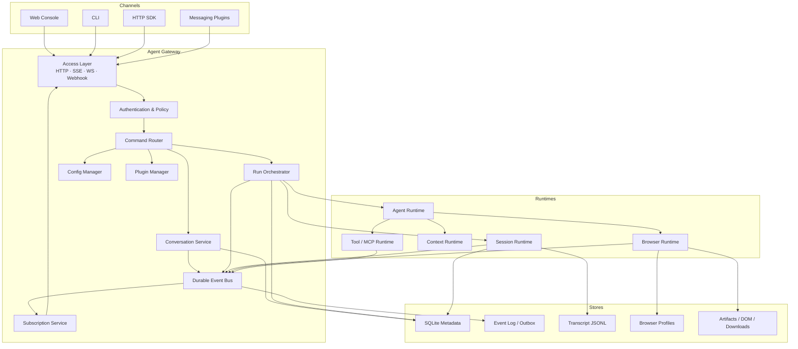

### 1.3 Responsibility boundary

| Component | Owns | Does not own |
|---|---|---|
| Gateway | ingress, auth, routing, orchestration, subscriptions | model reasoning or DOM operations |
| Channel | external message normalization and delivery | Agent scheduling or transcript storage |
| Session Runtime | conversation context chain, compact, replay, fork | transport connections |
| Agent Runtime | model/tool loop for one Run | durable channel identity |
| Browser Runtime | browser identity, contexts, tabs, DOM, network, downloads | model decisions |
| Context Runtime | deterministic Context Pack assembly | long-running Run state |
| Plugin Runtime | discovery, lifecycle, capabilities, isolation | implicit unrestricted access |

### 1.4 Current-to-target mapping

| Current module | Target owner |
|---|---|
| `tabvis/browser/server.py` | `gateway/access` + `gateway/methods` + compatibility adapter |
| `tabvis/agent/agents/registry.py` | `gateway/runtime/agent_store.py` and `run_store.py` |
| `tabvis/ui/cli/print.py::stream_agent` | `runtime/agent/runner.py` |
| `tabvis/browser/event_bus.py` | `gateway/events` |
| `tabvis/browser/manager.py` | `runtime/browser/manager.py` |
| `tabvis/utils/session_storage.py` | `runtime/session/transcript_store.py` |
| `tabvis/policy/*` | shared authorization service |
| `tabvis/agent/mcp/*` and skills | plugin capability providers |

### 1.5 Failure recovery

- Gateway restart MUST normalize orphaned Runs to `interrupted` or recover them from a lease.
- Event publication MUST use an outbox transaction with the associated metadata mutation.
- Channel delivery MUST store an external-message idempotency key.
- Browser leases MUST have heartbeat and expiry; stale leases MUST be reclaimable.
- Replaying events MUST never re-execute tools.

---

## 2. Overall Runtime

### 2.1 Startup lifecycle

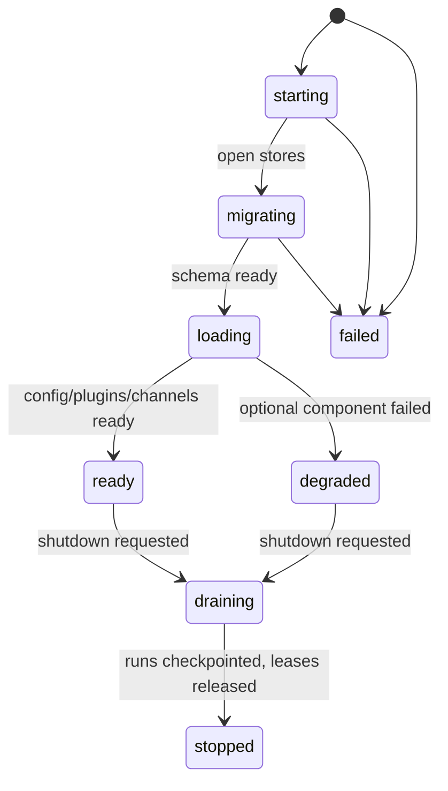

Startup order:

1. Load environment and validated configuration.
2. Open SQLite and apply forward-only schema migrations.
3. Recover the outbox, Agent records, Run leases, Session leases, and browser leases.
4. Discover plugins and validate manifests.
5. Start Browser Runtime and Agent Runtime service facades.
6. Start enabled Channels.
7. Bind HTTP/WS listeners.
8. Emit `gateway.ready` only after required components report ready.

Shutdown order is the reverse. The Gateway first stops accepting new commands, then drains or
checkpoints Runs, closes subscriptions, stops Channels, releases browser bindings, flushes events,
and closes stores.

### 2.2 Runtime modes

| Mode | Description | Required transports |
|---|---|---|
| one-shot | Current `tabvis -p` behavior | in-process command adapter |
| daemon | Local Gateway and optional Web console | HTTP + SSE/WS |
| embedded | Gateway used as a Python library | direct method calls |
| worker | Future split Agent/Browser worker | internal Gateway protocol |

All modes MUST invoke the same command handlers. CLI MUST NOT implement a second lifecycle.

### 2.3 Readiness

`GET /v1/health` SHOULD report component-level readiness:

```json
{
  "status": "ready",
  "components": {
    "metadata_store": "ready",
    "event_store": "ready",
    "agent_runtime": "ready",
    "browser_runtime": "ready",
    "channels": {"web": "ready"}
  },
  "capacity": {"runs": 4, "available": 3}
}
```

An optional Channel failure makes the Gateway `degraded`, not unavailable. Failure of metadata,
event storage, or the Agent Runtime makes it unready.

---

## 3. Gateway Control Plane

### 3.1 Modules

#### Access Layer

Responsibilities:

- Parse HTTP, SSE, WS, webhook, and embedded commands.
- Enforce request size, origin, version, and rate limits.
- Convert transport input to protocol Commands.
- Convert domain Events to transport frames.

The Access Layer MUST NOT directly call model or browser tools.

#### Authentication and authorization

Current behavior:

- Loopback requests resolve to local admin.
- Non-loopback bind requires an admin token.
- Agent credentials can resolve an Agent-scoped Principal.
- Runtime policy enforces owner isolation.

Target `Principal`:

```python
@dataclass(frozen=True)
class Principal:
    principal_id: str
    kind: Literal["user", "service", "agent", "channel"]
    tenant_id: str
    roles: tuple[str, ...]
    channel_id: str | None = None
    external_account_id: str | None = None
```

Every command carries the resolved Principal. Body fields MUST NOT override identity established by
credentials.

#### Command Router

The router maps a versioned command name to one handler:

```python
class CommandHandler(Protocol):
    command_type: str
    async def handle(self, command: Command, ctx: CommandContext) -> CommandResult: ...
```

Handlers MUST be idempotent for the same `command_id`.

#### Run Orchestrator

Responsibilities:

- Validate capacity and ownership.
- Create Run records.
- Acquire Session and Browser bindings.
- Queue and start the Agent Runtime.
- Handle wait, resume, retry, abort, and terminalization.
- Emit lifecycle events.

It MUST NOT format SSE or know about React routes.

#### Event Bus and Subscription Service

The in-memory Event Bus becomes two layers:

1. Durable event append and cursor assignment.
2. In-memory fan-out for low-latency subscribers.

The durable append is authoritative. Fan-out loss is repaired by replay from a cursor.

#### Configuration Manager

Configuration sources have explicit precedence:

`request override > workspace settings > user settings > environment > defaults`.

Secrets MUST be represented as set/not-set in public responses. Live changes emit
`config.changed`; components declare whether a setting is hot-reloadable.

#### Background Services

Required periodic jobs:

- Run and browser lease heartbeat.
- Expired interaction cleanup.
- Outbox delivery retry.
- Artifact retention.
- Session compaction scheduling.
- Plugin health checks.

### 3.2 Gateway state

```python
GatewayStatus = Literal[
    "starting", "migrating", "loading", "ready",
    "degraded", "draining", "stopped", "failed"
]
```

### 3.3 Extension points

- Transport adapter
- Authentication provider
- Channel provider
- Run scheduler
- Event store
- Plugin loader
- Secret store
- Artifact store

Extensions receive capability-scoped service interfaces, never the Gateway container itself.

---

## 4. Channel Framework

### 4.1 Problem and goals

The Web console, CLI, HTTP SDK, Feishu, Slack, Telegram, and future Browser OS surfaces have
different message formats and delivery semantics. Agent Runtime must not contain per-channel logic.

A Channel converts an external conversation into normalized inbound messages and converts Gateway
outbound deliveries into the channel's format.

### 4.2 Channel contract

```python
class ChannelPlugin(Protocol):
    manifest: ChannelManifest

    async def start(self, services: ChannelServices) -> None: ...
    async def stop(self) -> None: ...
    async def health(self) -> ChannelHealth: ...
    async def normalize(self, inbound: RawInbound) -> list[InboundMessage]: ...
    async def deliver(self, outbound: OutboundMessage) -> DeliveryReceipt: ...
    async def acknowledge(self, external_event_id: str) -> None: ...
```

`ChannelServices` exposes only:

- Submit normalized inbound command.
- Read conversation mapping.
- Publish delivery events.
- Resolve secret references.
- Evaluate channel policy.

### 4.3 Data model

```python
@dataclass
class ChannelAccount:
    channel_account_id: str
    plugin_id: str
    tenant_id: str
    external_account_ref: str
    credential_ref: str
    status: Literal["configured", "starting", "ready", "degraded", "stopped"]
    capabilities: set[str]

@dataclass
class ConversationBinding:
    binding_id: str
    channel_account_id: str
    external_conversation_id: str
    conversation_id: str
    session_id: str | None
    agent_id: str | None
```

The unique key
`(channel_account_id, external_conversation_id)` prevents one external thread from creating multiple
internal conversations during webhook retries.

### 4.4 Capability model

Capabilities are explicit strings:

- `message.text.inbound`
- `message.text.outbound`
- `message.rich.outbound`
- `message.update`
- `attachment.inbound`
- `interaction.buttons`
- `interaction.form`
- `stream.incremental`
- `thread.native`

The Gateway chooses a delivery strategy from capabilities. For example, a channel without
incremental streaming receives progress throttled into message updates or only a final response.

### 4.5 Inbound and outbound flow

Inbound:

1. Verify webhook signature before parsing content.
2. Deduplicate by external event id.
3. Resolve ChannelAccount and external identity.
4. Normalize content and attachments.
5. Resolve or create ConversationBinding.
6. Submit `conversation.message.received` and a Run command.
7. Acknowledge according to channel timeout requirements.

Outbound:

1. Subscribe to Run events.
2. Project events into channel-safe messages.
3. Apply throttling and capability degradation.
4. Deliver with an idempotency key.
5. Persist receipt and retry transient failures.

### 4.6 Channel lifecycle

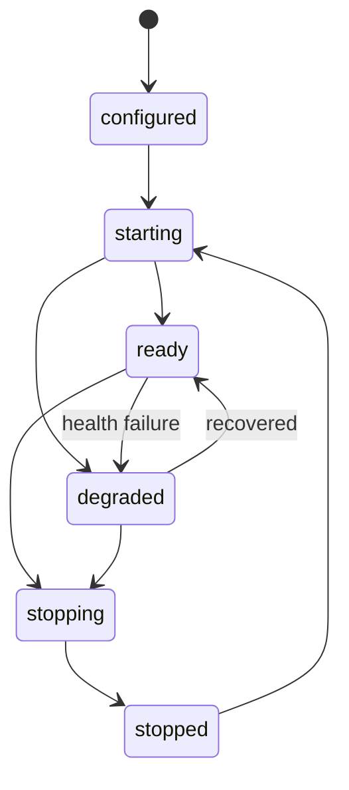

### 4.7 Security

- Channel credentials live only in SecretStore.
- Each inbound request is bound to a Channel Principal.
- External user ids are tenant-scoped and SHOULD be pseudonymized in logs.
- Attachments are scanned, size-limited, and stored before Agent access.
- Channel plugins cannot request arbitrary filesystem or browser capability implicitly.

### 4.8 First implementation

Implement `WebChannel` first. It wraps the current React/HTTP behavior and proves the contract.
Implement one webhook channel only after durable idempotency, delivery receipts, and interaction
responses are working.

---

## 5. Message Lifecycle

### 5.1 Normal message sequence

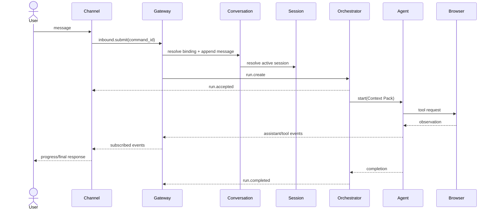

### 5.2 Human-in-the-loop sequence

This sequence replaces the current headless denial of `AskUserQuestion`.

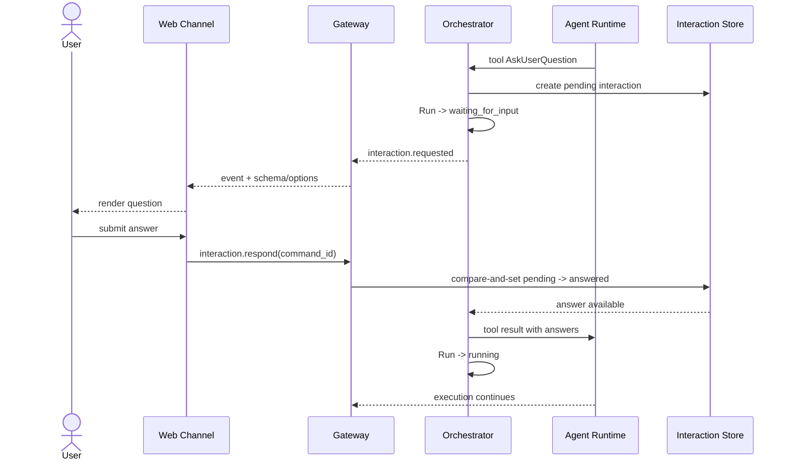

The Agent task MUST wait on an orchestrator-owned future keyed by `interaction_id`, not on an HTTP
request object. Restart recovery reconstructs pending interactions and resumes only if the model
provider/runtime supports checkpoint resume; otherwise the Run restarts from its persisted Session
boundary with the answer appended.

### 5.3 Event flow

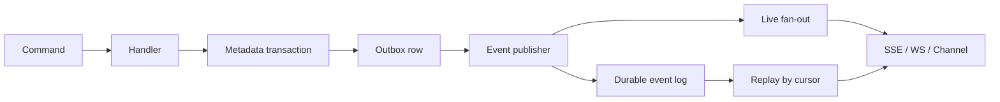

### 5.4 Message states

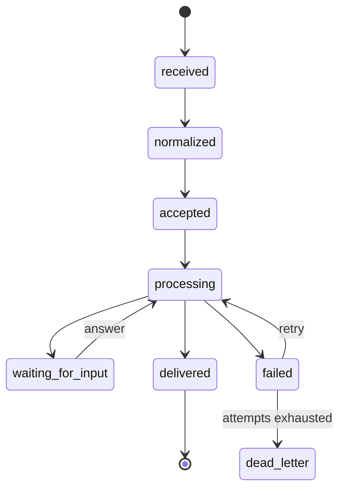

### 5.5 Ordering and idempotency

- Commands require globally unique `command_id`.
- Events receive a globally unique `event_id` and a monotonic `seq` within their aggregate.
- External inbound messages require `external_event_id`.
- Delivery requires `delivery_id`.
- Duplicate commands return the original CommandResult.
- Consumers store the last applied cursor and ignore older aggregate sequence numbers.

---

## 6. Session Runtime

### 6.1 Definitions

The target model deliberately separates related concepts:

| Entity | Lifetime | Meaning |
|---|---|---|
| Conversation | external/user-facing | stable thread across channels |
| Agent | durable | configured actor and browser identity owner |
| Session | context chain | transcript branch consumed by the model |
| Run | one execution | one prompt-to-terminal attempt |
| Workspace | resource binding | project, browser identity, artifacts, tabs |
| Interaction | temporary | question or approval awaited by a Run |
| Subscription | temporary/durable cursor | event consumer position |

### 6.2 Session model

```python
@dataclass
class SessionRecord:
    session_id: str
    conversation_id: str | None
    agent_id: str
    parent_session_id: str | None
    fork_point_message_id: str | None
    status: Literal["active", "compacting", "suspended", "archived", "failed"]
    head_message_id: str | None
    context_version: int
    created_at: str
    updated_at: str
```

Transcript messages remain append-only JSONL initially. SQLite stores indexes and relationships.

### 6.3 Operations

#### Create

Create an empty context chain and emit `session.created`.

#### Resume

Load the current head chain, validate parent links, apply compact boundaries, append the new user
message, and create a new Run. Resume MUST not mutate earlier message content.

#### Compact

Compaction appends:

1. `session.compaction.started`
2. A summary message with source range and token accounting.
3. A compact boundary.
4. `session.compaction.completed`

Failed compaction leaves the previous head valid.

#### Replay

Replay reconstructs context and presentation. It MUST NOT invoke tools or deliver channel messages.

#### Fork

Fork creates a new Session with `parent_session_id` and a fork point. Messages before the fork are
logically shared; new messages append to the child.

#### Merge

Automatic transcript merge is out of scope for the first implementation. Initial merge produces a
new summary/context message in the destination and records both source heads.

#### Subscription

Session subscriptions are event filters; they are not model sessions. A subscriber can reconnect
using its event cursor.

### 6.4 Session state

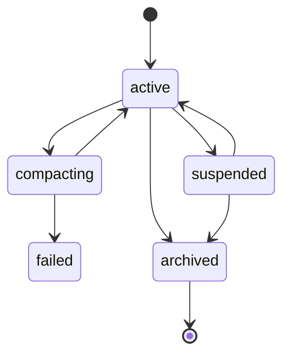

### 6.5 Failure recovery

- A partial JSONL line is ignored and reported; prior entries remain valid.
- Parent-chain corruption fails the Session explicitly rather than silently dropping history.
- Compaction uses an append boundary, never in-place rewriting.
- Session writes are serialized per `session_id`.

---

## 7. Agent and Run Runtime

### 7.1 Current problem

Current `AgentRecord` fields such as prompt, timing, counters, result, and error are overwritten on
reuse. The target splits configuration/identity from execution history.

### 7.2 Agent model

```python
@dataclass
class AgentRecord:
    agent_id: str
    tenant_id: str
    name: str | None
    default_model: str | None
    default_max_turns: int | None
    browser_identity_id: str | None
    status: Literal["active", "disabled", "deleted"]
    created_at: str
    updated_at: str
```

### 7.3 Run model

```python
@dataclass
class RunRecord:
    run_id: str
    agent_id: str
    session_id: str
    conversation_id: str | None
    workspace_id: str | None
    command_id: str
    prompt_message_id: str
    attempt: int
    status: Literal[
        "queued", "preparing", "running",
        "waiting_for_input", "waiting_for_approval",
        "retrying", "cancelling",
        "completed", "failed", "cancelled", "interrupted"
    ]
    model: str
    max_turns: int | None
    turns: int
    tool_calls: int
    result_message_id: str | None
    error_code: str | None
    created_at: str
    started_at: str | None
    ended_at: str | None
```

### 7.4 Run state machine

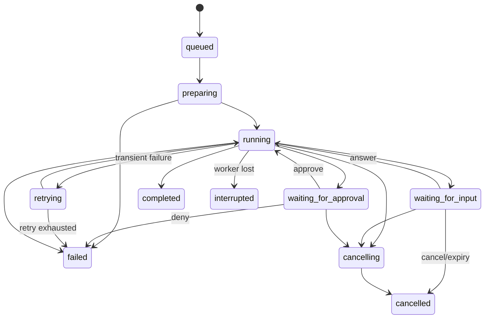

Only the Orchestrator may transition Run state. Updates use compare-and-set on the expected state.

### 7.5 Queue and capacity

Current behavior rejects over-capacity requests with `429`. Target behavior supports both:

- `queue=false`: reject immediately, preserving current semantics.
- `queue=true`: persist `queued` and schedule fairly.

Scheduling dimensions:

- global concurrent Runs;
- per-tenant quota;
- per-Agent single active Run by default;
- browser profile exclusivity;
- model/provider rate limits.

### 7.6 Abort

Cancel is cooperative:

1. Persist `cancelling`.
2. Trigger AbortController / task cancellation.
3. Stop starting new tools.
4. Give active tools a bounded cleanup window.
5. Release transient bindings.
6. Persist `cancelled` and emit terminal event.

`Quit Agent` is a management command that also closes its durable browser workspace. It remains
separate from canceling one Run.

### 7.7 Retry

Retry policy is error-class based:

| Error | Default |
|---|---|
| provider timeout/429/5xx | bounded exponential retry |
| invalid request/context overflow | compact or fail; no blind retry |
| tool validation/policy deny | report to model; no transport retry |
| browser transient disconnect | reconnect once if identity lease is valid |
| user cancellation | never retry |

Every retry increments `attempt` or creates a RunAttempt record. Tool calls require idempotency or an
explicit non-retryable marker.

### 7.8 Streaming

Agent Runtime emits typed domain events. It does not emit SSE dictionaries. Text deltas MAY be
ephemeral; assistant messages, tool lifecycle, interactions, and terminal results MUST be durable.

### 7.9 Tool lifecycle

```text
proposed -> validated -> authorized -> started -> progressed -> succeeded
                                              \-> failed
                                              \-> cancelled
```

Every tool event contains `run_id`, `tool_use_id`, tool name, timestamps, and redacted input/output
summaries. Raw secrets and screenshot bytes are never event payloads.

---

## 8. Plugin Runtime

### 8.1 Scope

Tabvis currently has multiple extension mechanisms:

- MCP servers provide tools and resources.
- Skills provide prompt/workflow knowledge.
- Browser engines provide driver implementations.
- Hooks observe lifecycle points.
- Future Channels provide external messaging.

The Plugin Runtime gives them shared discovery, lifecycle, capability, configuration, and permission
rules without forcing them to use the same execution mechanism.

### 8.2 Manifest

```json
{
  "schema_version": 1,
  "id": "channel.feishu",
  "version": "1.2.0",
  "kind": "channel",
  "entrypoint": "package.module:create_plugin",
  "capabilities": ["message.text.inbound", "interaction.buttons"],
  "permissions": [
    "gateway:conversation.submit",
    "secret:feishu.*:read"
  ],
  "config_schema": "config.schema.json",
  "requires": {
    "tabvis": ">=0.4,<0.6",
    "plugins": []
  }
}
```

### 8.3 Lifecycle

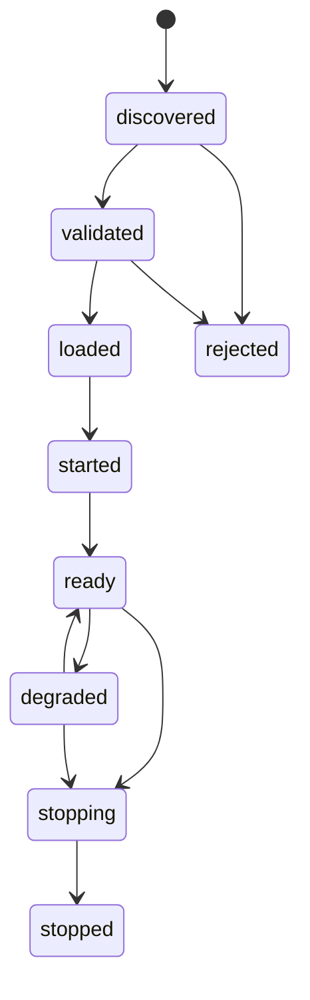

### 8.4 Registry interface

```python
class PluginRegistry(Protocol):
    def discover(self) -> list[PluginCandidate]: ...
    def validate(self, candidate: PluginCandidate) -> ValidationReport: ...
    async def start(self, plugin_id: str) -> PluginHandle: ...
    async def stop(self, plugin_id: str) -> None: ...
    def capabilities(self, plugin_id: str) -> frozenset[str]: ...
    def health(self, plugin_id: str) -> PluginHealth: ...
```

### 8.5 Dependency and compatibility

- Dependency graphs MUST be acyclic.
- Plugins start in topological order and stop in reverse.
- Protocol schema versions use integer major versions.
- A plugin with incompatible required capabilities is rejected before entrypoint execution.
- Optional plugin failure degrades only its feature.

### 8.6 Permission model

Manifest permissions are maximum requested permissions, not grants. Effective capability is:

`manifest request ∩ administrator grant ∩ runtime policy`.

Plugin services are capability-scoped facades. Direct access to internal stores is unsupported.

### 8.7 Migration

1. Register existing browser engines as built-in providers.
2. Wrap MCP configuration as built-in ToolProvider plugins.
3. Wrap Skill discovery as built-in ContextProvider plugins.
4. Add Channel plugins.
5. Only then expose third-party installation.

---

## 9. Gateway Protocol

### 9.1 Versioning

All new endpoints use `/v1`. The protocol has:

- HTTP commands for mutations and snapshots.
- SSE for simple resumable subscriptions.
- WebSocket for multiplexed events and interaction responses.
- Webhooks for Channel ingress.

Existing unversioned endpoints remain compatibility adapters until the deprecation window ends.

### 9.2 Command envelope

```json
{
  "protocol": "tabvis.gateway.v1",
  "command_id": "cmd_01...",
  "type": "run.create",
  "issued_at": "2026-07-21T10:00:00Z",
  "data": {
    "agent_id": "ag_...",
    "session_id": "ses_...",
    "message": {"type": "text", "text": "inspect the page"}
  }
}
```

### 9.3 Event envelope

```json
{
  "protocol": "tabvis.gateway.v1",
  "event_id": "evt_01...",
  "cursor": "0000000000018472",
  "aggregate": {"type": "run", "id": "run_..."},
  "seq": 12,
  "type": "tool.completed",
  "occurred_at": "2026-07-21T10:00:03Z",
  "correlation_id": "cmd_01...",
  "causation_id": "evt_01...",
  "scope": {
    "tenant_id": "local",
    "agent_id": "ag_...",
    "session_id": "ses_...",
    "run_id": "run_...",
    "workspace_id": "ws_..."
  },
  "data": {}
}
```

### 9.4 Core methods

| Method | Endpoint | Result |
|---|---|---|
| Create conversation | `POST /v1/conversations` | Conversation snapshot |
| Append message/create Run | `POST /v1/runs` | `202` Run snapshot |
| Read Run | `GET /v1/runs/{run_id}` | Run snapshot |
| Cancel Run | `POST /v1/runs/{run_id}/cancel` | updated Run |
| Respond to interaction | `POST /v1/interactions/{id}/responses` | interaction receipt |
| Subscribe | `GET /v1/events?cursor=&run_id=` | SSE |
| Read Session | `GET /v1/sessions/{id}` | Session snapshot |
| Fork Session | `POST /v1/sessions/{id}/fork` | child Session |
| Compact Session | `POST /v1/sessions/{id}/compact` | operation receipt |
| Read Workspace | `GET /v1/workspaces/{id}` | Workspace snapshot |
| Close Agent browser | `POST /v1/agents/{id}/quit` | Agent/browser state |

### 9.5 SSE frame

```text
id: 0000000000018472
event: tool.completed
data: {"protocol":"tabvis.gateway.v1", ...}
```

Clients reconnect with `Last-Event-ID`. The server replays durable events after that cursor, then
switches to live fan-out.

### 9.6 WebSocket frame

```json
{
  "id": "rpc_123",
  "type": "request",
  "method": "interaction.respond",
  "params": {"interaction_id": "int_...", "answers": {}}
}
```

Responses preserve `id`. Events use `type: "event"` and the standard Event envelope.

### 9.7 Error model

```json
{
  "error": {
    "code": "RUN_ALREADY_ACTIVE",
    "message": "Agent already has an active run",
    "retryable": false,
    "details": {"run_id": "run_..."},
    "trace_id": "tr_..."
  }
}
```

Error codes are stable; human-readable messages are not protocol identifiers.

### 9.8 Compatibility mapping

| Current | Adapter behavior |
|---|---|
| `POST /agent` | create/resolve Agent + Session, create Run, bind SSE to Run events |
| `GET /agents` | project Agents with latest Run summary |
| `GET /agents/{id}` | Agent plus latest Run compatibility view |
| `POST /agents/{id}/cancel` | cancel that Agent's active Run |
| current SSE names | project v1 domain events to legacy frames |

---

## 10. Browser Runtime

### 10.1 Responsibilities

Browser Runtime owns:

- Browser engine lifecycle.
- Durable BrowserIdentity metadata.
- Secret references and profile location.
- Browser context/session leases.
- Workspace bindings.
- Tabs, DOM snapshots, navigation history, network observations, downloads, and artifacts.
- Policy checks for origins, downloads, and sensitive interactions.

It does not decide what the Agent should click.

### 10.2 Core model

Existing `BrowserIdentity`, `IdentityBinding`, `WorkspaceRecord`, `BrowserSessionRecord`, and artifact
records are retained, but relationships are tightened:

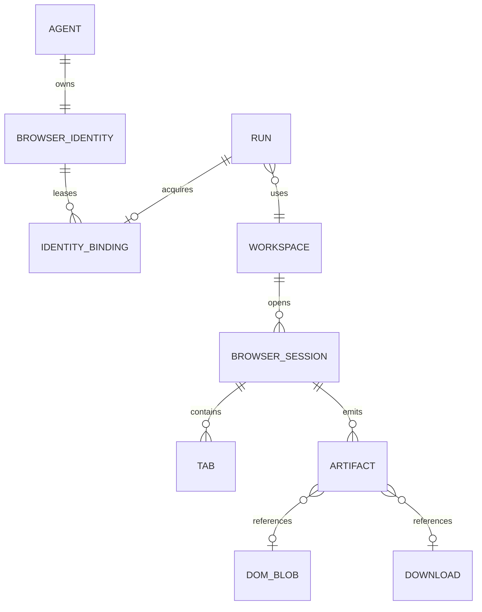

### 10.3 Browser session state

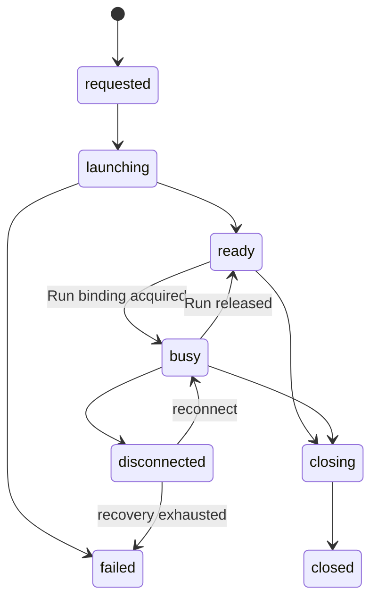

### 10.4 Runtime interface

```python
class BrowserRuntime(Protocol):
    async def acquire(self, request: BrowserAcquireRequest) -> BrowserBinding: ...
    async def release(self, binding_id: str) -> None: ...
    async def snapshot(self, binding_id: str) -> BrowserSnapshot: ...
    async def execute(self, binding_id: str, intent: BrowserIntent) -> ExecutionRecord: ...
    async def close_identity(self, identity_id: str) -> None: ...
```

Agent tools receive `binding_id`, not a raw Playwright browser object.

### 10.5 Identity and profile rules

- One Agent owns one default BrowserIdentity.
- An isolated Agent identity maps to its own profile directory.
- A shared named profile has one active writer.
- Binding acquisition is atomic and lease-backed.
- Identity metadata is Agent-readable; cookie values, tokens, passwords, and proxy credentials are
  not.
- Engine changes create or migrate profile compatibility explicitly; they never silently reuse an
  incompatible profile.

### 10.6 Tabs, DOM, network, storage, downloads

| Capability | Contract |
|---|---|
| Tabs | stable `tab_id`, active flag, URL/title, lifecycle events |
| DOM | content-addressed snapshots with size limits and redaction |
| Network | optional metadata events; bodies off by default |
| Cookies/storage | operations through secret-aware policy APIs |
| Downloads | quarantined workspace, collision-safe name, provenance event |
| Screenshots | artifact reference in events, never base64 in stream |

### 10.7 Recovery

- Wire the existing session heartbeat and lease TTL.
- Reclaim expired leases on startup.
- Preserve persistent profiles after worker loss.
- Mark uncertain side-effecting browser executions `interrupted`; do not blindly replay them.
- A reconnect verifies page/context identity before continuing.

---

## 11. Context Runtime

### 11.1 Problem

Tabvis currently assembles context across system prompts, project instructions, transcript history,
memory, tools, MCP resources, browser observations, and working-directory state. The ownership and
ordering are distributed across the Agent stack.

Context Runtime makes assembly deterministic and inspectable.

### 11.2 Context Pack

```python
@dataclass
class ContextPack:
    context_pack_id: str
    version: int
    run_id: str
    session_id: str
    model: str
    system_sections: list[ContextSection]
    messages: list[MessageRef]
    tool_descriptors: list[ToolDescriptor]
    resource_refs: list[ResourceRef]
    token_estimate: int
    provenance: list[ContextSource]
    digest: str
```

### 11.3 Providers

Providers run in a fixed order:

1. Safety and policy.
2. Agent definition and model capabilities.
3. Project instructions (`TABVIS.md`).
4. Session transcript and compact summaries.
5. Workspace and Git state.
6. Browser snapshot/history/identity metadata.
7. Project memory and knowledge.
8. Todos and workflow state.
9. Channel identity and capability hints.
10. Tool, MCP, and Skill descriptors.

Each provider returns content, priority, sensitivity, token estimate, cache scope, and provenance.

### 11.4 Interface

```python
class ContextProvider(Protocol):
    id: str
    async def collect(self, request: ContextRequest) -> list[ContextSection]: ...

class ContextRuntime(Protocol):
    async def build(self, request: ContextRequest) -> ContextPack: ...
    async def explain(self, context_pack_id: str) -> ContextPackReport: ...
```

### 11.5 Budget policy

Budgeting is deterministic:

- Reserve system safety and current user message first.
- Reserve tool schemas required for the Run.
- Include recent transcript verbatim.
- Include compact summaries before older raw messages.
- Rank optional sources by priority and freshness.
- Never truncate structured JSON into invalid content.

### 11.6 State and caching

Context Pack is immutable. A new pack version is created when source digests change. Cache keys
include model, Session head, workspace revision, browser snapshot revision, and enabled capability
set.

### 11.7 Security

- Context providers label sections `public`, `workspace`, `sensitive`, or `secret_ref`.
- Secret values cannot enter Context Pack.
- Channel-derived content is untrusted input.
- Browser DOM is untrusted input and cannot redefine system policy.
- `explain` redacts sensitive content while preserving provenance.

---

## 12. Persistence and Data Ownership

### 12.1 Target source-of-truth split

| Data | Authority | Secondary |
|---|---|---|
| Agent/Run/Session/Conversation metadata | SQLite | optional JSON export |
| command idempotency | SQLite | none |
| durable events/outbox | SQLite initially | external log later |
| transcript messages | JSONL initially | SQLite index |
| browser profile | browser profile directory | optional snapshot |
| DOM/download/screenshot artifacts | filesystem artifact store | SQLite metadata |
| secrets | Keychain/SecretStore | references in SQLite |

This intentionally evolves the current "JSON source + SQLite shadow" model. Migration MUST be
forward-only, resumable, and validated before changing read authority.

### 12.2 Required tables

- `agents`
- `conversations`
- `conversation_bindings`
- `sessions`
- `runs`
- `run_attempts`
- `interactions`
- `commands`
- `events`
- `outbox`
- `subscriptions`
- `channel_accounts`
- `deliveries`
- existing browser identity/workspace/artifact tables

### 12.3 Transaction boundary

For a state change and its event:

```text
BEGIN
  compare-and-set aggregate state
  insert command receipt if new
  insert outbox event
COMMIT
publish outbox asynchronously
```

No client-visible terminal response is returned before the transaction commits.

### 12.4 Retention

- Agent, Conversation, Session, and Run metadata: configurable, default retained.
- Text deltas: short retention or ephemeral.
- Durable messages and terminal events: Session retention period.
- DOM/screenshot/network artifacts: shorter policy-controlled retention.
- Audit decisions: append-only retention configured separately.
- Secrets: explicit deletion and rotation rules.

---

## 13. Security and Policy

### 13.1 Trust boundaries

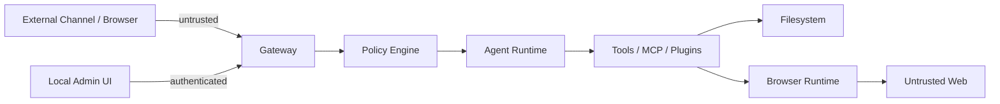

### 13.2 Required controls

- Authentication is mandatory on non-loopback listeners.
- Cross-owner isolation precedes policy fallback.
- All management actions produce audit events.
- Tool authorization uses validated inputs.
- Plugin and Channel capabilities are least-privilege.
- Event payloads pass a central redactor.
- Browser allowed-domain and pacing policies remain enforced.
- Secret references are resolved only inside trusted service boundaries.

### 13.3 Approval vs question

Two interaction types are distinct:

| Type | Purpose | Resolution |
|---|---|---|
| question | obtain missing preference/information | structured answer |
| approval | authorize a proposed sensitive action | allow/deny, optional scoped grant |

`AskUserQuestion` maps to `interaction.kind=question`. Permission `behavior=ask` maps to
`interaction.kind=approval`. They can share transport but not semantics.

---

## 14. Reference Implementation Layout

The target is a logical layout. Migration SHOULD move code only when a boundary is covered by tests;
large mechanical rewrites are discouraged.

```text
tabvis/
  gateway/
    app.py                    # composition root
    lifecycle.py              # startup, readiness, drain, shutdown
    access/
      http.py                 # Starlette routes
      sse.py                  # cursor subscriptions
      websocket.py            # multiplexed RPC/events
      middleware.py           # auth, limits, tracing, CORS
    protocol/
      commands.py             # command envelopes and schemas
      events.py               # event envelopes and schemas
      errors.py               # stable error catalog
      compatibility.py        # legacy /agent projections
    methods/
      agents.py
      runs.py
      sessions.py
      interactions.py
      workspaces.py
      config.py
    runtime/
      orchestrator.py
      scheduler.py
      leases.py
      recovery.py
    events/
      store.py
      outbox.py
      bus.py
      subscriptions.py
    auth/
      principals.py
      authentication.py
      authorization.py
    store/
      metadata.py
      migrations/

  channels/
    core/
      contract.py
      registry.py
      identity.py
      delivery.py
    web/
      channel.py
    plugins/
      feishu/
      telegram/

  runtime/
    agent/
      runner.py               # wraps existing query/tool loop
      models.py
      retry.py
    session/
      service.py
      transcript_store.py
      compact.py
      replay.py
      fork.py
    browser/
      service.py              # facade over current browser package
      identity.py
      workspace.py
      artifacts.py
    context/
      runtime.py
      pack.py
      providers/
    tools/
      registry.py
      execution.py

  plugins/
    contract.py
    manifest.py
    discovery.py
    registry.py
    lifecycle.py

  policy/                     # existing policy engine, evolved in place
  browser/                    # compatibility imports during migration
  agent/                      # compatibility imports during migration
```

### 14.1 Key classes

| Class | Primary responsibility |
|---|---|
| `GatewayApplication` | dependency composition and lifecycle |
| `CommandRouter` | versioned command dispatch and idempotency |
| `RunOrchestrator` | Run state machine and runtime coordination |
| `RunScheduler` | capacity and fairness |
| `EventStore` | append/read cursored durable events |
| `SubscriptionService` | replay then live fan-out |
| `ConversationService` | channel-to-conversation mapping |
| `SessionService` | context-chain lifecycle |
| `InteractionService` | pending question/approval lifecycle |
| `BrowserRuntime` | binding-based browser API |
| `ContextRuntime` | deterministic Context Pack |
| `PluginRegistry` | plugin validation and lifecycle |
| `ChannelRegistry` | channel account lifecycle |

### 14.2 Event catalog

Minimum durable events:

- `gateway.ready`, `gateway.draining`
- `conversation.created`, `conversation.message.received`
- `session.created`, `session.compaction.completed`, `session.forked`
- `run.created`, `run.queued`, `run.started`, `run.waiting`
- `run.retrying`, `run.completed`, `run.failed`, `run.cancelled`, `run.interrupted`
- `assistant.message.completed`
- `tool.started`, `tool.completed`, `tool.failed`
- `interaction.requested`, `interaction.answered`, `interaction.expired`
- `browser.binding.acquired`, `browser.binding.released`
- `browser.navigation.completed`, `browser.download.completed`
- `channel.delivery.succeeded`, `channel.delivery.failed`
- `policy.decision`

---

## 15. Implementation Plan

### Implementation status

The `tabvis/gateway/` package is being built additively, seams first, without touching the existing
`tabvis/browser/server.py` control plane. Landed so far (all covered by `tests/gateway/`):

- **Phase 0 (contracts)** — typed prefixed IDs (`tabvis/gateway/protocol/ids.py`), the stable error
  catalog (`errors.py`), and the command/event envelopes (`commands.py`, `events.py`).
- **Phase 1 core** — the immutable `RunRecord` and its state machine (`runtime/runs.py`); an
  authoritative durable event log with global cursor + per-aggregate `seq`, its outbox, and the
  command idempotency ledger in a dedicated `gateway.db` (`store/db.py`, `events/store.py`); the
  in-memory live fan-out (`events/subscriptions.py`); and `RunStore` (`runtime/run_store.py`), which
  creates Runs and applies compare-and-set transitions, emitting one event per transition in the
  §12.3 transaction boundary.

The durable store is deliberately **authoritative** (not the best-effort shadow that `runtime.db`
is), so a write failure surfaces rather than being swallowed. Two internal-only Run statuses
(`preparing`, `cancelling`) emit derived event names (`run.preparing`, `run.cancelling`) since the
§14.2 catalog is a minimum, not an exhaustive list.

Still to do in Phase 1: adapting the existing SSE stream onto the event log and exposing the latest
Run in the `POST /agent` compatibility views — both land with the Phase 3 gateway extraction so the
legacy control plane is moved rather than duplicated.

### Phase 0 — contracts and characterization

Deliverables:

- Freeze legacy endpoint behavior with integration tests.
- Add typed IDs for `run_id`, `conversation_id`, `interaction_id`, `command_id`, `event_id`. ✅
- Add protocol error catalog. ✅
- Document current event names and redaction.

Acceptance:

- Existing CLI, Web console, tests, and `POST /agent` remain unchanged. ✅

### Phase 1 — Run split and durable events

Deliverables:

- Introduce immutable RunRecord. ✅
- Keep AgentRecord durable fields; expose latest Run in compatibility views. *(views pending Phase 3)*
- Add events/outbox tables and Event envelope. ✅
- Add cursor-based `GET /v1/events`. *(store-level `EventStore.read(after_cursor=…)` landed; HTTP
  endpoint pending Phase 3 access layer)*
- Adapt current SSE to events without changing legacy frames. *(pending Phase 3)*

Acceptance:

- Continuing one Agent creates two queryable Runs. ✅ (`test_run_store.py`)
- Disconnect/reconnect with a cursor yields no gap or duplicate application. ✅ (`test_event_store.py`)
- Restart preserves terminal Run history. ✅ (`test_run_store.py` — cold read from `gateway.db`)

### Phase 2 — interactions

Deliverables:

- InteractionRecord and InteractionService. ✅ (`runtime/interactions.py`, `runtime/interaction_service.py`)
- `waiting_for_input` / `waiting_for_approval` Run states. ✅ (wired into the §7.4 machine + `RunStore`)
- question and approval events. ✅ (`interaction.requested/answered/expired`, durable `interactions` table)
- response HTTP/WS method. *(service-level `respond()` landed; HTTP/WS binding pending Phase 3)*
- React components for choices, free text, expiry, and approval. *(frontend — pending Phase 3 access layer)*

Acceptance:

- `AskUserQuestion` pauses a Run, survives page refresh, receives one answer, and resumes. ✅
  (`test_interactions.py` — pause + resume driven through the orchestrator-owned future, resolved by a
  fresh service instance to simulate a refresh)
- Duplicate answers return the original receipt. ✅ (`test_interactions.py`)
- Cancel while waiting terminates the Run and interaction. ✅ (`test_interactions.py`)

The resume future is **process-global and transport-decoupled** (§5.2): the agent task blocks on
`InteractionService.wait(interaction_id)`, and `respond` / `expire` / `cancel_for_run` resolve it from
wherever the answer arrives. Restart recovery of the pending set is available via
`db.list_pending_interactions`; resuming the model from that set is deferred to a later phase (it
depends on the open question in §18.2 about checkpoint-vs-transcript resume).

### Phase 3 — Gateway module extraction

Deliverables:

- Split access, methods, orchestration, auth, and event modules out of `browser/server.py`.
- One composition root for CLI, daemon, and tests.
- Component health and graceful drain.

Acceptance:

- No HTTP handler directly executes the model loop or browser operation.
- Legacy and v1 API tests pass.

### Phase 4 — Channel Framework

Deliverables:

- Channel contract, account store, conversation binding, delivery receipts.
- WebChannel adapter.
- Webhook signature/idempotency primitives.
- One optional external channel proof of concept.

Acceptance:

- The same Run can originate from WebChannel or the proof channel.
- External webhook retries create one internal message and one Run.

### Phase 5 — Context Runtime

Deliverables:

- ContextProvider contract and deterministic ordering.
- Context Pack digest/provenance.
- Providers wrapping project instructions, transcript, memory, Git, browser, tools, MCP, and skills.
- Redacted context explain endpoint.

Acceptance:

- Identical source revisions produce the same digest.
- Token budget decisions are explainable.
- No secret material appears in Context Pack snapshots.

### Phase 6 — Plugin Runtime

Deliverables:

- Manifest, discovery, validation, dependency graph, lifecycle, capabilities.
- Built-in adapters for MCP, skills, browser engines, and channels.

Acceptance:

- An incompatible or over-privileged plugin is rejected before startup.
- Optional plugin failure does not stop core Gateway readiness.

### Phase 7 — Browser Runtime hardening

Deliverables:

- Binding-only browser tool access.
- Wired heartbeats and lease recovery.
- Stable tab ids and artifact references.
- Network/storage capability contracts.

Acceptance:

- Two isolated Agents run in parallel.
- Shared profile conflict is deterministic.
- Crash recovery does not corrupt or silently reassign a live profile.

### Phase 8 — optional process separation

Only after contracts are stable:

- Split Agent/Browser workers from Gateway if isolation or scale requires it.
- Preserve the same Command/Event protocol.
- Add worker registration, leases, and placement.

Process separation is not required for the initial Gateway.

---

## 16. Testing Strategy

### 16.1 Test layers

| Layer | Focus |
|---|---|
| unit | state transitions, schemas, redaction, idempotency |
| contract | Channel, Plugin, Browser, Context provider contracts |
| integration | HTTP/WS/SSE, SQLite/outbox, transcript, recovery |
| browser | real Playwright profile ownership and artifacts |
| failure injection | disconnect, restart, timeout, duplicate webhook, corrupt tail |
| compatibility | legacy CLI/API/SSE projections |

### 16.2 State-machine invariants

- Terminal Run states never transition.
- One Agent has at most one active Run unless explicitly configured.
- One profile directory has at most one active writer.
- One pending interaction accepts at most one response.
- Aggregate event `seq` is strictly increasing.
- A command id maps to one logical mutation result.
- A transport disconnect never changes Run state.

### 16.3 Required end-to-end scenarios

1. New Web prompt → browser tool → final answer.
2. Continue Agent → same Session/browser → distinct Run history.
3. Ask question → refresh UI → answer → resume.
4. Cancel during model stream.
5. Cancel during browser tool.
6. Gateway restart with queued, running, and waiting Runs.
7. SSE reconnect from cursor.
8. Duplicate webhook delivery.
9. Shared browser profile conflict.
10. Policy denial and approval.

---

## 17. Observability

Every command and event carries:

- `trace_id`
- `correlation_id`
- `causation_id`
- relevant Agent/Session/Run/Workspace ids

Metrics:

- command latency and error rate;
- queue depth and wait time;
- active/waiting Runs;
- model first-token and completion latency;
- tool latency/failure;
- browser launch/reconnect latency;
- event subscriber lag;
- channel delivery success/retry;
- context tokens by provider.

Logs are structured and redacted. User text, DOM, tool input, and credentials are excluded by
default or recorded only as bounded summaries and artifact references.

---

## 18. Decisions and Open Questions

### 18.1 Accepted decisions

1. Gateway is a logical boundary before it is a separate process.
2. Agent and Run are separate aggregates.
3. SSE is retained, but detached from the POST that creates a Run.
4. WebSocket is added for multiplexing and interactions, not as the only transport.
5. Durable events use SQLite/outbox first.
6. Transcript JSONL remains during early phases.
7. Browser Runtime is a first-class service, not a generic plugin.
8. Questions and approvals are separate Interaction kinds.
9. Current APIs remain compatibility adapters during migration.

### 18.2 Open questions

- Should one Agent support concurrent Runs in different Sessions, or remain serialized?
- Does Conversation own exactly one active Session, or can a channel select branches?
- Which event types retain deltas, and for how long?
- Should pending interactions resume model execution after process restart or restart from a
  transcript checkpoint?
- When should SQLite become the transcript authority?
- Which first external Channel best validates rich interactions and thread mapping?
- What plugin isolation is required: in-process, subprocess, or both?

Each open question MUST be resolved in an Architecture Decision Record before the dependent phase.

---

## 19. Code Agent execution rules

A code agent implementing this design MUST:

1. Implement one phase at a time.
2. Inspect current behavior and add characterization tests before moving it.
3. Preserve unversioned API and CLI behavior unless the phase explicitly changes compatibility.
4. Avoid a repository-wide directory move in one change.
5. Add migrations before changing read authority.
6. Emit a domain event for every persisted lifecycle transition.
7. Use compare-and-set for state transitions.
8. Keep secrets, screenshot bytes, and full DOM out of events.
9. Include failure and restart tests, not only happy-path tests.
10. Update this document when implementation intentionally diverges.

The preferred implementation order is:

```text
IDs and schemas
→ RunRecord
→ durable EventStore/outbox
→ cursor subscriptions
→ interactions
→ Gateway extraction
→ WebChannel
→ external Channel
→ Context Runtime
→ Plugin Runtime
→ optional worker split
```

This order creates useful seams early while keeping Tabvis operational throughout the migration.
