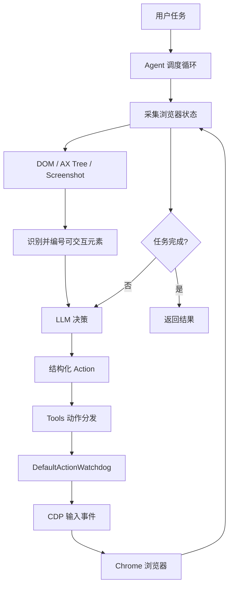
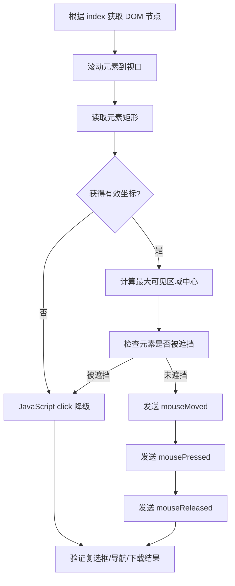
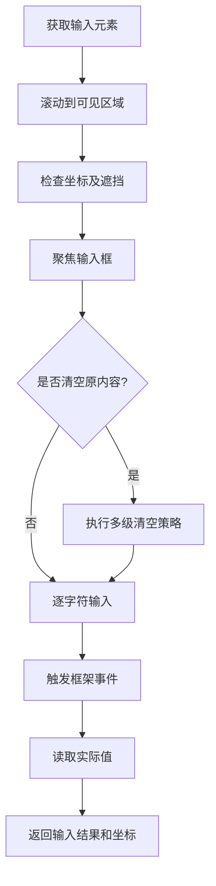

# 浏览器操作模拟技术实现

本文说明 Browser Use 如何理解网页、规划操作，并通过 Chrome DevTools Protocol（CDP）执行鼠标、键盘和滚动事件。

这里的“模拟人类操作”主要指：

1. 像人一样根据页面语义和视觉状态决定下一步操作。
2. 优先通过浏览器原生输入事件完成点击、输入和滚动。
3. 每次操作后重新观察页面并验证结果。

它并不是完整的人类行为生物特征模拟器。目前实现不包含随机鼠标曲线、真人速度分布或完整浏览器指纹伪装。

## 1. 技术目标

系统接收一个自然语言任务，例如：

> 打开目标网站，在搜索框中输入 Browser Use，点击搜索按钮，并返回第一个结果。

系统需要自动完成以下过程：

1. 获取当前页面状态。
2. 识别可点击、可输入和可滚动的元素。
3. 将页面状态和用户任务发送给大语言模型。
4. 接收并验证模型生成的结构化动作。
5. 将动作转换为 CDP 鼠标、键盘或滚动事件。
6. 重新获取页面状态并检查动作是否成功。
7. 重复执行，直到任务完成或达到终止条件。

## 2. 总体架构



系统主要分为五层：

| 层级 | 职责 | 主要模块 |
| --- | --- | --- |
| 感知层 | 获取 DOM、无障碍树、布局和截图 | `DOMWatchdog`、`DomService` |
| 元素层 | 识别并编号可交互元素 | `ClickableElementDetector`、DOM serializer |
| 决策层 | 根据任务和页面状态生成下一步动作 | `Agent`、LLM、system prompt |
| 动作层 | 校验动作参数并分发浏览器事件 | `Tools`、Pydantic action models |
| 执行层 | 通过 CDP 执行鼠标、键盘和滚动 | `DefaultActionWatchdog` |

## 3. Agent 执行循环

Agent 的单步执行过程可以概括为：

```python
async def step():
    browser_state = await collect_browser_state()
    model_context = build_model_context(browser_state)
    model_output = await llm.decide(model_context)
    actions = validate_actions(model_output)
    action_results = await execute_actions(actions)
    await verify_page_changes(action_results)
```

项目中的主要调用位置：

- [`Agent.step()`](browser_use/agent/service.py#L1025)：单步调度入口。
- [`Agent._prepare_context()`](browser_use/agent/service.py#L1079)：获取浏览器状态并构造模型上下文。
- [`Agent._get_next_action()`](browser_use/agent/service.py#L1167)：调用模型生成动作。
- [`Agent._execute_actions()`](browser_use/agent/service.py#L1203)：执行模型返回的动作。

执行循环的关键特征是：每轮动作后都会重新观察页面，避免持续使用已经过期的 DOM 和元素编号。

## 4. 页面感知

### 4.1 并行获取 DOM 和截图

浏览器状态请求会并行构建 DOM 状态并截取当前视口：

```python
dom_task = build_dom_tree()
screenshot_task = capture_screenshot()

dom_state, screenshot = await asyncio.gather(
    dom_task,
    screenshot_task,
)
```

对应实现位于 [`DOMWatchdog.on_BrowserStateRequestEvent()`](browser_use/browser/watchdogs/dom_watchdog.py#L241)。

DOM 用于精确识别和定位元素，截图用于补充以下信息：

- Canvas 内容。
- 图片和图标语义。
- 视觉弹窗及遮挡。
- DOM 无法完整表达的页面状态。

Agent 当前每一步都会采集截图，但是否把截图发送给模型由 `use_vision` 控制：

- `True`：总是发送截图。
- `"auto"`：仅在动作明确请求视觉信息时发送。
- `False`：不把截图发送给模型。

### 4.2 DOM 数据来源

页面结构由多种 CDP 数据合并构成：

```text
DOM.getDocument
        +
DOMSnapshot.captureSnapshot
        +
Accessibility.getFullAXTree
        +
JavaScript 事件监听器信息
        ↓
Enhanced DOM Tree
```

各数据源的作用如下：

| 数据源 | 作用 |
| --- | --- |
| `DOM.getDocument` | 获取完整 DOM，并通过 `pierce=True` 穿透开放的 Shadow DOM |
| `DOMSnapshot.captureSnapshot` | 获取元素位置、尺寸、样式、可见性和绘制顺序 |
| `Accessibility.getFullAXTree` | 获取角色、名称、焦点、可编辑状态等语义信息 |
| JS listener detection | 识别 React、Vue、Angular 等框架注册的鼠标事件 |

主要代码位置：

- [获取 Accessibility Tree](browser_use/dom/service.py#L347)
- [获取 DOM Snapshot](browser_use/dom/service.py#L546)
- [获取完整 DOM](browser_use/dom/service.py#L559)

## 5. 可交互元素识别

系统根据 HTML、无障碍属性、事件监听器和布局信息判断元素是否可交互。

简化后的判断逻辑如下：

```python
def is_interactive(node):
    if node.has_js_click_listener:
        return True

    if node.tag_name in {
        "button",
        "input",
        "select",
        "textarea",
        "a",
        "details",
        "summary",
        "option",
    }:
        return True

    if node.accessibility.focusable:
        return True

    if node.accessibility.editable:
        return True

    if node.attributes.get("onclick"):
        return True

    if node.attributes.get("tabindex") is not None:
        return True

    return False
```

实际实现位于 [`ClickableElementDetector.is_interactive()`](browser_use/dom/serializer/clickable_elements.py#L4)。

识别过程中还会处理：

- 包含表单控件的 `label` 和 `span` 包装器。
- 具有 JavaScript 点击监听器的非标准元素。
- iframe 和可滚动容器。
- ARIA `focusable`、`editable`、`checked`、`expanded` 等属性。
- `onclick`、`onmousedown`、`tabindex` 等交互属性。
- 可见性、绘制顺序和视口位置。

### 5.1 元素编号

符合条件且可操作的元素会被序列化成适合 LLM 阅读的形式：

```text
[125]<input placeholder="Search">
[229]<button aria-label="Submit">Search</button>
[418]<a href="/results">View results</a>
```

编号保存在 selector map 中，并映射到增强 DOM 节点：

```python
selector_map = {
    125: EnhancedDOMTreeNode(...),
    229: EnhancedDOMTreeNode(...),
    418: EnhancedDOMTreeNode(...),
}
```

模型只需要引用编号，不需要生成容易失效的 CSS Selector 或 XPath。

## 6. 模型上下文和动作决策

模型收到的页面信息主要包括：

- 用户原始任务。
- 当前 URL、标题和标签页。
- 当前页面上方和下方还有多少可滚动内容。
- 序列化后的可交互元素。
- 上一步动作及其执行结果。
- 可选截图。
- 当前可用的动作 schema。

页面状态的文本构造位于 [`AgentMessagePrompt._get_browser_state_description()`](browser_use/agent/prompts.py#L223)。

模型可能生成如下动作：

```json
{
  "thinking": "搜索框编号为 125，输入关键词后点击搜索按钮",
  "actions": [
    {
      "input": {
        "index": 125,
        "text": "Browser Use",
        "clear": true
      }
    },
    {
      "click": {
        "index": 229
      }
    }
  ]
}
```

## 7. 结构化动作协议

动作输入使用 Pydantic v2 模型校验，避免模型输出不完整或类型错误的参数。

核心 schema 可以简化为：

```python
from pydantic import BaseModel, Field


class ClickAction(BaseModel):
    index: int | None = Field(default=None, ge=1)
    coordinate_x: int | None = None
    coordinate_y: int | None = None


class InputAction(BaseModel):
    index: int = Field(ge=0)
    text: str
    clear: bool = True


class ScrollAction(BaseModel):
    down: bool = True
    pages: float = 1.0
    index: int | None = None


class SendKeysAction(BaseModel):
    keys: str
```

实际定义位于 [`browser_use/tools/views.py`](browser_use/tools/views.py)。

动作由 `Tools` 转换成浏览器事件：

```text
click  → ClickElementEvent / ClickCoordinateEvent
input  → TypeTextEvent
scroll → ScrollEvent
keys   → SendKeysEvent
```

事件最终由 [`DefaultActionWatchdog`](browser_use/browser/watchdogs/default_action_watchdog.py) 处理。

## 8. 鼠标点击模拟

### 8.1 点击流程



### 8.2 滚动到可见区域

点击之前调用：

```python
await cdp.send.DOM.scrollIntoViewIfNeeded(
    params={"backendNodeId": backend_node_id},
    session_id=session_id,
)
```

实现位置：[滚动元素到可见区域](browser_use/browser/watchdogs/default_action_watchdog.py#L765)。

滚动之后重新读取元素坐标，避免使用滚动前的过期位置。

### 8.3 计算点击坐标

系统会：

1. 获取元素矩形或 quad。
2. 计算元素和视口的交集。
3. 选择可见面积最大的 quad。
4. 计算 quad 中心。
5. 将坐标限制在视口范围内。

```python
center_x = sum(quad[i] for i in range(0, 8, 2)) / 4
center_y = sum(quad[i] for i in range(1, 8, 2)) / 4

center_x = max(0, min(viewport_width - 1, center_x))
center_y = max(0, min(viewport_height - 1, center_y))
```

实现位置：[计算可见区域及中心点](browser_use/browser/watchdogs/default_action_watchdog.py#L829)。

### 8.4 遮挡检测

点击前通过 `document.elementFromPoint(x, y)` 检查目标位置上的实际元素。

以下情况被视为可以点击：

- 命中目标本身。
- 命中目标子元素。
- 命中包含目标的父元素。
- 命中语义关联的 `label` 或 `input`。

如果目标被模态框、Cookie 弹窗或其他元素遮挡，系统会尝试 JavaScript 点击降级。

实现位置：[元素遮挡检测](browser_use/browser/watchdogs/default_action_watchdog.py#L565)。

### 8.5 CDP 鼠标事件

正常点击发送以下事件：

```python
await cdp.send.Input.dispatchMouseEvent(
    params={
        "type": "mouseMoved",
        "x": center_x,
        "y": center_y,
    },
    session_id=session_id,
)
await asyncio.sleep(0.05)

await cdp.send.Input.dispatchMouseEvent(
    params={
        "type": "mousePressed",
        "x": center_x,
        "y": center_y,
        "button": "left",
        "clickCount": 1,
    },
    session_id=session_id,
)
await asyncio.sleep(0.08)

await cdp.send.Input.dispatchMouseEvent(
    params={
        "type": "mouseReleased",
        "x": center_x,
        "y": center_y,
        "button": "left",
        "clickCount": 1,
    },
    session_id=session_id,
)
```

实现位置：[执行 CDP 坐标点击](browser_use/browser/watchdogs/default_action_watchdog.py#L902)。

### 8.6 点击降级策略

```text
CDP 坐标点击
    ↓ 坐标不可用或元素被遮挡
JavaScript element.click()
    ↓ 仍然失败
返回 ActionResult(error=...)
```

JavaScript 点击降级位于 [`_click_element_node_impl()`](browser_use/browser/watchdogs/default_action_watchdog.py#L799)。

对于复选框和单选按钮，系统还会读取点击前后的 `checked` 状态。如果 CDP 点击没有改变状态，会再次使用 `element.click()`。

## 9. 键盘输入模拟

### 9.1 输入流程



### 9.2 输入框聚焦

系统首先尝试通过 CDP 或 JavaScript 聚焦元素。如果普通聚焦失败，则通过元素中心坐标点击输入框。

实现位置：[`_focus_element_simple()`](browser_use/browser/watchdogs/default_action_watchdog.py#L1539)。

### 9.3 清空原内容

默认 `clear=True`，清空策略依次为：

```text
JavaScript 清空 value / textContent
        ↓ 失败
鼠标三击 + Delete
        ↓ 失败
Command/Ctrl + A + Backspace
```

这些策略用于兼容：

- 普通 `input` 和 `textarea`。
- `contenteditable`。
- React 受控组件。
- 自定义 Web Component。
- 特殊输入插件。

### 9.4 逐字符键盘事件

普通字符按以下顺序输入：

```text
keyDown → 等待 5ms → char → keyUp → 等待 1ms
```

```python
await cdp.send.Input.dispatchKeyEvent(
    params={
        "type": "keyDown",
        "key": base_key,
        "code": key_code,
        "modifiers": modifiers,
        "windowsVirtualKeyCode": virtual_key_code,
    },
    session_id=session_id,
)

await asyncio.sleep(0.005)

await cdp.send.Input.dispatchKeyEvent(
    params={
        "type": "char",
        "text": character,
        "key": character,
    },
    session_id=session_id,
)

await cdp.send.Input.dispatchKeyEvent(
    params={
        "type": "keyUp",
        "key": base_key,
        "code": key_code,
        "modifiers": modifiers,
        "windowsVirtualKeyCode": virtual_key_code,
    },
    session_id=session_id,
)

await asyncio.sleep(0.001)
```

实现位置：[逐字符输入](browser_use/browser/watchdogs/default_action_watchdog.py#L1834)。

对于大写字母和特殊字符，系统会计算 Shift 等修饰键：

```text
A → Shift + A
! → Shift + 1
@ → Shift + 2
```

换行会被转换成完整的 Enter 键事件序列。

### 9.5 前端框架兼容

完成输入后，系统补充触发前端框架依赖的事件，例如：

```javascript
element.dispatchEvent(new Event("input", { bubbles: true }));
element.dispatchEvent(new Event("change", { bubbles: true }));
```

随后读取 `element.value` 或 `element.textContent`，确认实际输入内容。

实现位置：

- [触发框架事件](browser_use/browser/watchdogs/default_action_watchdog.py#L1976)
- [读取并验证输入值](browser_use/browser/watchdogs/default_action_watchdog.py#L1981)

## 10. 滚动模拟

### 10.1 页面滚动

页面滚动首先将页数转换成像素：

```python
pixels = pages * viewport_height
```

然后在视口中心调用 CDP 滚动手势：

```python
await cdp.send.Input.synthesizeScrollGesture(
    params={
        "x": viewport_width / 2,
        "y": viewport_height / 2,
        "xDistance": 0,
        "yDistance": -pixels,
        "speed": 50000,
    },
    session_id=session_id,
)
```

实现位置：[`_scroll_with_cdp_gesture()`](browser_use/browser/watchdogs/default_action_watchdog.py#L2175)。

这里虽然发送的是真实滚动手势事件，但 `speed=50000` 表示滚动接近瞬时完成，并不符合普通人的滚动速度。

### 10.2 元素容器滚动

模型可以指定一个可滚动元素：

```json
{
  "scroll": {
    "down": true,
    "pages": 1,
    "index": 512
  }
}
```

系统读取元素中心坐标，并在该位置发送滚轮事件：

```python
await cdp.send.Input.dispatchMouseEvent(
    params={
        "type": "mouseWheel",
        "x": center_x,
        "y": center_y,
        "deltaX": 0,
        "deltaY": pixels,
    },
    session_id=session_id,
)
```

实现位置：[`_scroll_element_container()`](browser_use/browser/watchdogs/default_action_watchdog.py#L2228)。

### 10.3 多页滚动

多页滚动被拆分成多个完整页面：

```text
滚动一页 → 等待 150ms
滚动一页 → 等待 150ms
滚动一页 → 等待 150ms
```

实现位置：[scroll action](browser_use/tools/service.py#L1367)。

### 10.4 当前滚动降级问题

`_scroll_with_cdp_gesture()` 失败时返回 `False`，日志说明将降级为 JavaScript 滚动。但是当前 `on_ScrollEvent()` 调用路径没有检查该返回值，因此主页面滚动的 JavaScript 降级没有真正执行。

如果需要完善，可以改成：

```python
success = await self._scroll_with_cdp_gesture(pixels)
if not success:
    await self._scroll_with_javascript(pixels)
```

## 11. 特殊键和快捷键

`SendKeysEvent` 支持：

- `Enter`
- `Tab`
- `Escape`
- `PageUp` / `PageDown`
- `ArrowUp` / `ArrowDown`
- `Control+A`
- `Meta+A`
- `Shift+Tab`

组合键会被拆解为：

```text
按下修饰键
    ↓
按下主键
    ↓
释放主键
    ↓
逆序释放修饰键
```

实现位置：[`on_SendKeysEvent()`](browser_use/browser/watchdogs/default_action_watchdog.py#L2446)。

## 12. 页面变化检测

模型可以一次返回多个动作，例如：

```text
输入用户名
输入密码
点击登录
```

系统执行每个动作前后都会观察页面状态。如果检测到以下变化，会停止剩余动作并重新获取页面：

- URL 发生变化。
- 当前标签页发生变化。
- 页面焦点目标发生变化。
- 页面 DOM 已不再对应原 selector map。
- 点击打开了新标签页。

简化逻辑如下：

```python
for action in actions:
    before = await capture_page_identity()
    result = await execute(action)
    after = await capture_page_identity()

    if page_changed(before, after):
        break
```

这样可以避免页面跳转后继续使用旧页面上的元素编号。

系统 prompt 也要求可能改变页面的动作必须放到动作序列末尾，参见 [`system_prompt.md`](browser_use/agent/system_prompts/system_prompt.md)。

## 13. 操作结果验证

系统不会只因为 CDP 调用成功就认定业务动作成功。

不同动作包含不同验证：

| 动作 | 验证方式 |
| --- | --- |
| 点击 | 检查 URL、标签页、DOM、下载或复选框状态 |
| 输入 | 回读 `value` 或 `textContent` |
| 滚动 | 清理 DOM 缓存并重新构建当前可见元素 |
| 下载 | 监听下载开始、进度和完成事件 |
| 新标签页 | 比较点击前后的 target ID 并自动切换 |

模型下一轮还会看到上一步 `ActionResult`，结合新的 DOM 或截图判断是否继续、重试或选择其他路径。

## 14. 操作时序

默认时序配置为：

```python
minimum_wait_page_load_time = 0.25
wait_for_network_idle_page_load_time = 0.5
wait_between_actions = 0.1
```

定义位置：[BrowserProfile 页面时序配置](browser_use/browser/profile.py#L678)。

其他固定延迟包括：

| 场景 | 默认延迟 |
| --- | ---: |
| 元素滚动完成 | 50ms |
| 鼠标移动到按下 | 50ms |
| 鼠标按下到释放 | 80ms |
| 普通字符 keyDown 到 char | 5ms |
| 字符间隔 | 1ms |
| 多页滚动间隔 | 150ms |

这些延迟主要用于保证浏览器事件顺序和页面稳定，不是基于真人行为分布生成的随机延迟。

## 15. 基础反自动化配置

本地 Chrome 启动配置包含一些基础自动化特征处理：

```text
移除 --enable-automation
添加 --disable-blink-features=AutomationControlled
保留浏览器扩展能力
保持滚动条可见
允许配置用户数据目录和真实浏览器 Profile
```

相关位置：

- [Chrome 默认参数](browser_use/browser/profile.py#L140)
- [忽略 Playwright 默认 automation 参数](browser_use/browser/profile.py#L426)

默认扩展还可以处理广告和 Cookie 弹窗，减少遮挡对 Agent 的影响。

这些配置不能等同于完整浏览器指纹伪装。当前开源代码没有系统化模拟：

- Canvas 指纹。
- WebGL 指纹。
- 字体集合。
- 音频指纹。
- 硬件并发和设备内存组合。
- 长期一致的真人行为轨迹。

## 16. 最小使用示例

上层使用者不需要直接处理 CDP，可以通过 `Agent` 执行任务。浏览器自动化任务默认推荐使用 `ChatBrowserUse`：

```python
import asyncio

from browser_use import Agent, Browser, ChatBrowserUse


async def main() -> None:
    browser = Browser(
        headless=False,
        window_size={"width": 1280, "height": 900},
    )

    agent = Agent(
        task="""
        1. 打开 https://example.com
        2. 找到搜索框并输入 Browser Use
        3. 点击搜索按钮
        4. 返回第一个搜索结果
        """,
        llm=ChatBrowserUse(),
        browser=browser,
        use_vision="auto",
    )

    history = await agent.run(max_steps=30)

    print(history.final_result())
    print(history.action_names())
    print(history.urls())


if __name__ == "__main__":
    asyncio.run(main())
```

## 17. 当前实现能力

当前已经实现：

- DOM、无障碍树和视觉联合感知。
- 可交互元素语义识别和稳定编号。
- CDP 鼠标、键盘和滚轮事件。
- 元素遮挡检测。
- iframe 和 Shadow DOM 支持。
- React、Vue、Angular 等框架的输入事件兼容。
- 页面变化检测。
- 新标签页检测。
- 下载监听。
- 操作结果验证。
- 失败降级和重试。

当前尚未完整实现：

- 贝塞尔鼠标轨迹。
- 鼠标加速度和减速度模型。
- 元素内部随机点击位置。
- 符合真人分布的随机打字速度。
- 犹豫、回看、修正等高级行为模式。
- 完整的本地浏览器指纹模拟。

## 18. 可选的人类行为增强设计

如果业务确实需要更加接近人类的操作节奏，可以在现有执行层之上增加一个 `HumanInteractionPolicy`：

```python
from pydantic import BaseModel, Field


class HumanInteractionPolicy(BaseModel):
    enabled: bool = False
    mouse_move_duration_min: float = Field(default=0.12, ge=0)
    mouse_move_duration_max: float = Field(default=0.45, ge=0)
    key_delay_min: float = Field(default=0.04, ge=0)
    key_delay_max: float = Field(default=0.16, ge=0)
    click_hold_min: float = Field(default=0.05, ge=0)
    click_hold_max: float = Field(default=0.14, ge=0)
    click_position_jitter_ratio: float = Field(default=0.15, ge=0, le=0.45)
```

可以扩展的行为包括：

1. 使用三次贝塞尔曲线生成多段 `mouseMoved`。
2. 在元素安全区域内随机选择点击位置。
3. 根据字符类型生成不同的按键间隔。
4. 对长文本增加短暂停顿，但避免修改输入内容。
5. 将大距离滚动拆分成多个速度渐变的滚轮事件。
6. 对所有随机行为提供可复现的 seed，方便测试和问题定位。

这类增强应该作为显式可选配置，不能替换现有确定性执行路径，否则会降低自动化测试的稳定性和可复现性。

## 19. 实现总结

Browser Use 的浏览器操作模拟可以归纳为：

```text
LLM 负责“像人一样决定做什么”
             +
CDP 负责“像浏览器真实输入设备一样执行”
             +
状态重建负责“像人一样观察操作结果”
```

因此，更准确的技术定义是：

> 基于 LLM 决策、增强 DOM 感知和 CDP 原生输入事件的语义级浏览器操作系统。
