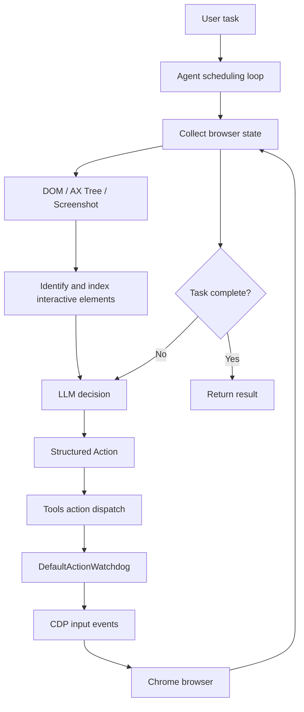
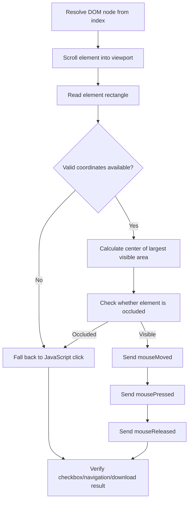
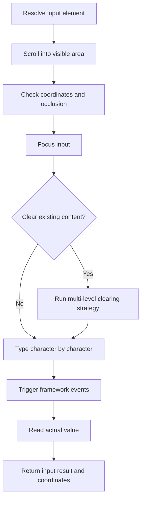

# Technical Implementation of Browser Interaction Simulation

This document explains how Browser Use understands web pages, plans actions, and executes mouse,
keyboard, and scrolling events through the Chrome DevTools Protocol (CDP).

In this context, “simulating human interaction” mainly means:

1. Deciding the next action from page semantics and visual state, as a person would.
2. Preferentially using native browser input events for clicking, typing, and scrolling.
3. Observing the page again and verifying the result after every action.

It is not a complete simulator of human behavioral biometrics. The current implementation does not
include randomized mouse paths, human speed distributions, or complete browser-fingerprint
spoofing.

## 1. Technical Goal

The system receives a natural-language task, for example:

> Open the target website, enter Browser Use in the search box, click Search, and return the first
> result.

The system must automatically:

1. Obtain the current page state.
2. Identify elements that can be clicked, typed into, or scrolled.
3. Send the page state and user task to a large language model.
4. Receive and validate the model's structured action.
5. Convert that action into CDP mouse, keyboard, or scrolling events.
6. Obtain the page state again and check whether the action succeeded.
7. Repeat until the task is complete or a termination condition is reached.

## 2. Overall Architecture


```mermaid
flowchart TD
    A["User task"] --> B["Agent scheduling loop"]
    B --> C["Collect browser state"]
    C --> D["DOM / AX Tree / Screenshot"]
    D --> E["Identify and index interactive elements"]
    E --> F["LLM decision"]
    F --> G["Structured Action"]
    G --> H["Tools action dispatch"]
    H --> I["DefaultActionWatchdog"]
    I --> J["CDP input events"]
    J --> K["Chrome browser"]
    K --> C
    C --> L{"Task complete?"}
    L -- "No" --> F
    L -- "Yes" --> M["Return result"]
```

The system has five primary layers:

| Layer | Responsibility | Main modules |
| --- | --- | --- |
| Perception | Obtain DOM, accessibility tree, layout, and screenshot | `DOMWatchdog`, `DomService` |
| Elements | Identify and index interactive elements | `ClickableElementDetector`, DOM serializer |
| Decision | Generate the next action from the task and page state | `Agent`, LLM, system prompt |
| Actions | Validate action arguments and dispatch browser events | `Tools`, Pydantic action models |
| Execution | Execute mouse, keyboard, and scrolling input through CDP | `DefaultActionWatchdog` |

## 3. Agent Execution Loop

A single Agent step can be summarized as:

```python
async def step():
    browser_state = await collect_browser_state()
    model_context = build_model_context(browser_state)
    model_output = await llm.decide(model_context)
    actions = validate_actions(model_output)
    action_results = await execute_actions(actions)
    await verify_page_changes(action_results)
```

Primary call sites in the project:

- [`Agent.step()`](browser_use/agent/service.py#L1025): single-step scheduling entry point.
- [`Agent._prepare_context()`](browser_use/agent/service.py#L1079): obtains browser state and builds
  model context.
- [`Agent._get_next_action()`](browser_use/agent/service.py#L1167): calls the model to generate an
  action.
- [`Agent._execute_actions()`](browser_use/agent/service.py#L1203): executes actions returned by the
  model.

The essential property of the execution loop is that it observes the page again after every group of
actions, avoiding continued use of stale DOM data and element indices.

## 4. Page Perception

### 4.1 Obtain DOM and Screenshot in Parallel

A browser-state request builds DOM state and captures the current viewport concurrently:

```python
dom_task = build_dom_tree()
screenshot_task = capture_screenshot()

dom_state, screenshot = await asyncio.gather(
    dom_task,
    screenshot_task,
)
```

The corresponding implementation is in
[`DOMWatchdog.on_BrowserStateRequestEvent()`](browser_use/browser/watchdogs/dom_watchdog.py#L241).

The DOM provides precise element identification and location, while the screenshot supplements:

- Canvas content.
- Image and icon semantics.
- Visual dialogs and occlusion.
- Page state that cannot be represented completely by the DOM.

The Agent currently captures a screenshot at every step, but `use_vision` controls whether it is sent
to the model:

- `True`: always send the screenshot.
- `"auto"`: send it only when an action explicitly requests visual information.
- `False`: do not send the screenshot to the model.

### 4.2 DOM Data Sources

The page structure combines multiple CDP data sources:

```text
DOM.getDocument
        +
DOMSnapshot.captureSnapshot
        +
Accessibility.getFullAXTree
        +
JavaScript event-listener information
        ↓
Enhanced DOM Tree
```

Each data source has a distinct role:

| Data source | Purpose |
| --- | --- |
| `DOM.getDocument` | Obtain the complete DOM and pierce open Shadow DOM with `pierce=True` |
| `DOMSnapshot.captureSnapshot` | Obtain element position, size, style, visibility, and paint order |
| `Accessibility.getFullAXTree` | Obtain semantic information such as role, name, focus, and editability |
| JS listener detection | Detect mouse listeners registered by frameworks such as React, Vue, and Angular |

Primary code locations:

- [Obtain the Accessibility Tree](browser_use/dom/service.py#L347)
- [Obtain the DOM Snapshot](browser_use/dom/service.py#L546)
- [Obtain the complete DOM](browser_use/dom/service.py#L559)

## 5. Interactive-Element Detection

The system uses HTML, accessibility properties, event listeners, and layout information to determine
whether an element is interactive.

A simplified version of the logic is:

```python
def is_interactive(node):
    if node.has_js_click_listener:
        return True

    if node.tag_name in {
        "button",
        "input",
        "select",
        "textarea",
        "a",
        "details",
        "summary",
        "option",
    }:
        return True

    if node.accessibility.focusable:
        return True

    if node.accessibility.editable:
        return True

    if node.attributes.get("onclick"):
        return True

    if node.attributes.get("tabindex") is not None:
        return True

    return False
```

The actual implementation is in
[`ClickableElementDetector.is_interactive()`](browser_use/dom/serializer/clickable_elements.py#L4).

Detection also handles:

- `label` and `span` wrappers containing form controls.
- Nonstandard elements with JavaScript click listeners.
- Iframes and scrollable containers.
- ARIA properties such as `focusable`, `editable`, `checked`, and `expanded`.
- Interactive attributes such as `onclick`, `onmousedown`, and `tabindex`.
- Visibility, paint order, and viewport position.

### 5.1 Element Indices

Eligible actionable elements are serialized into an LLM-readable form:

```text
[125]<input placeholder="Search">
[229]<button aria-label="Submit">Search</button>
[418]<a href="/results">View results</a>
```

Indices are stored in a selector map and mapped to enhanced DOM nodes:

```python
selector_map = {
    125: EnhancedDOMTreeNode(...),
    229: EnhancedDOMTreeNode(...),
    418: EnhancedDOMTreeNode(...),
}
```

The model references only the index and does not need to generate fragile CSS selectors or XPath.

## 6. Model Context and Action Decisions

The page information sent to the model primarily contains:

- The original user task.
- Current URL, title, and tabs.
- The amount of scrollable content above and below the current page.
- Serialized interactive elements.
- The previous action and its result.
- An optional screenshot.
- Schemas for currently available actions.

Page-state text is constructed in
[`AgentMessagePrompt._get_browser_state_description()`](browser_use/agent/prompts.py#L223).

The model may generate an action such as:

```json
{
  "thinking": "The search box is element 125. Enter the query and then click Search.",
  "actions": [
    {
      "input": {
        "index": 125,
        "text": "Browser Use",
        "clear": true
      }
    },
    {
      "click": {
        "index": 229
      }
    }
  ]
}
```

## 7. Structured Action Protocol

Action input is validated with Pydantic v2 models to prevent incomplete or incorrectly typed model
arguments.

The core schema can be simplified as:

```python
from pydantic import BaseModel, Field


class ClickAction(BaseModel):
    index: int | None = Field(default=None, ge=1)
    coordinate_x: int | None = None
    coordinate_y: int | None = None


class InputAction(BaseModel):
    index: int = Field(ge=0)
    text: str
    clear: bool = True


class ScrollAction(BaseModel):
    down: bool = True
    pages: float = 1.0
    index: int | None = None


class SendKeysAction(BaseModel):
    keys: str
```

Actual definitions are in [`browser_use/tools/views.py`](browser_use/tools/views.py).

`Tools` converts actions into browser events:

```text
click  → ClickElementEvent / ClickCoordinateEvent
input  → TypeTextEvent
scroll → ScrollEvent
keys   → SendKeysEvent
```

Events are ultimately handled by
[`DefaultActionWatchdog`](browser_use/browser/watchdogs/default_action_watchdog.py).

## 8. Mouse-Click Simulation

### 8.1 Click Flow


```mermaid
flowchart TD
    A["Resolve DOM node from index"] --> B["Scroll element into viewport"]
    B --> C["Read element rectangle"]
    C --> D{"Valid coordinates available?"}
    D -- "No" --> J["Fall back to JavaScript click"]
    D -- "Yes" --> E["Calculate center of largest visible area"]
    E --> F["Check whether element is occluded"]
    F -- "Occluded" --> J
    F -- "Visible" --> G["Send mouseMoved"]
    G --> H["Send mousePressed"]
    H --> I["Send mouseReleased"]
    I --> K["Verify checkbox/navigation/download result"]
    J --> K
```

### 8.2 Scroll Into the Visible Area

Before clicking, the system calls:

```python
await cdp.send.DOM.scrollIntoViewIfNeeded(
    params={"backendNodeId": backend_node_id},
    session_id=session_id,
)
```

Implementation: [scroll element into the visible
area](browser_use/browser/watchdogs/default_action_watchdog.py#L765).

Element coordinates are read again after scrolling to avoid using a stale pre-scroll position.

### 8.3 Calculate Click Coordinates

The system:

1. Obtains the element rectangle or quad.
2. Calculates the intersection of the element and viewport.
3. Selects the quad with the largest visible area.
4. Calculates the center of the quad.
5. Clamps coordinates to the viewport.

```python
center_x = sum(quad[i] for i in range(0, 8, 2)) / 4
center_y = sum(quad[i] for i in range(1, 8, 2)) / 4

center_x = max(0, min(viewport_width - 1, center_x))
center_y = max(0, min(viewport_height - 1, center_y))
```

Implementation: [calculate visible area and center
point](browser_use/browser/watchdogs/default_action_watchdog.py#L829).

### 8.4 Occlusion Detection

Before clicking, `document.elementFromPoint(x, y)` checks the actual element under the target
coordinate.

The following are treated as clickable hits:

- The target itself.
- A child of the target.
- A parent containing the target.
- A semantically associated `label` or `input`.

If a modal, cookie dialog, or other element obscures the target, the system attempts a JavaScript
click fallback.

Implementation: [element occlusion
detection](browser_use/browser/watchdogs/default_action_watchdog.py#L565).

### 8.5 CDP Mouse Events

A normal click sends:

```python
await cdp.send.Input.dispatchMouseEvent(
    params={
        "type": "mouseMoved",
        "x": center_x,
        "y": center_y,
    },
    session_id=session_id,
)
await asyncio.sleep(0.05)

await cdp.send.Input.dispatchMouseEvent(
    params={
        "type": "mousePressed",
        "x": center_x,
        "y": center_y,
        "button": "left",
        "clickCount": 1,
    },
    session_id=session_id,
)
await asyncio.sleep(0.08)

await cdp.send.Input.dispatchMouseEvent(
    params={
        "type": "mouseReleased",
        "x": center_x,
        "y": center_y,
        "button": "left",
        "clickCount": 1,
    },
    session_id=session_id,
)
```

Implementation: [execute a CDP coordinate
click](browser_use/browser/watchdogs/default_action_watchdog.py#L902).

### 8.6 Click Fallback Strategy

```text
CDP coordinate click
    ↓ Coordinates unavailable or element occluded
JavaScript element.click()
    ↓ Still unsuccessful
Return ActionResult(error=...)
```

The JavaScript click fallback is in
[`_click_element_node_impl()`](browser_use/browser/watchdogs/default_action_watchdog.py#L799).

For checkboxes and radio buttons, the system also reads `checked` before and after the click. If a
CDP click does not change the state, it calls `element.click()` again.

## 9. Keyboard-Input Simulation

### 9.1 Input Flow


```mermaid
flowchart TD
    A["Resolve input element"] --> B["Scroll into visible area"]
    B --> C["Check coordinates and occlusion"]
    C --> D["Focus input"]
    D --> E{"Clear existing content?"}
    E -- "Yes" --> F["Run multi-level clearing strategy"]
    E -- "No" --> G["Type character by character"]
    F --> G
    G --> H["Trigger framework events"]
    H --> I["Read actual value"]
    I --> J["Return input result and coordinates"]
```

### 9.2 Focus the Input

The system first attempts to focus the element through CDP or JavaScript. If ordinary focus fails, it
clicks the center coordinates of the element.

Implementation:
[`_focus_element_simple()`](browser_use/browser/watchdogs/default_action_watchdog.py#L1539).

### 9.3 Clear Existing Content

`clear=True` by default. Clearing attempts, in order:

```text
Clear value / textContent through JavaScript
        ↓ Failure
Triple-click + Delete
        ↓ Failure
Command/Ctrl + A + Backspace
```

These strategies support:

- Ordinary `input` and `textarea` elements.
- `contenteditable`.
- React controlled components.
- Custom Web Components.
- Specialized input plugins.

### 9.4 Per-Character Keyboard Events

Ordinary characters are entered in this order:

```text
keyDown → wait 5ms → char → keyUp → wait 1ms
```

```python
await cdp.send.Input.dispatchKeyEvent(
    params={
        "type": "keyDown",
        "key": base_key,
        "code": key_code,
        "modifiers": modifiers,
        "windowsVirtualKeyCode": virtual_key_code,
    },
    session_id=session_id,
)

await asyncio.sleep(0.005)

await cdp.send.Input.dispatchKeyEvent(
    params={
        "type": "char",
        "text": character,
        "key": character,
    },
    session_id=session_id,
)

await cdp.send.Input.dispatchKeyEvent(
    params={
        "type": "keyUp",
        "key": base_key,
        "code": key_code,
        "modifiers": modifiers,
        "windowsVirtualKeyCode": virtual_key_code,
    },
    session_id=session_id,
)

await asyncio.sleep(0.001)
```

Implementation: [per-character
input](browser_use/browser/watchdogs/default_action_watchdog.py#L1834).

For uppercase letters and special characters, the system calculates modifiers such as Shift:

```text
A → Shift + A
! → Shift + 1
@ → Shift + 2
```

Newlines are converted into a complete Enter-key event sequence.

### 9.5 Frontend Framework Compatibility

After input completes, the system additionally triggers events required by frontend frameworks:

```javascript
element.dispatchEvent(new Event("input", { bubbles: true }));
element.dispatchEvent(new Event("change", { bubbles: true }));
```

It then reads `element.value` or `element.textContent` to confirm the actual input.

Implementation:

- [Trigger framework events](browser_use/browser/watchdogs/default_action_watchdog.py#L1976)
- [Read and verify the input value](browser_use/browser/watchdogs/default_action_watchdog.py#L1981)

## 10. Scrolling Simulation

### 10.1 Page Scrolling

Page scrolling first converts pages into pixels:

```python
pixels = pages * viewport_height
```

It then invokes a CDP scrolling gesture at the center of the viewport:

```python
await cdp.send.Input.synthesizeScrollGesture(
    params={
        "x": viewport_width / 2,
        "y": viewport_height / 2,
        "xDistance": 0,
        "yDistance": -pixels,
        "speed": 50000,
    },
    session_id=session_id,
)
```

Implementation:
[`_scroll_with_cdp_gesture()`](browser_use/browser/watchdogs/default_action_watchdog.py#L2175).

Although this sends a real scrolling-gesture event, `speed=50000` makes the scroll nearly
instantaneous and does not resemble ordinary human scrolling speed.

### 10.2 Scrolling an Element Container

The model can identify a scrollable element:

```json
{
  "scroll": {
    "down": true,
    "pages": 1,
    "index": 512
  }
}
```

The system reads the element's center coordinates and sends a wheel event at that position:

```python
await cdp.send.Input.dispatchMouseEvent(
    params={
        "type": "mouseWheel",
        "x": center_x,
        "y": center_y,
        "deltaX": 0,
        "deltaY": pixels,
    },
    session_id=session_id,
)
```

Implementation:
[`_scroll_element_container()`](browser_use/browser/watchdogs/default_action_watchdog.py#L2228).

### 10.3 Multi-Page Scrolling

A multi-page scroll is split into complete pages:

```text
Scroll one page → wait 150ms
Scroll one page → wait 150ms
Scroll one page → wait 150ms
```

Implementation: [scroll action](browser_use/tools/service.py#L1367).

### 10.4 Current Scroll-Fallback Issue

`_scroll_with_cdp_gesture()` returns `False` on failure, and the log states that it will fall back to
JavaScript scrolling. However, the current `on_ScrollEvent()` call path does not check that return
value, so the JavaScript fallback for main-page scrolling never actually runs.

It can be completed as follows:

```python
success = await self._scroll_with_cdp_gesture(pixels)
if not success:
    await self._scroll_with_javascript(pixels)
```

## 11. Special Keys and Shortcuts

`SendKeysEvent` supports:

- `Enter`
- `Tab`
- `Escape`
- `PageUp` / `PageDown`
- `ArrowUp` / `ArrowDown`
- `Control+A`
- `Meta+A`
- `Shift+Tab`

Key combinations are decomposed into:

```text
Press modifier keys
    ↓
Press primary key
    ↓
Release primary key
    ↓
Release modifier keys in reverse order
```

Implementation:
[`on_SendKeysEvent()`](browser_use/browser/watchdogs/default_action_watchdog.py#L2446).

## 12. Page-Change Detection

The model can return multiple actions at once, for example:

```text
Enter username
Enter password
Click Log in
```

The system observes page state before and after each action. It stops remaining actions and obtains
the page again when it detects:

- A URL change.
- A current-tab change.
- A change in the page's focused target.
- A DOM that no longer corresponds to the old selector map.
- A click that opens a new tab.

Simplified logic:

```python
for action in actions:
    before = await capture_page_identity()
    result = await execute(action)
    after = await capture_page_identity()

    if page_changed(before, after):
        break
```

This prevents the system from continuing to use old element indices after navigation.

The system prompt also requires actions that may change the page to appear last in an action
sequence. See [`system_prompt.md`](browser_use/agent/system_prompts/system_prompt.md).

## 13. Action-Result Verification

The system does not assume a business action succeeded merely because the CDP call succeeded.

Different actions have different verification methods:

| Action | Verification |
| --- | --- |
| Click | Check URL, tabs, DOM, download, or checkbox state |
| Input | Read back `value` or `textContent` |
| Scroll | Clear the DOM cache and rebuild currently visible elements |
| Download | Observe download start, progress, and completion events |
| New tab | Compare target IDs before and after the click and switch automatically |

On the next turn, the model also sees the previous `ActionResult` and uses it together with the new
DOM or screenshot to decide whether to continue, retry, or choose another path.

## 14. Interaction Timing

Default timing configuration:

```python
minimum_wait_page_load_time = 0.25
wait_for_network_idle_page_load_time = 0.5
wait_between_actions = 0.1
```

Definition: [BrowserProfile page-timing
configuration](browser_use/browser/profile.py#L678).

Other fixed delays:

| Scenario | Default delay |
| --- | ---: |
| Element scroll completion | 50ms |
| Mouse move to press | 50ms |
| Mouse press to release | 80ms |
| Ordinary-character keyDown to char | 5ms |
| Inter-character interval | 1ms |
| Multi-page scroll interval | 150ms |

These delays primarily guarantee browser event ordering and page stability; they are not randomized
from human behavior distributions.

## 15. Basic Anti-Automation Configuration

Local Chrome startup includes some basic handling of automation signals:

```text
Remove --enable-automation
Add --disable-blink-features=AutomationControlled
Retain browser-extension support
Keep scrollbars visible
Allow configuration of the user-data directory and a real browser Profile
```

Relevant locations:

- [Chrome default arguments](browser_use/browser/profile.py#L140)
- [Ignore Playwright default automation arguments](browser_use/browser/profile.py#L426)

Default extensions can also handle ads and cookie dialogs, reducing occlusion for the Agent.

These settings are not equivalent to complete browser-fingerprint spoofing. The current open-source
code does not systematically simulate:

- Canvas fingerprint.
- WebGL fingerprint.
- Font set.
- Audio fingerprint.
- Combinations of hardware concurrency and device memory.
- Long-term consistent human behavior traces.

## 16. Minimal Usage Example

Upstream users do not need to work directly with CDP. They can run tasks through `Agent`.
`ChatBrowserUse` is recommended by default for browser-automation tasks:

```python
import asyncio

from browser_use import Agent, Browser, ChatBrowserUse


async def main() -> None:
    browser = Browser(
        headless=False,
        window_size={"width": 1280, "height": 900},
    )

    agent = Agent(
        task="""
        1. Open https://example.com
        2. Find the search box and enter Browser Use
        3. Click the search button
        4. Return the first search result
        """,
        llm=ChatBrowserUse(),
        browser=browser,
        use_vision="auto",
    )

    history = await agent.run(max_steps=30)

    print(history.final_result())
    print(history.action_names())
    print(history.urls())


if __name__ == "__main__":
    asyncio.run(main())
```

## 17. Current Capabilities

Currently implemented:

- Combined DOM, accessibility-tree, and visual perception.
- Semantic detection and stable indexing of interactive elements.
- CDP mouse, keyboard, and wheel events.
- Element-occlusion detection.
- Iframe and Shadow DOM support.
- Input-event compatibility with frameworks such as React, Vue, and Angular.
- Page-change detection.
- New-tab detection.
- Download observation.
- Action-result verification.
- Failure fallbacks and retries.

Not yet fully implemented:

- Bézier mouse trajectories.
- Mouse acceleration and deceleration models.
- Random click positions inside an element.
- Random typing speeds that follow human distributions.
- Advanced behavior patterns such as hesitation, review, and correction.
- Complete local browser-fingerprint simulation.

## 18. Optional Human-Behavior Enhancement Design

If a use case genuinely requires a more human-like interaction cadence, a
`HumanInteractionPolicy` can be added above the existing execution layer:

```python
from pydantic import BaseModel, Field


class HumanInteractionPolicy(BaseModel):
    enabled: bool = False
    mouse_move_duration_min: float = Field(default=0.12, ge=0)
    mouse_move_duration_max: float = Field(default=0.45, ge=0)
    key_delay_min: float = Field(default=0.04, ge=0)
    key_delay_max: float = Field(default=0.16, ge=0)
    click_hold_min: float = Field(default=0.05, ge=0)
    click_hold_max: float = Field(default=0.14, ge=0)
    click_position_jitter_ratio: float = Field(default=0.15, ge=0, le=0.45)
```

Possible extensions include:

1. Generate multiple `mouseMoved` segments from a cubic Bézier curve.
2. Choose a random click position within the element's safe area.
3. Generate different key intervals based on character type.
4. Add brief pauses to long text without changing its content.
5. Split long-distance scrolling into multiple wheel events with changing speeds.
6. Give all randomized behavior a reproducible seed for testing and debugging.

These enhancements should be explicitly opt-in and must not replace the existing deterministic
execution path; otherwise they would reduce the stability and reproducibility of automation tests.

## 19. Implementation Summary

Browser Use interaction simulation can be summarized as:

```text
The LLM decides what to do “like a person”
             +
CDP executes “like a browser's real input device”
             +
State reconstruction observes the result “like a person”
```

A more precise technical definition is therefore:

> A semantic browser interaction system based on LLM decisions, enhanced DOM perception, and native
> CDP input events.
