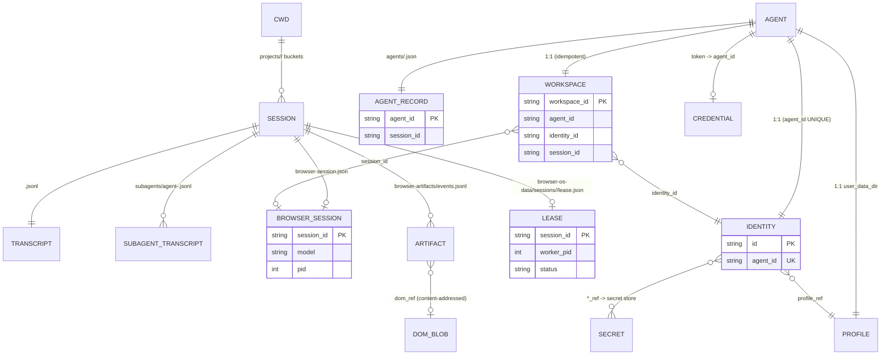

# Tabvis Data Model — file system & database

How tabvis persists state on disk: conversation sessions, browser sessions, workspaces, identities,
profiles, secrets, the SQLite metadata store, and the smaller caches — and how they relate.

> Scope: **the current implementation**, with `file:line` citations. Where the code only *scaffolds*
> a design target that nothing writes to yet, it is flagged **⚠ scaffolding**. Everything here lives
> under one **config home**.

---

## 1. Config home

Everything is rooted at the **config home**:

```
<config-home> = $TABVIS_CONFIG_DIR  or  ~/.tabvis        (NFC-normalized)
```

Resolved by `get_tabvis_config_home_dir` (`tabvis/utils/env_utils.py:9`). The directory is never
created up front — each subsystem `mkdir`s its own subtree lazily on first write (usually mode `0o700`).

**One exception:** the *personal* workflow dir is hardcoded to `~/.tabvis/workflows` and does **not**
honor `TABVIS_CONFIG_DIR` (`tabvis/agent/workflows/storage.py:33`).

## 2. Source of truth vs. the SQLite shadow

Two durability layers, and the distinction matters everywhere below:

- **JSON / JSONL sidecar files are the source of truth.** Every persisted record is a file.
- **`runtime.db` (SQLite) is a best-effort _shadow_** (PERS-2). Every DB write is wrapped so a failure
  is logged and swallowed — the file write already happened (`tabvis/browser/persistence/db.py:5`).
  Controlled by `TABVIS_BROWSER_SQLITE` (default **on**); turning it off makes every DB op a no-op
  with zero behavioral change (`db.py:90`). A later phase (PERS-3) will flip SQLite to the *read*
  authority for agent cold-load, with JSON as fallback.

Each SQLite table keeps the queryable columns **plus a full `data` JSON blob**, so a record
round-trips losslessly while staying indexable (`db.py:9`). Reads return `json.loads(data)`, never the
columns. `runtime.db` never deletes rows — only upsert/append.

## 3. The five keying axes

Almost every path/record is keyed by one of these. Keep them straight — they are the backbone of every
relation in §8.

| Key | What it is | Example | Scope |
|---|---|---|---|
| **cwd** | the working directory, sanitized (`[^A-Za-z0-9]→'-'`, truncated + djb2-hashed if > 200) | `-Users-me-tabvis` | per project, cross-session |
| **session_id** | a per-run UUID minted at startup (`bootstrap/state.py`), reused on `--resume` | `dbec7918-…` | one run |
| **agent_id** | `ag_<hex8>` — one per agent run; the **spine** of the browser data model | `ag_73ee2032` | one agent |
| **workspace_id** | `ws_<hex16>` — an agent's live "what it's doing" record | `ws_1a2b…` | 1:1 with agent |
| **identity_id** | `id_<hex16>` — a durable browser identity (cookies/logins/fingerprint) | `id_9f8e…` | 1:1 with agent |
| **global** | one file, no key | `agent-credentials.json` | machine-wide |

## 4. Top-level layout

```
<config-home>/                              # ~/.tabvis (or $TABVIS_CONFIG_DIR)
├── projects/                               # ── conversation + per-session state (§5, §6) ──
│   └── <sanitized-cwd>/
│       ├── <session_id>.jsonl              # conversation transcript (append-only)      [REAL]
│       ├── <session_id>/                   # per-session sidecar directory
│       │   ├── browser-session.json        # agent↔browser pairing record               [REAL]
│       │   ├── browser-artifacts/
│       │   │   ├── events.jsonl            # browser action audit/replay log            [REAL]
│       │   │   ├── dom/<sha256[:16]>.html  # content-addressed page DOM blobs           [REAL]
│       │   │   └── replay.json             # semantic timeline                    [⚠ off by default]
│       │   ├── subagents/agent-<id>.jsonl  # subagent transcripts (+ .meta.json)        [REAL]
│       │   ├── remote-agents/…meta.json    # remote-task sidecars                       [REAL]
│       │   ├── workspace/                   # browser downloads + fetched web PDFs        [REAL]
│       │   └── tool-results/               # large tool outputs
│       └── memory/                         # auto-memory: MEMORY.md + <topic>.md        [REAL]
├── browser-os-data/                        # ── "Browser OS" tree (§7) ──
│   ├── runtime.db                          # SQLite metadata shadow (5 tables)          [REAL]
│   ├── sessions/<session_id>/lease.json    # browser-session crash-recovery lease       [REAL]
│   ├── identities/<identity_id>/           #                                      [⚠ scaffolding]
│   ├── workspaces/<workspace_id>/          #                                      [⚠ scaffolding]
│   └── logs/                               #                                      [⚠ scaffolding]
├── browser[/-<engine>]/                    # Chromium persistent profile (cookies/logins) [REAL]
│   └── profiles/<slug>/                    # per-agent / named profile dirs               [REAL]
├── browser-identities/<agent_id>.json      # BrowserIdentity sidecar (§7.4)             [REAL]
├── browser-secrets.json                    # secret store (plaintext, 0600) OR keychain [⚠ empty by default]
├── agents/<agent_id>.json                  # AgentRecord registry (§7.5)                [REAL]
├── agent-credentials.json                  # token → agent_id (RT-3)                    [on register]
├── image-cache/<session_id>/<id>.<ext>     # pasted-image cache                         [REAL]
├── session-env/<session_id>/*.sh           # hook env fragments                         [REAL]
├── cache/model-capabilities.json           # model-limits cache                   [⚠ dead: never written]
├── sessions/<pid>.json                     # concurrent-session PID registry      [⚠ not wired]
├── settings.json                           # user/global settings                       [REAL]
└── workflows/ · skills/ · commands/ · agents/ · output-styles/ · plans/ · tasks/ · teams/
                                            # markdown/config + swarm stores (on demand)
```

---

## 5. Conversation sessions (transcripts)

The CLI/agent conversation is stored as append-only JSONL, one file per session, bucketed by cwd.

**`<config-home>/projects/<sanitized-cwd>/<session_id>.jsonl`**
— `get_transcript_path` (`session_storage.py:276`) → `get_project_dir` (`:266`) → `sanitize_path`
(`session_storage_portable.py:352`). Created lazily on the first message; appended via a 100 ms-batched
write queue (mode `0o600`, parent `0o700`). There is **no index file and no database** — the `/resume`
listing is recomputed every time by scanning `projects/`, `stat`-ing files, and scraping the first/last
64 KB of each (`get_session_files_lite`).

**What a line is.** Each line is one JSON object — either a **message envelope** or an **append-only
metadata record**:

- Message line (`_insert_message_chain_impl`, `session_storage.py:882`): `parentUuid`, `isSidechain`,
  `agentId`, then the message (`type` ∈ `user|assistant|attachment|system`, `uuid`, `message{role,
  content}`, `timestamp`), then a stamp: `cwd`, `sessionId`, `version`, `gitBranch`, `slug`.
- Metadata records (each `{type, …, sessionId}`): `custom-title`, `ai-title`, `tag`, `agent-name`,
  `agent-color`, `agent-setting`, `last-prompt`, `summary`, `task-summary`, `pr-link`,
  `worktree-state`, `file-history-snapshot`, `content-replacement`, and a `compact_boundary` marker.

**Sidecars** under `<session_id>/`:

| Path | Keyed by | Contents |
|---|---|---|
| `subagents/agent-<agent_id>.jsonl` | agent_id | subagent (sidechain) transcript |
| `subagents/agent-<agent_id>.meta.json` | agent_id | agent metadata (e.g. `agentType`) |
| `remote-agents/remote-agent-<task_id>.meta.json` | task_id | remote-task metadata |

**Off switches:** `TABVIS_SKIP_PROMPT_HISTORY`, `settings.cleanupPeriodDays = 0`, or `NODE_ENV=test`
disable local persistence entirely (`_should_skip_persistence`, `session_storage.py:809`).

## 6. Browser session & artifacts (per session)

Living **inside** the per-session dir, these capture what the browser did during the run.

### 6.1 `browser-session.json` — the agent↔browser pairing

`get_browser_session_path` (`browser/session.py:105`). Written atomically (tmp + `os.replace`) on every
lifecycle change and navigation; finalized with `ended_at`/`status` at close.

`BrowserSessionRecord` (`session.py:51`):

| Field | Type | Notes |
|---|---|---|
| `agent` | `AgentInfo` | `{session_id, model, cwd, pid, started_at}` — **no `agent_id`** |
| `status` | str | `launching → ready → closed` (or `failed`) |
| `browser` | dict\|null | engine/kernel/mode/profile_dir/viewport/… — **credential-free** (proxy pw stripped, license → bool), because it is also served over the unauthenticated API (`browser_service.py:560`) |
| `tabs` | list | `{index, url, active}` |
| `history` | list | `{url, title, at}`, capped at 500 |
| `ended_at`, `error` | str\|null | set at close / on failed launch |

### 6.2 `browser-artifacts/` — the browsing trail (default on, `TABVIS_BROWSER_ARTIFACTS`)

- **`events.jsonl`** — append-only, one action per line (`artifacts.py`): `seq` (1-based monotonic),
  `ts`, `agent_id`, `workspace_id`, `type` (`navigation|page|interaction|download`), `action`, `url`,
  `title`, `tab_count`, optional `interaction`, `dom_ref`, `dom_bytes`. Typed text is **redacted by
  default** — the `interaction` keeps only `text_len`; set `TABVIS_BROWSER_ARTIFACTS_INCLUDE_INPUT=1`
  to persist the (truncated) text, and even then card-number / token-looking values are always
  stripped. A `download` event records `filename`, `path_ref`, `sha256`, `size_bytes`, `policy_effect`,
  `policy_rule_id`, and `quarantined` — a reference + hash, never the file's bytes.
- **`dom/<hash>.html`** — the page HTML at each event, **content-addressed** so identical DOMs dedupe
  to one file (`_store_dom_sync`, `artifacts.py:82`). Capped at `TABVIS_BROWSER_ARTIFACTS_MAX_DOM_BYTES`
  (default 1 MB). ⚠ **Gotcha:** the filename is `sha256(html).hexdigest()[:16]` — the first **16 hex
  chars (64-bit prefix)**, *not* the full digest despite the "sha256" name.
- **`replay.json`** — ⚠ only written when `TABVIS_BROWSER_REPLAY` is set (**off** by default); otherwise
  the semantic-observation timeline stays in memory only (`observation.py:125`).

## 7. The Browser-OS tree & SQLite (`browser-os-data/`)

`<config-home>/browser-os-data/` (`persistence/paths.py:27`) is the design's "Browser OS" root. **Today
only two things are actually written here:** `runtime.db` and the session `lease.json`. The
`identities/`, `workspaces/`, `logs/` subtrees are **⚠ scaffolding** — the path helpers resolve them but
no writer calls them (`paths.py:12` — *"Nothing writes into it yet"*). The real state for those lives
elsewhere (noted below).

### 7.1 `runtime.db` — SQLite schema (WAL, `user_version = 1`)

Five tables, each `= indexed columns + a lossless `data` JSON blob`:

| Table | PK | Key columns | Index | JSON source of truth | Writer |
|---|---|---|---|---|---|
| `agents` | `agent_id` | session_id, status, model, profile, created_at, ended_at | `idx_agents_status(status)` | `agents/<agent_id>.json` | `db.upsert_agent` (`db.py:164`) |
| `sessions` | `session_id` | agent_id ⚠, status, engine, updated_at | `idx_sessions_agent(agent_id)` | `browser-session.json` | `db.upsert_session` (`db.py:207`) |
| `browser_identities` | `id` | **agent_id UNIQUE NOT NULL**, status, created_at, updated_at | — | `browser-identities/<agent_id>.json` | `db.upsert_identity` (`db.py:243`) |
| `workspaces` | `workspace_id` | agent_id, identity_id, profile, session_id, created_at | `idx_workspaces_agent(agent_id)` | *(in-memory — DB **is** the durable half)* | `db.upsert_workspace` (`db.py:277`) |
| `artifacts` | `id` AUTOINCREMENT | session_id, agent_id, seq, type, action, url, ts | `idx_artifacts_session(session_id, seq)` | `browser-artifacts/events.jsonl` | `db.insert_artifact` (`db.py:311`, append-only) |

⚠ **`sessions.agent_id` is always NULL** — it is read from `record.agent.agent_id`, but `AgentInfo` has
no `agent_id` field (acknowledged at `db.py:220`). The `browser_identities.agent_id UNIQUE` constraint
is what enforces the **1:1 agent↔identity** invariant.

`PersistenceService` (`persistence/service.py`) is a pass-through facade with **no runtime callers yet**
— the real writers are still called directly. It exists so future phases have one seam.

### 7.2 Session leases — `sessions/<session_id>/lease.json`

Crash recovery for browser sessions (`session_registry.py`). `SessionLease`: `{session_id, agent_id,
worker_pid, lease_id, heartbeat_at, lease_ttl_s=90, status}` (`active|crashed|released`). Written
tmp+replace on acquire/release; `reclaim_crashed` on daemon startup (`server.py:1059`) marks any
`active` lease older than 90 s as `crashed` and returns its `session_id`.

⚠ **The heartbeat is not wired** — `session_registry.heartbeat()` has no caller, so an acquired lease is
never refreshed and any lease older than 90 s is reclaimed as "crashed" on the next daemon startup.

### 7.3 Workspaces — `WorkspaceRecord` (`workspace.py:29`)

A workspace is *what an agent is currently doing*. `{workspace_id (ws_…), agent_id, identity_ref
(=profile user_data_dir), identity_id, profile, session_id, goal, status (active|paused|closed),
created_at}`. **workspace_id ↔ agent_id is 1:1** and `register_workspace` is idempotent per agent.
Persisted **only** to the `workspaces` SQLite table (no JSON sidecar) and re-attached on restart. ⚠
`goal` is always `None` today (WS-5 stub); the per-workspace `workspaces/<id>/{artifacts,checkpoints,
replays}` dir is scaffolding — real artifacts live in the per-session `browser-artifacts/`.

> **Two different "workspace" objects:** `workspace.WorkspaceRecord` (durable metadata, keyed by
> `workspace_id`) vs. the manager's in-process `_Workspace` (the live Chromium, keyed by
> `user_data_dir`, carrying `owner_agent`/`busy_agent`). `init_browser_session` creates both
> (`manager.py:295`).

### 7.4 Identities, profiles & secrets

| Thing | Path | Keyed by | Notes |
|---|---|---|---|
| **BrowserIdentity** | `browser-identities/<agent_id>.json` (+ `browser_identities` table) | **agent_id** | durable per-agent identity: `{agent_id (UNIQUE owner), id (id_…), status, profile/auth/network/environment/permissions}`. Secrets referenced by `*_ref` only, never inline (`identity.py:87`). Note: keyed by **agent_id**, not identity_id, despite the design tree. |
| **IdentityBinding** | *in-memory only* | — | transient per-run acquisition (`bnd_…`); never persisted (`identity.py:121`). |
| **Chromium profile** | `<config-home>/browser[-<engine>]/` and `…/profiles/<slug>/` | agent/profile name (1:1 with agent) | the **real** cookies/logins/tabs on disk. `resolve_profile_dir` (`manager.py:148`): `default → base`, else `<base>/profiles/<slug>`. Engine suffix (`browser-cloak`, …) prevents cross-build collisions. Override: `TABVIS_BROWSER_USER_DATA_DIR`. |
| **Secret store** | macOS Keychain / system keyring **or** `browser-secrets.json` (0600, **plaintext** fallback) | global (by `sec_<hex16>`) | holds the plaintext behind every `*_ref`. **Secure backend by default** (`secret_store._resolve_backend`): macOS → Keychain, else the `keyring` package's system store if installed, else the 0600 file. Force with `TABVIS_SECRET_BACKEND=file\|keychain\|keyring`. `has_secure_backend()` gates storage-state export. `identity_store.delete_identity` cascades secret deletion. |

⚠ The design's `browser-os-data/identities/<identity_id>/{profile.snapshot, storage-state.enc}` is
**never written**. There is no encrypted `storage-state.enc` file; the functional analogue is a
`storage_state` envelope (`{version, exported_at, storage_state}`) stored as a `sec_ref` via
`identity_store.export_identity_state` — encrypted at rest only under a secure backend, and refused
outright when none is present (unless `TABVIS_ALLOW_INSECURE_STORAGE_STATE=1`). It is an **explicit,
gated export/import**, not auto-loaded at launch: the persistent Chromium profile stays the single
live auth source (issue #7).

### 7.5 Agent registry & credentials

- **`agents/<agent_id>.json`** — `AgentRecord` (`registry.py:47`), the source of truth for a run:
  `{agent_id (ag_…), session_id, status (queued|running|completed|failed|cancelled), prompt, model,
  max_turns, profile, cwd, created_at/started_at/ended_at, turns, tool_calls, result, error, is_error,
  browser}`. Shadowed to the `agents` table (the read authority on cold-load, JSON fallback +
  backfill). A persisted non-terminal record is normalized to `failed` ("interrupted") on restart.
- **`agent-credentials.json`** — flat `{ "cred_<token>": "<agent_id>" }` (RT-3). Presented in the
  `x-tabvis-agent-credential` header; additive (no credential ⇒ still unauthenticated). Materializes
  only once an agent registers.

## 8. Relations

The join keys tie it together — **`agent_id` is the spine of the browser model; `session_id` is the
spine of the conversation/run**, and `cwd` buckets everything.



In prose:

- **A run** has one `session_id` (the transcript file, the sidecar dir, the browser-session record, the
  artifacts, and the crash-recovery lease all share it) and one driving `agent_id`.
- **`agent_id` is the durable browser spine:** `AgentRecord.agent_id` → `BrowserIdentity.agent_id`
  (UNIQUE, 1:1) → `WorkspaceRecord.agent_id` (1:1) → `PROFILE` dir (1:1) → every `artifact.agent_id`.
- **A workspace** joins the two spines: it carries `agent_id`, `identity_id`, and `session_id`, so it is
  the record that says "agent X, using identity/profile Y, is driving browser session Z."
- **Secrets** are global and reached only by indirection: an identity stores `*_ref` values; the
  plaintext lives in the secret store. Agents see refs, never secrets.
- **cwd** is the outer bucket: `projects/<cwd>/` contains every `<session_id>` for that directory, and
  auto-memory keys off the same sanitized cwd (git root) so it persists across conversations.
- ⚠ **Known break:** `sessions.agent_id` (SQLite) is always NULL because `AgentInfo` carries no
  `agent_id` — cross-referencing a browser session to its agent goes through `session_id`, not this
  column.

## 9. Smaller stores

| Store | Path | Keyed by | Real? |
|---|---|---|---|
| Download workspace | `projects/<cwd>/<session_id>/workspace/` (browser downloads + fetched web PDFs); override `TABVIS_WORKSPACE_DIR` | session_id | ✅ collision-free names |
| Pasted images | `image-cache/<session_id>/<id>.<ext>` (raw bytes, 0600) | session_id | ✅ old dirs pruned |
| Hook env | `session-env/<session_id>/<event>-hook-<index>.sh` | session_id | ✅ |
| Auto-memory | `projects/<sanitize(git-root\|cwd)>/memory/` — `MEMORY.md` index + `<topic>.md` | cwd | ✅ default on |
| Model-limits cache | `cache/model-capabilities.json` | global | ⚠ **dead** — eligibility hardcoded `False`; never written/read |
| Concurrent-session PIDs | `sessions/<pid>.json` | pid/cwd | ⚠ **not wired** — no callers in this build |
| Workflows | `~/.tabvis/workflows/*.py` (personal, ignores `TABVIS_CONFIG_DIR`) + `<cwd>/.tabvis/workflows/*.py` (project) | cwd | on save |
| Settings | `<config-home>/settings.json` (user) · `<cwd>/.tabvis/settings.json` (project) · `…/settings.local.json` (local, gitignored) | global/project | ✅ |
| Swarm | `tasks/<list-id>/<task>.json`, `teams/<team>/config.json` | session/team | on swarm use |
| Custom agents/skills/commands | `agents/*.md`, `skills/`, `commands/`, `output-styles/`, `plans/` | global | user-provided |

## 10. Real vs. scaffolding — quick reference

| Populated **today** | ⚠ Scaffolding / not wired |
|---|---|
| `projects/<cwd>/<session_id>.jsonl` + sidecars | `browser-os-data/{identities,workspaces,logs}/` subtrees |
| `browser-session.json`, `browser-artifacts/{events.jsonl,dom/}` | `browser-artifacts/replay.json` (needs `TABVIS_BROWSER_REPLAY`) |
| `runtime.db` (all 5 tables) + `sessions/<id>/lease.json` | lease **heartbeat** (never refreshed → 90 s staleness) |
| `browser-identities/<agent_id>.json`, Chromium profiles | secret store (`browser-secrets.json`/keychain) — no default callers |
| `agents/<agent_id>.json`, `agent-credentials.json` (on register) | `sessions/<pid>.json` PID registry, `PersistenceService` facade |
| `image-cache/`, `session-env/`, `memory/`, `settings.json`, `workflows/` | `cache/model-capabilities.json` (eligibility `False`) |

## 11. Environment knobs affecting storage

| Env var | Effect |
|---|---|
| `TABVIS_CONFIG_DIR` | config home (default `~/.tabvis`). Honored everywhere **except** the personal `workflows/` dir |
| `TABVIS_BROWSER_SQLITE` | master switch for `runtime.db` (default on); off ⇒ JSON-only, no behavior change |
| `TABVIS_BROWSER_USER_DATA_DIR` | override the Chromium profile base dir |
| `TABVIS_BROWSER_ARTIFACTS` / `_DOM` / `_MAX_DOM_BYTES` | artifact recording, DOM capture, DOM cap |
| `TABVIS_BROWSER_ARTIFACTS_INCLUDE_INPUT` / `_REDACT_INPUT` | persist typed text (default off → redacted) / force redaction |
| `TABVIS_BROWSER_REPLAY` | write `replay.json` (default off) |
| `TABVIS_SECRET_BACKEND` | force the secret backend: `file` \| `keychain` \| `keyring` (blank = auto; secure by default) |
| `TABVIS_ALLOW_INSECURE_STORAGE_STATE` | permit storage-state export to the plaintext 0600 file when no secure backend is present |
| `TABVIS_SKIP_PROMPT_HISTORY`, `settings.cleanupPeriodDays=0` | disable conversation persistence |
| `TABVIS_MEMORY_PATH_OVERRIDE`, `TABVIS_REMOTE_MEMORY_DIR`, `TABVIS_DISABLE_AUTO_MEMORY` | auto-memory location / disable |

---

*Generated from the implementation; key claims cite `file:line`. If code moves, re-verify against
`tabvis/browser/persistence/`, `tabvis/browser/session.py`, `tabvis/browser/workspace.py`,
`tabvis/browser/identity_store.py`, and `tabvis/utils/session_storage.py`.*
