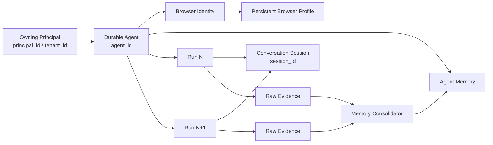
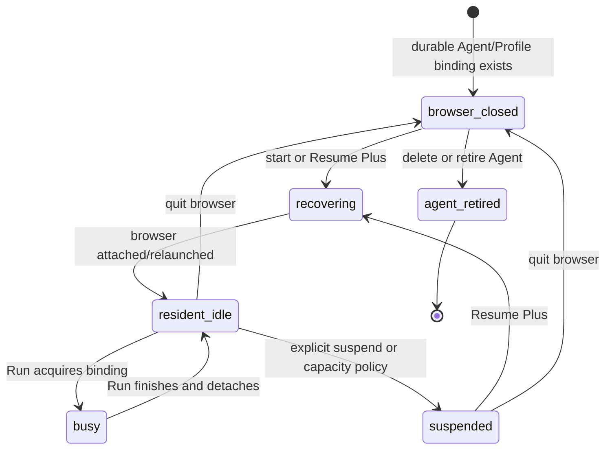
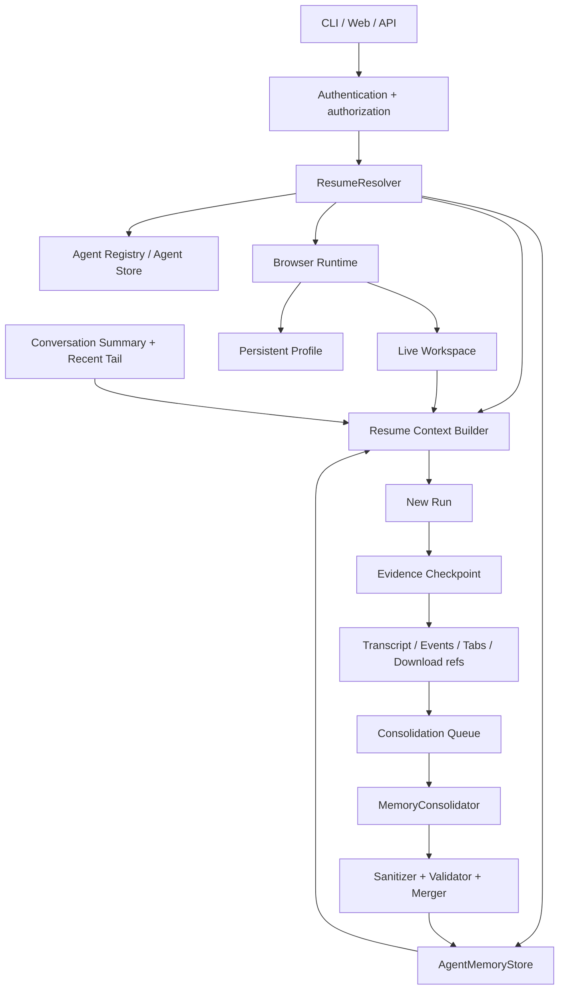

# Tabvis Resume Plus and Agent Browser Memory Design

> Status: Draft v0.1
> Audience: Tabvis maintainers and code agents implementing the feature incrementally
> Scope: Resume Plus, durable Agent continuity, resident-browser recovery, and historical-session
> consolidation into agent-scoped memory
> Related documents: [Agent Gateway design](AGENT_GATEWAY_DESIGN.md),
> [current data model](DATA_MODEL.md), [feature overview](FEATURES.md), and
> [runtime guide](RUNNING.md)

> **Implementation status.** This is a target design; most of it is not built yet. The parts that
> exist today are the Phase 0 security prerequisites: artifact typed-input redaction defaults to on
> (only `text_len` is recorded unless `TABVIS_BROWSER_ARTIFACTS_INCLUDE_INPUT=1`, and card/token-like
> values are always stripped), `BrowserDownload` maps explicitly to `browser.download`,
> click-triggered downloads are policy-judged and quarantined when not cleared, downloads are recorded
> as `type=download` audit artifacts, and the deterministic URL / excluded-origin **memory sanitizer**
> (`tabvis/agent/mem/sanitizer.py`) is implemented with adversarial tests. Everything else below —
> the resolver, Run envelopes, the revisioned MemoryStore, consolidation, the Context provider, and
> resident-browser leasing — remains to be built along the phased plan in §19.

---

## 0. Document contract

This is a target design, not a statement that every feature described here already exists. The
following labels are used throughout:

| Label | Meaning |
|---|---|
| **Current** | Implemented in this repository today |
| **Target** | Required Resume Plus behavior |
| **Transition** | Compatibility behavior used while moving from Current to Target |

Normative words have their usual meanings:

- **MUST**: required for correctness, security, or compatibility.
- **SHOULD**: expected unless a documented constraint prevents it.
- **MAY**: optional extension.

The design makes four foundational decisions:

1. A persistent browser **Profile** is the source of truth for Cookies, LocalStorage, IndexedDB,
   Cache, login state, and other browser-managed data.
2. **Agent Memory** is the source of semantic continuity: what the user explicitly prefers, what was
   being researched, what was concluded, and where work stopped.
3. Raw transcripts, browser history, artifact events, DOM snapshots, and downloads are **evidence**.
   They are not injected wholesale into the next model context.
4. A browser process can be truly resident only when a daemon/server owns it. A one-shot CLI can
   reuse a persistent Profile and Memory, but cannot keep the previous browser process alive.

---

## 1. Executive summary

Resume Plus makes a returning Agent behave more like the same person returning to the same desk:

- the authenticated owning Principal resolves the same `agent_id` from the requested historical
  session; knowing the Session ID alone is insufficient;
- the same browser identity and Profile are used;
- if the daemon is still alive, the Agent reattaches to the same live browser workspace and tabs;
- after a process restart, the Profile is relaunched and semantic continuity comes from Agent Memory;
- the prior conversation is continued using its compact summary and recent valid message tail;
- historical browsing is represented by a small User Profile, Browsing Profile, relevant Topic
  Memories, and a Session Digest rather than a dump of all URLs, DOM, clicks, or typed input;
- only consented evidence ranges may be consolidated, and older history requires explicit backfill;
- the current prompt and current live state always override stale Memory.

Resume Plus can be implemented additively. It does **not** require the legacy `AgentRecord` to be
fully replaced before the first release. The MVP should introduce a strict resume resolver, a
lightweight unique `run_id` for every execution, a Principal-plus-Agent-scoped MemoryStore, a post-Run
consolidation pipeline, and a new Context provider. Those seams can later map directly onto the
Gateway's durable Agent and Run aggregates.

### 1.1 Desired experience

```text
Run N finishes
  -> checkpoint transcript + browser evidence + final tabs
  -> consolidate into a committed Agent Memory revision
  -> browser remains resident when a daemon owns it

Later: Resume Plus(session_id)
  -> resolve the same Agent + Profile
  -> attach live browser, or relaunch the persistent Profile
  -> load a bounded semantic Memory pack
  -> continue from the latest conversation summary/recent tail
  -> execute a new Run without replaying prior side effects
```

### 1.2 What Resume Plus is not

Resume Plus is not:

- a byte-for-byte browser backup or synchronization product;
- a substitute for exporting and encrypting Playwright `storage_state`;
- a guarantee that JavaScript heap state, an unsubmitted form, a popup, scroll position, or an
  in-flight request survives a process restart;
- a browser action replay system;
- permission memory or proof that a previous approval still applies;
- an excuse to put full browser artifacts into the model context.

---

## 2. Current implementation and gaps

### 2.1 Current capability map

| Area | Current behavior | Gap for Resume Plus |
|---|---|---|
| Agent reuse | `registry.reuse()` keeps `agent_id`, `session_id`, `profile`, and `cwd`, resets Run-like fields, and sets `resume=True` | `AgentRecord` still mixes durable identity with the latest execution and overwrites prior Run fields |
| Authorization ownership | Server/Gateway layers have Principal and Agent-visibility checks | Legacy `AgentRecord`, transcript paths, Profile metadata, and proposed Memory files do not yet share one durable owning-Principal relation; a Session ID must not become a bearer credential |
| Conversation replay | `stream_agent(..., resume=True)` calls `load_conversation_for_resume(session_id)` and reconstructs the valid parent chain, including tool pairs | No public CLI selector; target context should prefer compact summary + recent tail under a budget rather than grow without bound |
| Session path routing | `stream_agent()` switches process-global bootstrap session state; transcript and browser sidecar paths are later derived from that state | Concurrent Agents can attribute writes to the wrong session/project; Resume Plus needs an explicit or ContextVar-backed Run/Session locator throughout persistence |
| CLI | `tabvis -p` always starts a fresh default session through `run_headless()` | No `--resume` or `--resume-plus` is parsed in `tabvis/agent/main.py` |
| Legacy server | Reusing an existing Agent passes its stored identifiers into `stream_agent()` with `teardown=False` | Resume semantics are implicit in Agent reuse and are not exposed as an inspectable Resume Plus result |
| Browser ownership | `manager.py` separates durable-in-process `owner_agent` from per-Run `busy_agent`; `detach_agent()` clears only the latter | Ownership and exclusivity are mainly process-local; cross-process lease/lock hardening is still needed |
| Resident browser | Server runs use `teardown=False`, so the live browser and tabs stay with the Agent until quit or process exit | One-shot CLI uses `teardown=True`; it cannot provide a resident browser |
| Persistent Profile | Launch-based engines use a stable `user_data_dir`, retaining browser-managed state across relaunches | A relaunch does not guarantee exact restoration of live pages or ephemeral renderer state |
| Browser session record | `BrowserSessionRecord` stores tabs and up to 500 navigation entries | It is recreated on reuse and written back to the same session path, its nested `AgentInfo` has no `agent_id` and the record has no `run_id`, and it is not a complete cross-Run history ledger; tab summaries expose only index/URL/active, not title or a stable tab ID |
| Artifacts | `events.jsonl` appends navigation/page/interaction evidence and may reference DOM blobs | Events have no `run_id`; typed-input redaction is opt-in today; manually browsing while the Agent is idle and some page-driven navigations may not be captured; raw evidence is unsuitable as direct long-term context |
| Sensitive browser input | `BrowserType` text can remain in transcript `tool_use` input, and browser snapshots can expose input element values | Artifact redaction alone does not protect transcript replay or snapshots; persistence-time, snapshot-time, and resume-time redaction are required |
| Downloads | Files are captured in the session workspace | Explicit `BrowserDownload` does not currently enter `events.jsonl`; automatic download events depend on an optional EventBus; policy mapping falls through to `browser.interact` |
| Browser identity | `BrowserIdentity` points to the persistent Profile and secret references | `store_storage_state()` / `load_storage_state()` exist but are not wired into production launch/close paths |
| Existing Memory | Project auto-memory loads a project-scoped `MEMORY.md` index; the model may read linked typed detail files on demand | It is scoped by project/cwd, not Agent; linked details are not all automatically injected; using it for browser identity memory could mix multiple Agents or users |
| Gateway context | `SourceCollector` and `ContextRuntime` can assemble project memory, transcript, and a browser summary | There is no agent-scoped browser-memory provider; the default live browser summary may be collected before the legacy browser is initialized |
| Gateway Runs | A durable `RunRecord`, RunStore, event log, and Context Pack infrastructure already exist | Legacy Agent reuse and the new Run aggregate are not yet one unified public path; the Gateway compatibility reuse path currently creates a new `session_id`, so `resume=True` cannot find the previous transcript |

### 2.2 Important implications

- **Current conversation replay already includes browser tool outputs that happened to be written into
  the transcript.** It does not independently load `browser-session.json`, `events.jsonl`, DOM blobs,
  downloads, or the browser's raw History database.
- **`BrowserSessionRecord.history` is an Agent-observed navigation trail, not the browser's History
  database.** It is bounded, only updated through instrumented activity, and resets when the current
  record is recreated.
- **Transcript lookup is project-path sensitive.** A cross-project resolver must recover the original
  session project directory and switch both `session_id` and `project_dir`; looking up only the UUID
  under the current cwd can incorrectly appear as an empty transcript.
- **Changing one process-global session is not a concurrency solution.** Every Run needs an immutable
  locator propagated to transcript, browser-session, Artifact, DOM, and Download writers so two
  Agents cannot redirect each other's sidecars.
- **Artifact input redaction does not sanitize the transcript.** Historical `BrowserType` tool input
  and input values returned in snapshots need separate redaction before persistence and again before
  old messages are used as Resume seed.
- **Persistent Profile state is already more important than `storage_state`.** Resume Plus should use
  the Profile first. Portable identity backup can be designed separately later.
- **A live same-process server resume is stronger than a cold resume.** The former can preserve the
  exact tabs and renderer state; the latter combines a relaunched Profile with Memory and should say
  so explicitly.
- **"Session end" is not a reliable trigger.** A resident Agent may live for days, so historical
  consolidation must happen after every Run and again on idle/suspend/quit as compensation.

### 2.3 Browser data ownership under Resume Plus

| Data | Runtime/durable authority | Resume Plus use | Memory rule |
|---|---|---|---|
| Cookies | Persistent browser Profile; optional future secret-backed export is separate | Reused implicitly by attaching/relaunching the recorded Profile | Cookie names/values never enter Memory |
| Browser History | Browser's internal Profile database plus Tabvis's partial instrumented evidence | Do not query/inject the raw browser database; consolidate only sanitized Tabvis-observed evidence | Store semantic topics/resources, not a chronological URL list |
| Tabs | Live Browser Workspace; bounded final tab checkpoint for cold orientation | Attach live tabs when possible; otherwise report cold state and use the sanitized digest | Only title/origin/safe path and active/open-task meaning; no automatic reopen by default |
| Downloads | Per-session workspace and download metadata/events | Preserve safe file/artifact refs; never assume a file is trustworthy | Do not copy file contents into Memory by default |
| Identity | Durable Agent + BrowserIdentity + immutable Profile binding | Resolve the same identity before starting the new Run | Memory may store non-secret identity IDs only; secret refs stay runtime-internal and model-invisible |
| Permissions | Current Policy Engine, identity policy, and current approval flow | Re-evaluate every consequential tool action | Never persist a permission grant as semantic Memory |
| LocalStorage | Persistent browser Profile | Reused by Profile attach/relaunch | Keys and values never enter Memory |
| IndexedDB | Persistent browser Profile | Reused by Profile attach/relaunch | Database names/records never enter Memory |
| Cache/service-worker state | Persistent browser Profile, subject to browser behavior | Best-effort reuse; never promised as an exact restored page | Never serialized into Memory |
| Artifacts/DOM | Per-session append-only evidence and content-addressed blobs | Bounded, sanitized consolidation source; on-demand inspection by ref | Raw event/DOM files are not automatic context |

This split is intentional: Profile data restores browser behavior, Agent Memory restores meaning,
and Artifacts retain inspectable evidence.

---

## 3. Goals and non-goals

### 3.1 Goals

1. Resolve a historical `session_id` to exactly one durable Agent, browser Profile, cwd, and Memory
   namespace.
2. Continue the prior conversation without injecting an unbounded raw transcript.
3. Restore semantic browsing continuity without injecting complete History or Artifact files.
4. Reattach to a live browser when available and safely degrade to a Profile relaunch when it is not.
5. Preserve Cookies and browser storage through the existing persistent Profile.
6. Produce human-readable, inspectable, editable, and forgettable Agent Memory files.
7. Bound context size and keep Memory useful after hundreds of Runs.
8. Treat web-derived Memory as untrusted, possibly stale reference material.
9. Make consolidation incremental, idempotent, crash-recoverable, and isolated per Agent.
10. Keep the first implementation compatible with both the legacy server and the Gateway migration.

### 3.2 Non-goals

- Saving Cookie values, storage values, passwords, tokens, authorization headers, or form contents in
  Markdown Memory.
- Automatically replaying an interrupted click, form submission, download, purchase, message, or any
  other browser side effect.
- Inferring sensitive identity or personal attributes from browsing behavior.
- Replacing the raw audit trail with Memory. Evidence and derived summaries have different purposes.
- Making one-shot CLI execution equivalent to a daemon-owned resident browser.
- Deleting Downloads, Artifacts, Profile data, and Memory through one ambiguous "clear" operation.
- Completing the entire Durable Agent/Run refactor as a prerequisite for the MVP.

---

## 4. Domain model and identity rules

### 4.1 Terms

| Term | Meaning and owner |
|---|---|
| Agent | Durable identity keyed by `agent_id`; owns one browser identity/Profile and one Agent Memory namespace |
| Run | One execution attempt keyed by `run_id`; owns prompt, timing, status, counters, result, and error |
| Owning Principal | Authenticated user/service and tenant scope authorized to operate the Agent and its Session/Profile/Memory |
| Conversation Session | Transcript lineage keyed by `session_id`; Resume Plus selects one and continues it |
| Browser Workspace | Live process/context/tabs bound to an Agent; may outlive a Run inside a daemon |
| Browser Profile | Persistent browser `user_data_dir`; carries real browser-managed login/storage state |
| Durable Profile Binding | Long-lived 1:1 Agent-to-Profile assignment; survives Run completion and browser-process close |
| Resident Ownership Lease | Cross-process lease held while one daemon owns/runs the Agent's local browser process |
| Run Browser Binding | Short-lived busy/driving right for one Run; released when that Run stops driving |
| Browser Identity | Durable metadata and secret references associated 1:1 with the Agent |
| RunContext / SessionLocator | Immutable `principal_id`, `agent_id`, `session_id`, `run_id`, cwd, and resolved project/session roots propagated to every writer |
| Raw Evidence | Transcript records, browser-session record, artifact events, DOM refs, download refs, and final live snapshot |
| Agent Memory | Agent-scoped, bounded semantic state derived from evidence and explicit user statements |
| Browsing Profile | Semantic research summary; **not** the Chromium Browser Profile directory |
| Memory Revision | One complete committed content view, always filtered through the newer global suppression/forget ledger when read |

### 4.2 Target relationship



### 4.3 Required identifiers

Every Resume Plus execution MUST have:

- one authenticated owning `principal_id` and tenant/scope where applicable;
- one stable `agent_id`;
- one selected `session_id`;
- one new `run_id`, even on the legacy path;
- one immutable resolved Profile path or remote browser reference;
- one input Memory revision and, after consolidation, zero or one new output revision.

**Transition:** current documentation and fields sometimes describe `session_id` as a per-Run ID,
while the existing reuse path deliberately retains it across executions. Resume Plus formalizes that
retained ID as the conversation/transcript lineage and uses the new `run_id` to distinguish each
execution. This removes the ambiguity without rewriting existing transcript paths.

The MVP does not need to expose the full target Agent aggregate, but it SHOULD add a lightweight,
append-only Run envelope so two reuses of the same legacy `AgentRecord` remain distinguishable and
consolidation can be idempotent.

Minimum legacy Run envelope:

```json
{
  "requestId": "req_01...",
  "runId": "run_01...",
  "principalId": "principal_local",
  "agentId": "ag_73ee2032",
  "sessionId": "dbec7918-...",
  "resumeMode": "plus",
  "inputMemoryRevision": "memrev_01...",
  "browserRecovery": "attached_live",
  "status": "completed",
  "createdAt": "...",
  "startedAt": "...",
  "endedAt": "...",
  "evidenceCheckpointRef": "checkpoint:run_01..."
}
```

It contains bounded metadata and references, not prompt bodies, DOM, tool payloads, or secrets. The
Gateway's existing `RunRecord` remains the richer target representation.

### 4.4 Resume resolver

The canonical mapping is:

```text
(owning principal, session_id) -> agent_id -> browser identity -> profile/workspace -> agent-memory
```

The resolver MUST fail closed:

- authenticate and authorize the caller before looking up or revealing whether a Session exists;
- query only inside the owning principal/tenant scope; possession of a `session_id` is not authority;
- no matching session: return `RESUME_SESSION_NOT_FOUND`; do not silently create a fresh session;
- more than one Agent claims the session: return `RESUME_SESSION_AMBIGUOUS`; do not guess;
- caller-supplied `agent_id`, Profile, or cwd conflicts with the durable record: reject the request;
- recorded Profile is missing: fail unless the caller explicitly allows a new empty browser;
- Profile is actively owned elsewhere: return a conflict rather than switching to `default`;
- identifiers are validated before they are used in filesystem paths;
- Agent A can never resolve, load, mutate, or forget Agent B's Memory.

The authorization relation MUST bind Agent, Session, Browser Identity/Profile, Memory, Artifacts, and
Downloads to the same owning Principal. Local single-user CLI mode may resolve a fixed local
Principal, but server/API mode must never treat an unguessable ID as authentication.
Public remote APIs SHOULD use non-enumerating error behavior so an unauthorized caller cannot test
which Session/Profile IDs exist, while internal audit still distinguishes forbidden from missing.

The current cwd is security- and behavior-relevant because it selects project instructions and tool
scope. Resume Plus SHOULD reject a cwd mismatch by default. A later explicit `--allow-cwd-change`
option may fork the conversation into a new Session instead of silently changing the original one.
The resolved project/session directory MUST be supplied to the transcript storage layer rather than
re-derived from the caller's current global bootstrap state.

`ResumeResolver` returns an immutable `RunContext`/`SessionLocator`. Persistence APIs MUST accept that
locator explicitly or read it from a task-local ContextVar. Calling the current process-global
`switch_session()` is insufficient when a server runs Agents concurrently.

---

## 5. Resume Plus semantics

### 5.1 Public modes

The initial public feature is `resume-plus`. Internally it should use an enum so conversation-only
resume remains available for compatibility and diagnosis.

| Mode | Conversation | Agent Memory | Same Profile | Live browser attach |
|---|---|---|---|---|
| `fresh` | New | Project memory only | Newly resolved | No |
| `conversation_only` | Prior summary/recent tail | No agent browser memory | Optional existing Profile | If explicitly selected |
| `plus` | Prior summary/recent tail | User + browsing + session memory | Required recorded Profile | Preferred when available |

Target CLI:

```bash
tabvis --resume-plus <session_id> -p "Continue the comparison"
tabvis --resume-plus <session_id> --conversation-only -p "Continue without long-term memory"
tabvis --resume-plus <session_id> --no-memory -p "Do not read or write Agent Memory for this Run"
```

Semantics:

- `--conversation-only` reads the conversation but neither reads nor depends on Agent Memory. It may
  still use the resolved Profile when the caller selected the historical Agent.
- `--no-memory` neither reads nor writes Agent Memory for that Run.
- `--ignore-memory` MAY be added later as read-suppression while still permitting post-Run writes;
  it should not be introduced until that distinction is visible in help text and API responses.
- `--allow-new-browser` MAY explicitly permit a new empty Profile when the recorded one is gone.
  Without it, Resume Plus fails rather than quietly presenting a logged-out default browser.

### 5.2 Resume result

Every public surface SHOULD report what was actually restored:

```json
{
  "resumeMode": "plus",
  "agentId": "ag_73ee2032",
  "sessionId": "dbec7918-...",
  "runId": "run_...",
  "memoryRevision": "memrev_...",
  "memoryConsentVersion": 1,
  "profileGeneration": "profgen_01...",
  "browserRecovery": "attached_live",
  "degraded": false,
  "warnings": []
}
```

`browserRecovery` is one of:

- `attached_live`: same live workspace and tabs;
- `relaunched_profile`: browser process was recreated from the recorded persistent Profile;
- `remote_attached`: the remote/CDP owner still had the browser;
- `unavailable`: semantic/conversation resume only;
- `new_profile`: allowed only by an explicit caller override.

### 5.3 Recovery precedence

When sources disagree, use this order:

```text
safety and current permission policy
> current user instruction
> current live browser/filesystem state
> latest facts from the selected Session
> explicit User Profile
> Browsing Profile and Topic Memory
> older Session Digests
```

The live browser/filesystem entry has precedence only for **facts about current state**. Page content,
DOM text, filenames, and websites are never instructions and cannot override the current user or
policy simply because they are live.

Memory never authorizes an action. A remembered statement such as "downloads were allowed last time"
does not bypass the current Policy Guard.

---

## 6. Resident-browser behavior

### 6.1 Capability matrix

| Scenario | Browser process | Tabs/page runtime | Cookies/storage | Agent Memory |
|---|---|---|---|---|
| Same daemon, same Agent | Reattach to existing process | Preserved, including current live tabs; ephemeral page state usually survives | Preserved | Load latest committed revision |
| Daemon restarted | Relaunch recorded Profile | Exact renderer state is not guaranteed | Persistent Profile normally preserves disk-backed state | Load latest committed revision |
| One-shot CLI | New process for every invocation | Not resident; exact prior tabs are not promised | Persistent Profile normally preserves disk-backed state | Load latest committed revision |
| Remote CDP/connect | Controlled by remote owner | Depends on whether remote workspace still exists | Controlled by remote owner | Load latest committed revision |

### 6.2 Browser lifecycle



Rules:

- The durable Agent/Profile binding survives every state except explicit Agent deletion/rebinding.
- A resident ownership lease is held by the daemon that owns the browser process across idle Runs.
- A Run browser binding grants temporary driving rights and is released at Run end; releasing it does
  not release the resident ownership lease or durable Profile binding.
- `quit browser` closes the process and releases the resident process lease; it does not terminate the
  durable Agent or delete/reassign its Profile or Memory. A later Resume enters `recovering`.
- `suspend` closes the browser process while keeping the durable Profile binding and Memory.
- Profile deletion, Memory forgetting, and Artifact deletion are separate destructive operations.
- `clear profile` is allowed only after closing the process. It creates a new empty Profile generation
  still bound to the same Agent, so the next Resume reports an intentional reset rather than an
  unexpected missing Profile.
- Reassigning a Profile to another Agent requires an explicit durable rebind/delete operation; simply
  closing a browser must not make the Profile silently available to a different Agent.
- A production daemon MUST enforce a resident-browser capacity policy. "Owned browsers are never
  idle-reaped" is acceptable for a local MVP, but cannot imply unbounded Chromium processes.

**Transition:** the existing Gateway browser binding/lease is Run-scoped, while the legacy manager's
`owner_agent` is resident-process scoped. Resume Plus must model the three layers above explicitly;
the current `release()` behavior must not be mistaken for durable Agent/Profile ownership.

### 6.3 Cold-resume limitations

On a cold resume, Tabvis MUST NOT claim that the prior page is still live. The Session Digest can
include a sanitized last-tab summary, but URLs should not be reopened automatically by default:

- a prior page may represent a POST result, purchase, logout, or expired one-time link;
- reopening can cause network or privacy side effects;
- query parameters may contain secrets.

An optional future "reopen safe GET tabs" feature must pass URL sanitization, origin policy, and an
explicit user setting. It is outside the Resume Plus MVP.

---

## 7. Target architecture



### 7.1 Components

| Component | Responsibility |
|---|---|
| `AuthorizationService` | Resolve owning Principal/tenant and authorize Agent/Session/Profile/Memory/Artifact operations before lookup |
| `ResumeResolver` | Validate selector, resolve Agent/Session/Profile/cwd, enforce conflicts, and describe recovery mode |
| `RunContext` / `SessionLocator` | Carry immutable owner, Agent, Session, Run, cwd, and resolved path roots through every task-local read/write |
| `RunEnvelopeStore` | Give every legacy and Gateway execution a stable `run_id` and append-only terminal record |
| `BrowserOwnershipStore` | Maintain durable Agent/Profile binding, resident process lease, Profile generation, and short Run driving binding |
| `EvidenceCheckpoint` | Quickly persist final transcript head, artifact high-water mark, final tabs, status, and references before teardown |
| `ConsolidationQueue` | Persist jobs so daemon restart cannot lose pending consolidation |
| `MemoryConsolidator` | Convert a bounded evidence delta into strict structured candidates |
| `MemorySanitizer` | Strip secrets, sensitive URL components, excluded origins, and forbidden categories |
| `MemoryMerger` | Deterministically validate, upsert, expire, tombstone, and render Memory |
| `AgentMemoryStore` | Isolated, revisioned, crash-safe storage keyed by `agent_id` |
| `AgentMemoryProvider` | Retrieve relevant Memory and expose provenance/budget decisions to Context Runtime |
| `ResumeContextBuilder` | Combine conversation, Memory, live browser state, and current prompt without duplication |

### 7.2 Inline and background work

Run completion has two stages:

1. **Inline checkpoint:** MUST finish before the browser is detached/closed and before the Run is
   considered fully settled. It records only bounded metadata and should be fast.
2. **Semantic consolidation:** runs in a durable background job in daemon mode. A one-shot CLI cannot
   abandon a background task when its process exits, so it waits for consolidation with a bounded
   timeout or leaves a durable job for the next daemon/CLI startup to recover.

Consolidation failure does not change a successful Run into a failed Run. It emits a warning, keeps
the previous Memory revision, and retries later.

The terminal barrier order is normative:

```text
stop accepting new browser/tool actions for the Run
-> wait for the active tool call to settle or cancel
-> drain the Artifact and Download event writer
-> flush transcript persistence
-> capture final live tabs/browser recovery metadata
-> freeze transcript/artifact/download high-water marks
-> commit EvidenceCheckpoint + terminal Run envelope
-> release Run browser binding
-> detach/suspend/close only as requested by the owning runtime
```

This ordering prevents a late Artifact append from falling after the checkpoint that claims to cover
the Run. A checkpoint failure marks Memory continuity degraded and remains retryable; it does not
rewrite a successful model result as an Agent failure.

Illustrative checkpoint:

```json
{
  "runId": "run_01...",
  "agentId": "ag_73ee2032",
  "sessionId": "dbec7918-...",
  "status": "completed",
  "transcriptHeadUuid": "msg_...",
  "transcriptDigest": "sha256:...",
  "artifactHighWaterSeq": 41,
  "artifactTailDigest": "sha256:...",
  "finalBrowserSnapshot": {
    "capturedAt": "...",
    "recoveryMode": "attached_live",
    "tabs": []
  },
  "downloadRefs": [],
  "createdAt": "..."
}
```

---

## 8. Agent-scoped storage model

### 8.1 Layout

Agent browser memory MUST not share the existing project auto-memory namespace.

```text
<config-home>/agent-memory/<principal-scope>/<agent_id>/
├── CURRENT                         # committed memory_revision id
├── consent.json                    # persisted consent version/epoch and allowed evidence range
├── MEMORY.md                       # short human-readable index/projection
├── user-profile.md                 # explicit durable user facts/preferences only
├── browsing-profile.md             # recent research/workflow profile, not identity inference
├── sessions/
│   └── <session_id>.md             # evolving Session Digest for the conversation lineage
├── topics/
│   └── <topic-id>.md               # detailed topic memories loaded only when relevant
├── manifest.json                   # schema, hashes, cursors, sources, current revision
├── tombstones.jsonl                # global monotonic forget/suppression ledger
├── jobs/
│   └── <job-id>.json               # pending/retryable consolidation work
└── revisions/
    └── <memory_revision>/           # immutable committed snapshot for rollback/audit
        ├── manifest.json
        ├── MEMORY.md
        ├── user-profile.md
        ├── browsing-profile.md
        ├── sessions/...
        └── topics/...
```

`principal-scope` is an opaque validated owner/tenant key, never an email address or caller-supplied
path. A local single-user compatibility deployment may use the fixed scope `local`; logical store keys
still include the owning Principal.

Directories MUST be mode `0700`; files MUST be mode `0600`. The content is local plaintext unless a
future encrypted Memory backend is explicitly enabled. The design must not imply that local Markdown
is encrypted merely because the Secret Store exists.

### 8.2 Source of truth

- The committed `revisions/<memory_revision>/` snapshot is the read authority for Resume Plus.
- `CURRENT` is switched atomically only after every file and its manifest have been validated and
  fsynced as appropriate for the platform.
- Top-level Markdown files are inspectable projections of `CURRENT`; they may be refreshed after the
  commit and are not used if their digest disagrees with the committed manifest.
- `manifest.json` records machine metadata, not secret content.
- `tombstones.jsonl` is a global monotonic suppression ledger above every revision. Every normal read,
  rollback, export, and Context build applies it, so an explicitly forgotten fact is neither exposed
  from an old revision nor regenerated from retained raw evidence.
- `consent.json` is also outside revisions: a rollback cannot roll consent back or expand the allowed
  evidence range.

A supported edit operation creates and commits a new revision. Top-level projections should be
treated as read-only in the MVP; whether arbitrary manual edits are imported as pinned changes is an
explicit open question, not silent behavior.

This revision staging is preferable to independent `os.replace()` calls across several canonical
files: a crash must expose either the complete prior revision or the complete next revision, never a
half-updated mix.

"Immutable revision" means application updates create a new revision. It does not prevent an
authorized privacy erasure from physically deleting or rewriting historical revisions that contain
forgotten data.

### 8.3 `MEMORY.md`

`MEMORY.md` is an index, analogous to the existing project memory entrypoint and to the way
`TABVIS.md` is automatically made available. It is not a chronological log and should not contain
raw page content.

It SHOULD keep the existing auto-memory safety bounds:

- at most 200 lines;
- at most 40 KB UTF-8;
- one-line links/hooks to selected detail files;
- no secrets or full URLs with query values.

Example:

```markdown
# Agent memory

- [User profile](user-profile.md) — Explicit preferences and durable goals.
- [Current browsing profile](browsing-profile.md) — Active research themes and source habits.
- [Latest session](sessions/dbec7918-....md) — Comparison unfinished; verify current pricing.
- [Browser identity research](topics/browser-identity.md) — Profile persistence and storage-state notes.
```

### 8.4 User Profile

Only explicit user-authored statements may enter `user-profile.md`.

Allowed examples:

- "Prefer concise Chinese explanations."
- "Always compare primary documentation before recommending a library."
- "I am working toward a resident browser Agent."
- "Remember that I do not want raw browser history injected into context."

Disallowed examples:

- "The user visited a medical site, therefore they have condition X."
- "The user read a political page, therefore they support position Y."
- Any password, token, account identifier, payment detail, exact address, Cookie, or storage value.

User Profile items do not automatically expire, but each one records `last_confirmed_at` and can be
edited or forgotten.

### 8.5 Browsing Profile

`browsing-profile.md` describes recent research behavior, not personal identity. Preferred wording is
"recently researched X" or "often consults Y for this project," never "the user is X."

It may contain:

- active and recurring research themes;
- preferred source types or domains when demonstrated repeatedly;
- recurring comparison/research workflows;
- open cross-session questions;
- freshness, confidence, and expiry indicators.

It MUST NOT contain sensitive-attribute inference. Topic activity SHOULD decay and expire, with a
default of 90 days since last meaningful activity unless pinned by the user.

### 8.6 Session Digest

One `sessions/<session_id>.md` is updated after every Run in the conversation lineage. It answers
"where did we leave off?" and contains:

- the Session goal;
- confirmed conclusions and what evidence supports them;
- completed work;
- key sanitized resource references;
- download/artifact references without file contents;
- open questions and next actions;
- last known tab titles/origins and active tab summary;
- latest Run status: `completed`, `failed`, `cancelled`, or `interrupted`;
- `updated_at`, `last_run_id`, and input evidence high-water marks.

The digest is a current synthesis, not an append-only transcript. Immutable revisions preserve its
history when needed.

### 8.7 Topic Memory

Large or recurring themes belong in `topics/<topic-id>.md`. The Browsing Profile links to them but
does not inline all detail. Topic IDs are stable semantic keys, not model-generated filenames used
without validation.

A topic records:

- normalized title and aliases;
- concise known facts and unresolved claims;
- source references and last verification time;
- first/last activity;
- confidence and expiry;
- a warning when the source evidence has expired or is no longer available.

### 8.8 Manifest schema

Illustrative target shape:

```json
{
  "schemaVersion": 1,
  "principalId": "principal_local",
  "agentId": "ag_73ee2032",
  "currentRevision": "memrev_01...",
  "updatedAt": "2026-07-22T10:00:00Z",
  "generator": {
    "sanitizerVersion": "1",
    "schemaVersion": "1",
    "promptVersion": "1",
    "model": "configured-consolidator"
  },
  "consent": {
    "version": 1,
    "enabledAt": "2026-07-22T09:00:00Z",
    "evidenceNotBefore": "2026-07-22T09:00:00Z",
    "historicalBackfillAllowed": false
  },
  "sessions": {
    "dbec7918-...": {
      "lastRunId": "run_01...",
      "transcriptHeadUuid": "msg_...",
      "transcriptDigest": "sha256:...",
      "artifactSeq": 41,
      "artifactTailDigest": "sha256:...",
      "browserHistoryCount": 12
    }
  },
  "files": {
    "user-profile.md": "sha256:...",
    "browsing-profile.md": "sha256:...",
    "sessions/dbec7918-....md": "sha256:..."
  },
  "facts": {
    "mem_01...": {
      "kind": "user_explicit",
      "sourceRefs": ["transcript:dbec7918-...#msg_..."],
      "firstSeenAt": "...",
      "lastConfirmedAt": "...",
      "confidence": 1.0,
      "expiresAt": null,
      "sensitivity": "normal",
      "status": "active"
    }
  }
}
```

Source references identify evidence without copying its sensitive payload into the manifest.

### 8.9 Markdown projection schemas

Every generated Markdown file SHOULD use validated frontmatter so humans can inspect it and loaders
can reject a file from the wrong Agent/revision.

User Profile:

```markdown
---
schema_version: 1
kind: user_profile
principal_id: principal_local
agent_id: ag_73ee2032
memory_revision: memrev_01...
updated_at: 2026-07-22T10:00:00Z
---

# User Profile

## Explicit preferences

- Prefers browser history to be summarized as semantic Memory instead of injected as raw files.

## Durable goals

- Build an Agent that remains bound to a resident browser across Runs.
```

Browsing Profile:

```markdown
---
schema_version: 1
kind: browsing_profile
principal_id: principal_local
agent_id: ag_73ee2032
memory_revision: memrev_01...
updated_at: 2026-07-22T10:00:00Z
---

# Browsing Profile

## Active research

- Resume Plus and durable browser identity — active; verify implementation details against current code.

## Source and workflow patterns

- Recently compared transcript replay, persistent Profiles, Artifact trails, and Context Runtime.

## Open cross-session questions

- Decide whether the public flag is `--resume-plus` or `--resume` with Plus as the default mode.
```

Session Digest:

```markdown
---
schema_version: 1
kind: session_digest
principal_id: principal_local
agent_id: ag_73ee2032
session_id: dbec7918-...
last_run_id: run_01...
status: completed
memory_revision: memrev_01...
updated_at: 2026-07-22T10:00:00Z
---

# Session Digest

## Goal

Design Resume Plus and historical-session consolidation.

## Confirmed conclusions

- Persistent Profile owns real login/storage state; Agent Memory owns semantic continuity.
- Raw browser evidence is retained separately and is not loaded wholesale.

## Completed

- Defined resolver, Memory layers, consolidation, context, privacy, and phased implementation.

## Key resources

- `source:transcript:dbec7918-...#msg_...`
- `source:artifact:dbec7918-...#seq=41`

## Last browser state

- Recovery: attached live at checkpoint time.
- Active tab: sanitized title and origin only.

## Open questions / next actions

- Finalize CLI spelling and begin Phase 0 security prerequisites.
```

The model-facing body stays concise. Fine-grained confidence, provenance arrays, hashes, and expiry
remain in the manifest rather than cluttering every rendered bullet.

---

## 9. Evidence model and sanitization

### 9.1 Evidence sources

| Source | Useful fields | Never copied directly into Memory |
|---|---|---|
| Conversation transcript | Explicit user statements, task goal, assistant conclusions, message UUIDs | Raw tool payloads, secrets, entire old conversation |
| `browser-session.json` | Run status, final tab summaries, bounded navigation metadata | Profile contents, complete raw history file |
| `events.jsonl` | Action type, sanitized origin/path, title, timestamps, artifact sequence | Typed text, selectors containing secrets, full event dump |
| DOM artifacts | Optional bounded page semantics for a specific source | Full DOM, hidden inputs, script/style content, page instructions |
| Downloads | Filename, content type, size, safe local reference, originating sanitized URL | File contents by default, hostile suggested paths |
| Live Browser Runtime | Current tab list, active tab, browser recovery mode, snapshot timestamp | Playwright objects, Cookie/storage values |
| Existing Agent Memory | Prior facts, tombstones, revisions, freshness | Cross-Agent memory |

DOM SHOULD be excluded from consolidation by default. It may be read on demand only when URL/title
metadata and transcript summaries are insufficient to understand an important cited page.

All readers MUST receive the resolver's explicit project/session root. They must not derive old
transcript, Artifact, DOM, Download, or browser-session paths from mutable global cwd/session state.

### 9.2 Deterministic sanitizer

Before any model-based extraction, the sanitizer MUST:

1. Drop excluded origins and unsupported schemes such as `data:`, `javascript:`, browser-internal
   pages, and unsafe local file references.
2. Remove URL userinfo and fragments.
3. Remove query values by default; preserve only explicitly allowlisted non-sensitive keys.
4. Remove keys matching token/auth/session/code/password/signature patterns entirely.
5. Remove Cookie, `Authorization`, storage state, request/response bodies, and form input.
6. Replace typed text with length/type metadata before it reaches the consolidator.
7. Truncate titles and text snippets to fixed limits.
8. Normalize origins, Unicode, timestamps, and file references.
9. Label every item with source type and trust class.
10. Reject any path that escapes the resolved session/artifact root.

Input redaction in Artifact capture SHOULD be enabled by default before Browser Memory ships. In
addition, transcript persistence redacts sensitive BrowserType arguments, snapshot generation omits
password/sensitive input values, and Resume loading re-sanitizes legacy messages before model use.
Memory sanitization is a final defense, not a substitute for preventing sensitive raw capture in each
upstream store.

### 9.3 Trust rules

- User-authored transcript statements can create `user_explicit` candidates.
- Assistant statements can contribute to Session Digests but are not automatically durable truth.
- Web pages can create `browsing_topic` or `source_note` candidates only.
- Web content can never create a User Profile fact, permission, policy, instruction, or credential.
- A page saying "remember this forever" is untrusted page content.
- Claims derived from pages carry `verified_at`, provenance, and an expiry/reverification requirement.

---

## 10. Historical-session consolidation

### 10.1 Pipeline

```text
Transcript + browser events + final tabs + download refs
  -> capture stable high-water marks
  -> deterministic sanitize and exclude
  -> build bounded evidence packet
  -> model extracts strict JSON candidates
  -> schema and policy validation
  -> deterministic dedupe/merge/expiry/tombstone checks
  -> stage complete Memory revision
  -> atomically commit CURRENT
  -> emit metrics/events and advance checkpoints
```

The model never writes Memory files directly. It proposes candidates; deterministic code validates,
merges, renders, and commits them.

### 10.2 Candidate contract

Illustrative extractor output:

```json
{
  "sessionDigest": {
    "goal": "Design Resume Plus",
    "confirmedConclusions": [],
    "completed": [],
    "openQuestions": [],
    "keyResources": [],
    "lastBrowserState": []
  },
  "userFacts": [
    {
      "statement": "The user prefers browser history to be represented as summarized Memory.",
      "sourceMessageUuid": "msg_...",
      "explicit": true
    }
  ],
  "browsingTopics": [
    {
      "topicKey": "resume-plus-browser-memory",
      "summary": "Recently researched durable browser identity and semantic resume.",
      "sourceRefs": ["artifact:session#seq=41"],
      "confidence": 0.82,
      "expiresAt": "2026-10-20T00:00:00Z"
    }
  ]
}
```

Validation MUST reject:

- unknown fields when strict schema is enabled;
- a User Profile candidate without a real user message UUID and explicit supporting statement;
- secrets, forbidden sensitive categories, unsanitized URLs, or cross-Agent references;
- source references outside the evidence high-water marks;
- instructions or permission claims originating from browser content;
- invalid topic IDs, paths, timestamps, confidence values, or oversized fields.

### 10.3 Merge rules

| Memory kind | Merge policy |
|---|---|
| User fact | Upsert by normalized semantic key; explicit newer correction wins; preserve confirmation time and tombstones |
| Browsing topic | Merge supporting sources, update last activity/confidence, avoid duplicate near-identical topics |
| Session Digest | Replace the current synthesis for the same `session_id`; retain prior immutable revision |
| Resource/source note | Merge by canonical sanitized resource identity; newer verification supersedes stale claims |
| Open question | Keep until resolved, explicitly dropped, expired, or contradicted by current evidence |

Semantic similarity may suggest a merge, but deterministic thresholds and stable keys prevent a model
from appending the same fact in slightly different wording after every Run.

### 10.4 Triggers

| Trigger | Behavior |
|---|---|
| Run `completed` | Checkpoint and queue full consolidation |
| Run `failed`/`cancelled`/`interrupted` | Checkpoint useful evidence and update the open Session Digest without claiming success |
| Agent becomes idle | Consolidate any unprocessed evidence delta |
| Browser suspend/quit | Capture final tabs first, then enqueue compensation job |
| Daemon shutdown | Flush checkpoints and durable queue; do not depend on a long model call completing |
| Startup | Scan pending jobs and manifests for unprocessed high-water marks |
| Immediate Resume Plus | Use last committed revision; optionally wait briefly for an already-running job, never read a partial revision |

### 10.5 Job idempotency

A consolidation job MUST have a unique persisted key derived from:

```text
principal/tenant scope
+ consent version and evidence_not_before
+ agent_id
+ session_id
+ run_id
+ transcript head UUID and digest
+ artifact high-water seq and tail digest
+ sanitizer version
+ memory schema version
+ extractor prompt/model version
```

The first valid model output is stored as a validated CandidateSet keyed by that job. Retries reuse it
instead of asking a nondeterministic model to regenerate different prose. Fact/topic IDs are generated
by deterministic code from kind, normalized semantic fields, and stable source scope—not from a
model-chosen display string alone.

The same job executed twice must produce the same logical result or a no-op. Checkpoints advance only
after the new revision commits. Invalid model output, write failure, cancellation, or crash does not
advance them. Re-running extraction intentionally requires a new extractor/prompt version or explicit
administrative reprocess job.

### 10.6 Single writer

- Only one consolidator may commit for an Agent at a time.
- The daemon SHOULD use a per-Agent async lock plus an OS/file or durable DB lease for cross-process
  exclusion.
- A new Run may begin while consolidation is running; it reads the last committed revision.
- Every job records `base_memory_revision`. Commit performs compare-and-swap on `CURRENT`; if it
  changed, the committer reloads current state, reapplies suppression/consent, deterministically
  re-merges the stored CandidateSet, and retries. It never overwrites a newer revision blindly.
- A later consolidation job observes and merges any new evidence rather than overwriting it; durable
  per-Agent queue order makes this the normal path, while CAS/rebase is the safety backstop.
- Artifact sequence allocation and append ordering need cross-thread/process hardening; an in-memory
  `_seq_by_dir` alone is insufficient for a multi-writer future.

---

## 11. Resume Context Pack

### 11.1 Context inputs

Resume Plus assembles a bounded Context Pack from:

1. safety and current permission policy;
2. project instructions (`TABVIS.md`) and current workspace state;
3. current user request;
4. explicit User Profile facts;
5. the latest Session Digest for the selected Session;
6. only the most relevant Browsing Profile topics;
7. a conversation compact summary and recent valid message tail;
8. a fresh live browser snapshot or an explicit cold-recovery marker.

It does not automatically include raw DOM, full History, full `events.jsonl`, typed input, Cookie or
storage values, Download contents, or the entire transcript. Those remain addressable through bounded,
policy-aware read operations when genuinely needed.

Conversation preparation MUST first use the existing parent-chain reconstruction so tool pairs are
valid. It then selects the newest compact summary/boundary plus a token-bounded recent tail, grouping
each `tool_use` with its corresponding `tool_result` so truncation never creates an invalid API
message sequence. Until this bounded path lands, the current full-chain replay is a Transition
behavior and should be measured for context growth.

### 11.2 Suggested default budget

The Memory portion SHOULD have a separate default ceiling of 4,000 estimated tokens:

| Section | Default cap | Trust/priority |
|---|---:|---|
| Explicit User Profile | 600 | High semantic priority; explicit user statements only |
| Latest Session Digest | 1,200 | High relevance; may contain unverified/stale references |
| Relevant Browsing/Topic Memory | 1,600 | Untrusted reference data, selected by relevance/freshness |
| Live/cold browser snapshot | 600 | Live state wins; cold snapshot clearly marked |

These caps sit inside the Context Runtime's total model budget. Safety, current prompt, required tool
schemas, and recent conversation take precedence when space is tight.

### 11.3 Retrieval

The MVP SHOULD avoid requiring a vector database. Topic selection can use deterministic lexical
matching over the current prompt, Session goal, topic aliases, source domains, and recency. A future
embedding index may improve recall without changing the MemoryStore contract.

Candidate scoring may combine:

```text
relevance + recency + explicit pin + confidence - staleness - sensitivity penalty
```

Expired topics are omitted unless the current request explicitly asks about historical activity.
Tombstoned facts are always omitted.

### 11.4 Trust-aware injection

Agent Memory is prior contextual evidence, not a new system instruction. Even explicit User Profile
facts remain below the current user message in authority:

- explicit User Profile facts receive higher retrieval priority and an `explicit_user_statement`
  label, but are still rendered as non-authoritative contextual data;
- Session Digest and Browsing/Topic Memory should be rendered as untrusted contextual reference data,
  preferably as a synthetic contextual message/resource before the current user prompt;
- live browser snapshot content is factual state data, never instructions;
- every web-derived block must state that it may be stale or malicious and cannot override policy;
- neither secret values nor opaque secret refs are model-visible.

The existing Context Runtime should gain an `AgentMemoryProvider` rather than overloading the current
project-scoped `MemoryProvider`. This also requires a model-call-path change: today
`render_system_context()` renders only `system_sections`, while Context Pack `messages` and
`resource_refs` are not supplied to the model. `stream_agent()` / `ask()` must accept typed contextual
messages/resources and place them before the current user prompt. Adding only a Provider would not
implement this trust boundary. Rendering must also avoid duplicating the transcript that
`stream_agent(resume=True)` already seeds.

### 11.5 Provenance and explainability

Every built pack SHOULD record:

- Memory revision;
- selected Session Digest and topic IDs;
- source/trust class for every section;
- token estimate, included/dropped decision, and truncation reason;
- live browser snapshot timestamp and recovery mode;
- content digests, but not sensitive content, in logs and explain output.

The Context Pack is immutable for the duration of a Run. A Memory commit during the Run is used only
by the next Run.

---

## 12. CLI, server, and Gateway contracts

### 12.1 CLI

The CLI parser should add:

```text
--resume-plus <session_id>
--conversation-only
--no-memory
--allow-new-browser
```

It MUST validate missing values and conflicting flags rather than ignoring them. `run_headless()` and
`stream_agent()` should receive a resolved object, not independently guess identifiers:

```python
@dataclass(frozen=True)
class ResumeTarget:
    mode: Literal["conversation_only", "plus"]
    principal_id: str
    tenant_id: str | None
    agent_id: str
    session_id: str
    run_id: str
    cwd: str
    project_dir: str
    profile: str | None
    profile_generation: str | None
    memory_revision: str | None
    consent_version: int | None
    browser_recovery: str
    read_memory: bool
    write_memory: bool
```

The one-shot CLI still uses `teardown=True`; help/output must not call that browser "resident."

### 12.2 Legacy server

The existing reuse path can remain compatible:

- an existing `agent_id` continues to map to the same `session_id` and Profile;
- add `resume_mode: "plus" | "conversation_only"` and a new `run_id` per request;
- resolve and report the input Memory revision;
- keep `teardown=False` so the Agent's browser remains resident;
- trigger the common evidence checkpoint and consolidation service at terminal Run state.

The legacy route must reject a second active Run for the same Agent.

### 12.3 Gateway

Illustrative `run.create` input:

```json
{
  "command_id": "cmd_01...",
  "agent_id": "ag_73ee2032",
  "resume_from_session_id": "dbec7918-...",
  "resume_mode": "plus",
  "prompt": "Continue the comparison",
  "memory_mode": "read_write",
  "allow_new_browser": false
}
```

Gateway orchestration SHOULD:

1. authenticate the caller and resolve Agent/Session/Profile inside the owning Principal scope;
2. enforce the durable Agent/Profile binding and acquire/recover a resident process lease;
3. acquire a short-lived Run browser binding;
4. snapshot live browser state;
5. assemble the Context Pack;
6. start the model loop using the already acquired binding;
7. execute the terminal barrier, release only the Run binding, and queue consolidation.

This ordering fixes the current edge where a browser summary can be collected before the legacy
browser session exists. Wiring the real `BrowserRuntime` into `AgentRunLauncher` is not sufficient by
itself: the current BrowserRuntime path initializes a manager-backed browser/session and
`stream_agent()` then initializes the legacy browser/session again. `stream_agent()` must accept a
pre-acquired binding and skip its legacy `init_browser_session()` / warmup / detach ownership path so
exactly one runtime owns initialization and release.

`command_id`/an HTTP idempotency key is distinct from the newly allocated `run_id`. Retrying the same
create request returns the original Run receipt; it must not create another Run merely because the
client did not receive the first response. Legacy server APIs need an equivalent request key.

### 12.4 Errors

Recommended stable codes:

| Code | Meaning |
|---|---|
| `RESUME_SESSION_NOT_FOUND` | No durable session matches |
| `RESUME_SESSION_AMBIGUOUS` | More than one Agent claims the session |
| `RESUME_IDENTITY_MISMATCH` | Caller selector conflicts with durable Agent/Profile/cwd |
| `RESUME_FORBIDDEN` | Authenticated Principal does not own/operate the selected resources |
| `MEMORY_CONSENT_REQUIRED` | Plus mode was requested without persisted consent |
| `BROWSER_PROFILE_MISSING` | Recorded Profile no longer exists |
| `BROWSER_PROFILE_BUSY` | Another live owner/lease holds the Profile |
| `AGENT_RUN_ACTIVE` | Same Agent already has an active Run |
| `MEMORY_UNAVAILABLE` | No readable committed Memory revision; may degrade if allowed |
| `MEMORY_CORRUPT` | Current revision failed validation and no prior valid revision is available |

---

## 13. Privacy, safety, and permission requirements

### 13.1 Release prerequisites

Before enabling Browser Memory for general use:

1. Artifact typed-input redaction MUST default to on when Browser Memory is available.
2. New transcript persistence MUST redact sensitive `BrowserType` arguments while retaining a valid
   historical tool-use/result shape; Resume loading MUST sanitize legacy seed messages again.
3. Browser snapshots MUST suppress password fields and other sensitive input values rather than
   exposing `element.value`.
4. `BrowserDownload` MUST map explicitly to `browser.download`.
5. Click-triggered downloads MUST receive an independent download policy decision before final save
   or release to the Agent workspace.
6. URL sanitizer and excluded-origin enforcement MUST be covered by adversarial tests.
7. Memory files and revision storage MUST use private filesystem permissions.
8. Principal/tenant ownership and cross-Agent access checks MUST be enforced below the HTTP/CLI layer.

Artifact, transcript, snapshot, and Resume-seed redaction are distinct defenses. Enabling only
`TABVIS_BROWSER_ARTIFACTS_REDACT_INPUT=1` is not sufficient.

### 13.2 Opt-in

Browsing behavior is sensitive even when stored locally. Browser Memory MUST be explicit opt-in
while the feature is in preview. Consent is a persisted, owner-scoped record with a version,
`enabled_at`, `evidence_not_before`, and a separate `historical_backfill_allowed` flag.

`--resume-plus` is a request to use the feature, not implicit permission to mine all older browsing
evidence. In a non-interactive/headless surface, `plus` without persisted consent returns
`MEMORY_CONSENT_REQUIRED` or explicitly degrades to `conversation_only` according to caller policy;
it must never silently enable background processing.

| Consent/mode | Read Agent Memory | Write/consolidate | Evidence range |
|---|---|---|---|
| Memory disabled + `plus` | No | No | Error or explicit conversation-only degradation |
| Enabled + `plus` | Yes | Yes | Evidence at/after `evidence_not_before` |
| Enabled + `conversation_only` | No | No | None |
| Any + `no-memory` | No | No | None |
| Enabled + explicit historical backfill | Yes | Yes | User-approved older Session/range only |

Consent revocation stops new reads/writes immediately and prevents rollback from re-enabling them.
Old Memory/raw evidence retention then follows the user's selected keep-or-delete operation.

### 13.3 Forbidden Memory content

The following MUST never enter Memory:

- passwords, passkeys, TOTP values, recovery codes, access/refresh tokens;
- Cookie values, `Authorization` headers, Playwright storage-state bodies;
- raw typed form text;
- payment card/bank details, government identifiers, or exact private addresses;
- hidden DOM fields or private request/response bodies;
- permission grants or instructions supplied by a webpage;
- sensitive user-attribute inference from browsing.

### 13.4 Excluded origins

Configuration supports exact origins and safe wildcard host patterns. Excluded origins contribute no
title, URL, DOM, action, download origin, or topic candidate. The evidence checkpoint records only
that an excluded event was skipped, without retaining the sensitive origin in normal logs.

### 13.5 Prompt injection resistance

- Web and Artifact content is labeled untrusted before extraction and again during context injection.
- The extractor prompt says that page instructions are data and emits only the strict candidate schema.
- Deterministic validation rejects instruction-like facts, permissions, and user-profile candidates
  without explicit user-message provenance.
- A Memory fact cannot change tool availability, approval behavior, policy mode, or executable code.
- Before consequential action, the Agent should re-check live authoritative sources rather than rely
  on stale Memory.

### 13.6 Secret Store boundary

Agent Memory and the Secret Store are separate:

- Memory is readable semantic context and must contain no secret value.
- Browser identity records may retain opaque secret refs.
- Secret refs are runtime-internal handles. They must not be rendered into model-visible Resume
  context; an authorized internal Context provenance record may refer to a redacted handle/hash only.
- The current `store_storage_state()` / `load_storage_state()` scaffolding is not required for Resume
  Plus MVP and must not be described as an active backup mechanism.
- The file-backed Secret Store is a permission-`0600` local JSON file only when no secure OS backend
  is available; macOS defaults to the Keychain and other platforms to the system keyring. A future
  storage-state backup must not call the plaintext fallback "encrypted."
- If portable storage-state backup is added later, it needs encrypted-at-rest storage, explicit
  export/import lifecycle, expiry, and launch integration. It remains subordinate to the persistent
  Profile for normal local resume.

---

## 14. Retention, inspect, edit, and forget

### 14.1 Separate lifecycle commands

| Operation | Browser process | Profile/login state | Agent Memory | Raw evidence |
|---|---|---|---|---|
| Quit browser | Close | Keep | Keep | Keep |
| Suspend Agent browser | Close temporarily | Keep | Keep | Keep |
| Forget Memory item/topic | No change | Keep | Delete/suppress selected derived facts | Keep unless separately requested |
| Clear browser data/Profile | Close first | Create a new empty Profile generation for the same durable Agent binding | Keep by default | Keep by default |
| Delete Artifacts | No change | Keep | Keep committed summaries, mark provenance unavailable | Delete selected raw evidence |
| Delete Agent | Explicit composite operation only | User chooses | User chooses | User chooses |

These operations must not be hidden behind one "clear history" button.

### 14.2 Forget semantics

If raw evidence remains after a derived fact is deleted, the next consolidation could recreate it.
Therefore `forget` MUST append a tombstone or suppression rule keyed by the fact/topic and its source
scope. Re-indexing respects tombstones. The user may separately choose to delete supporting raw
evidence.

Two operations are distinct:

- **Logical forget** appends to the global monotonic suppression ledger. Suppression is applied above
  `CURRENT`, every historical revision, rollback, export, retrieval cache, and Context build.
- **Physical erase** additionally removes the fact from top-level projections, all historical
  revisions, persisted Context Packs/caches, queued job packets and validated candidates, and any
  derived search index. The user chooses whether supporting transcript/Artifact/DOM/Download evidence
  is also erased; the result reports sources that could not be removed.

Rollback can never bypass the suppression ledger. A privacy erase is allowed to delete otherwise
immutable operational revisions. Logs retain at most non-reversible audit metadata required by policy,
not forgotten content.

### 14.3 Suggested defaults

| Data | Default retention |
|---|---|
| Raw DOM and browser artifact evidence | 14 days, configurable |
| Browsing topics | Decay; expire after 90 inactive days unless pinned |
| Session Digests | Retain until project/Agent cleanup policy removes them |
| Explicit User Profile | No automatic expiry; show last confirmation time |
| Downloads | Existing workspace/user cleanup policy; not silently deleted by Memory retention |
| Tombstones/suppressions | Monotonic by default; at minimum as long as any evidence or revision capable of exposing/regenerating the fact |

Retention cleanup must be reference-aware: do not delete a DOM/file while a running consolidation
job is reading it, and mark Memory provenance when evidence has expired.

---

## 15. Failure recovery and degradation

| Failure | Required behavior |
|---|---|
| Memory is disabled or consent is absent | Fail `plus` or explicitly degrade to conversation + Profile resume; never process old evidence implicitly |
| `CURRENT` revision is corrupt | Validate and roll back to the newest prior complete revision; schedule repair |
| Consolidator model fails | Keep Run result and prior Memory; retry durable job |
| Model emits invalid candidate JSON | Reject output, do not advance checkpoint, retry/fallback |
| Browser process died | Relaunch the recorded Profile and report `relaunched_profile` |
| Profile missing | Fail closed unless `allow_new_browser` was explicit |
| Profile lock/lease conflict | Return conflict; never steal or silently switch Profile |
| Process crashes mid-Run | Mark Run `interrupted`; do not replay unfinished tools automatically |
| Transcript has invalid/dangling tool chain | Reuse current repair/reconstruction rules or trim to last valid boundary |
| Raw evidence expired | Keep summary with `source unavailable`; lower confidence/reverify when used |
| Remote browser disconnected | Semantic resume only unless remote owner confirms a live reattach |
| Crash during Memory commit | On restart, read old `CURRENT` or new complete revision only |

Memory errors are observable but must not corrupt conversation transcripts or browser Profiles.

---

## 16. Concurrency and cross-process ownership

### 16.1 Invariants

- At most one active Run drives an Agent at a time.
- At most one Agent owns a Profile.
- At most one process owns a local Profile/browser lease at a time.
- At most one consolidator commits Agent Memory at a time.
- Readers see only committed Memory revisions.
- Replaying events or recovering a Run never re-executes browser tools.

### 16.2 Required hardening

The current `owner_agent`/`busy_agent` guards are effective within one process. A production Resume
Plus daemon also needs:

- an OS-level Profile lock or reliable observation of the browser's own lock;
- a non-expiring durable Agent/Profile binding with Profile generation and explicit rebind semantics;
- a resident process lease with `agent_id`, Profile generation, owner process, heartbeat, and expiry;
- a per-Run busy binding tied to `run_id`, released without releasing the two durable layers above;
- cautious stale-lease recovery that confirms the old browser process/lock is gone;
- a durable Agent-Memory writer lease;
- a 409/conflict response for a second concurrent Resume of the same Agent;
- a configured resident-browser capacity and explicit eviction/suspend policy.

Remote browser ownership cannot be inferred from a local expired lease alone; the remote provider
must confirm whether reattachment is safe.

---

## 17. Configuration

Illustrative `settings.json` target:

```json
{
  "browserMemory": {
    "enabled": false,
    "consolidateOnRunEnd": true,
    "userProfile": true,
    "browsingProfile": true,
    "maxContextTokens": 4000,
    "retainRawDays": 14,
    "topicExpiryDays": 90,
    "includeDom": false,
    "excludeOrigins": [
      "https://bank.example",
      "https://*.health.example"
    ]
  }
}
```

This setting enables the product capability; it is not the user's consent record. A server requires
both feature availability and valid owner-scoped `consent.json`. Environment variables controlled by
an administrator cannot retroactively authorize processing a user's old evidence.

Recommended environment overrides:

| Variable | Default | Meaning |
|---|---:|---|
| `TABVIS_BROWSER_MEMORY` | `0` during preview | Make Agent browser-memory capability available; does not grant owner consent |
| `TABVIS_BROWSER_MEMORY_MAX_CONTEXT_TOKENS` | `4000` | Resume Plus Memory budget |
| `TABVIS_BROWSER_MEMORY_RETAIN_RAW_DAYS` | `14` | Raw artifact/DOM retention target |
| `TABVIS_BROWSER_MEMORY_INCLUDE_DOM` | `0` | Permit bounded on-demand DOM extraction |
| `TABVIS_BROWSER_MEMORY_EXCLUDE_ORIGINS` | empty | Additional comma-separated excluded origins |

Security invariants such as "web content cannot create a User Profile fact" are code rules, not
configuration switches.

---

## 18. Observability

### 18.1 Events

Recommended events:

- `resume.resolve.started`
- `resume.resolve.completed`
- `resume.resolve.failed`
- `browser.attach.live`
- `browser.relaunch.profile`
- `browser.profile.lease_conflict`
- `memory.consolidation.queued`
- `memory.consolidation.completed`
- `memory.consolidation.failed`
- `memory.consent.granted`
- `memory.consent.revoked`
- `memory.backfill.authorized`
- `memory.revision.committed`
- `memory.fact.added`
- `memory.fact.updated`
- `memory.fact.expired`
- `memory.fact.forgotten`
- `memory.erasure.completed`
- `memory.redaction.applied`
- `context.pack.built`

Event payloads contain IDs, counts, timings, hashes, recovery mode, and error codes—not Memory body,
typed input, complete URLs, or secret values.

### 18.2 Metrics

- Resume success, failure, and degradation rates;
- live attach vs Profile relaunch ratio;
- Memory revision age and consolidation queue latency;
- consolidation success/retry/invalid-output counts;
- facts added/merged/expired/tombstoned;
- redaction and excluded-origin counts;
- Context Memory tokens, truncation, and topic-selection counts;
- resident browser count, resource consumption, suspensions, and lease conflicts.

### 18.3 Explain endpoint

The existing Context Runtime `explain` shape should expose redacted Memory provenance and budget
decisions. A separate Memory inspection endpoint/CLI can show the actual local Markdown to the owning
user, subject to Agent authorization.

---

## 19. Incremental implementation plan

### Phase 0 — characterization and security prerequisites

Deliverables:

- tests that freeze current internal transcript resume and server browser reuse behavior;
- Artifact typed browser input redaction on by default before feature enablement, with an explicit
  opt-out only if required; **(done)**
- persistence-time BrowserType argument redaction, password/sensitive input-value suppression in
  browser snapshots, and compatibility redaction when loading legacy Resume seed messages;
- explicit `BrowserDownload -> browser.download` policy mapping; **(done)**
- policy handling for click-triggered downloads; **(done — quarantine)**
- deterministic URL sanitizer and excluded-origin matcher; **(done — `tabvis/agent/mem/sanitizer.py`)**
- document/verify that persistent Profile, not `storage_state`, is current login-state authority.

Acceptance:

- password-like typed input cannot be found in new transcript persistence, snapshots, Artifacts,
  Resume seed, logs, or Memory candidates;
- standard-mode explicit and click-triggered downloads require the expected permission decision;
- sanitizer adversarial tests cover query tokens, userinfo, fragments, Unicode, and path escape.

### Phase 1 — Resume resolver and lightweight Run identity

Deliverables:

- owner-authorized `ResumeTarget` and strict `(principal, session_id) -> agent_id -> profile/cwd`
  resolver;
- immutable task-local `RunContext`/`SessionLocator` propagated to transcript, browser-session,
  Artifact, DOM, and Download path APIs; no concurrent write path relies on global session state;
- unique `run_id` and append-only legacy Run envelopes;
- request/command idempotency key independent of `run_id`;
- CLI `--resume-plus`, `--conversation-only`, `--no-memory`, `--allow-new-browser` parsing;
- legacy server/API `resume_mode` and recovery metadata;
- single-active-Run guard plus separate durable Profile binding, resident lease, and Run binding seams;
- pre-acquired browser binding support in `stream_agent()` so Gateway/legacy initialization cannot run
  twice;
- current transcript replay wired through the resolved target;
- Gateway compatibility reuse corrected to retain/resolve the prior `session_id` instead of creating a
  new transcript lineage while claiming `resume=True`.

Acceptance:

- unknown or ambiguous sessions fail without creating a new default Agent/Profile;
- same-process server resume retains the exact live workspace;
- process restart relaunches the recorded Profile and reports cold recovery;
- one-shot CLI output never claims that its browser was resident;
- every reuse creates a separately inspectable `run_id`;
- concurrent Runs cannot redirect transcript/Artifact/Download writes into another Session.

### Phase 2 — revisioned AgentMemoryStore

Deliverables:

- Principal-plus-Agent-scoped paths, authorization, private permissions, schema validation, and path
  hardening;
- persisted consent version/epoch and an explicit historical-backfill authorization path;
- revision staging, CAS-switched `CURRENT`, rollback, manifest, and content digests;
- `MEMORY.md`, User Profile, Browsing Profile, Session Digest, and Topic renderers;
- global suppression ledger, logical forget, physical erase, and inspect/edit/forget APIs;
- per-Agent single-writer lock/lease.

Acceptance:

- Agent A cannot read or mutate Agent B Memory;
- knowing a Session ID does not bypass owning-Principal authorization;
- crash injection at each commit step yields only a complete old or complete new revision;
- forgotten items are not regenerated during rebuild;
- rollback never re-exposes a suppressed item, and physical erase removes historical derived copies;
- no evidence older than consent is processed without explicit backfill authorization;
- `MEMORY.md` respects the 200-line/40-KB bounds.

### Phase 3 — evidence checkpoint and MemoryConsolidator

Deliverables:

- common inline `EvidenceCheckpoint` for CLI, legacy server, and Gateway Runs;
- terminal barrier that drains event writers and flushes transcript before freezing high-water marks;
- durable consolidation job queue and startup recovery;
- bounded evidence collector and deterministic sanitizer;
- strict JSON extractor, persisted validated CandidateSet, deterministic fact IDs, CAS/rebase merger,
  topic decay, and expiry;
- session digest updates after completed, failed, cancelled, and interrupted Runs.

Acceptance:

- the same job run twice is a no-op on the second run;
- a concurrent newer Memory commit is preserved through CAS/rebase rather than overwritten;
- invalid extraction does not advance evidence checkpoints;
- a Run remains successful when post-Run consolidation fails;
- raw DOM/history/artifact files are never copied wholesale into a Memory file.

### Phase 4 — Context Runtime integration

Deliverables:

- `AgentMemoryProvider` separate from project auto-memory;
- relevant-topic retrieval and a bounded Memory token budget;
- typed low-privilege contextual message/resource injection for all Agent Memory, with explicit trust
  labels for user-authored vs web-derived facts;
- browser acquire/warm before live snapshot and Context Pack assembly;
- Memory revision and source selection in Context Pack provenance/explain output;
- deduplication with the conversation messages seeded by `stream_agent(resume=True)`.

Acceptance:

- Resume Plus loads the latest Digest, explicit User Profile, only relevant topics, and current browser
  recovery state;
- Context stays inside its configured budget after hundreds of Runs;
- live state overrides stale Memory only for current facts;
- Context Pack message/resource sections actually reach `ask()` and are not promoted to system
  instructions;
- a malicious webpage cannot create a durable instruction, permission, or User Profile fact.

### Phase 5 — resident-browser operations and lifecycle UX

Deliverables:

- daemon browser capacity, status, suspend, recover, durable binding, resident lease, and Run binding
  management;
- Profile generation tracking for intentional clear/reset and safe subsequent recovery;
- inspect/edit/forget Memory commands and UI;
- distinct quit, clear Profile, delete Artifacts, forget Memory, and delete Agent operations;
- retention worker with reference-aware cleanup;
- remote browser recovery semantics.

Acceptance:

- browser resource usage is bounded and observable;
- `quit browser` does not retire the Agent, delete/reassign its Profile, or delete Memory;
- `forget` does not log the user out;
- Profile clearing cannot accidentally delete Memory unless the user selects a composite operation.

### Phase 6 — converge with Durable Agent/Run Gateway

This phase removes compatibility duplication after Resume Plus is stable:

- promote Gateway Agent/Run stores to the authoritative public path;
- map legacy Agent views to the durable Agent plus latest Run;
- use Gateway browser leases and Context Packs in the default daemon composition;
- retain existing `agent_id`, `session_id`, Profile, Memory, and revision identifiers;
- migrate legacy Run envelopes into the Gateway Run history.

The earlier phases deliberately avoid a big-bang registry rewrite while creating contracts that map
cleanly to this end state.

---

## 20. Expected code change map

Names are illustrative; implementation may adjust module boundaries while preserving contracts.

| Area | Likely change |
|---|---|
| `tabvis/agent/main.py` | Parse and validate Resume Plus flags; show recovery result/errors |
| `tabvis/ui/cli/print.py` | Accept `ResumeTarget`/pre-acquired browser binding, bounded resume messages/context, checkpoint before teardown, and skip duplicate legacy browser init when bound |
| `tabvis/agent/query_engine.py` | Accept typed low-privilege contextual messages/resources before the current user prompt |
| `tabvis/agent/agents/registry.py` | Durable owner metadata, owner-scoped reverse lookup by session, mismatch checks, active-Run guard, compatibility mapping |
| `tabvis/browser/server_auth.py` and `tabvis/gateway/auth/` | Authorize the full Agent/Session/Profile/Memory/Artifact resource relation and use non-enumerating external errors |
| `tabvis/agent/resume_plus.py` | New resolver and public Resume Plus domain types |
| `tabvis/bootstrap/state.py` | Replace concurrent Run dependence on process-global session routing with task-local/explicit locator plumbing |
| `tabvis/utils/session_storage.py` | Explicit resolved SessionLocator paths, persisted BrowserType redaction, and legacy Resume-seed sanitization |
| `tabvis/agent/mem/agent_store.py` | New revisioned, Principal-plus-Agent-scoped MemoryStore |
| `tabvis/agent/mem/consolidator.py` | Evidence packet, persisted CandidateSet, deterministic IDs, validation, CAS/rebase merge, and commit orchestration |
| `tabvis/agent/mem/schemas.py` | Strict candidates, consent, manifest, suppression, job, checkpoint, and revision schemas |
| `tabvis/agent/mem/sanitizer.py` | Deterministic URL/typed-input sanitizer and excluded-origin matcher **(implemented)** |
| `tabvis/agent/mem/retrieval.py` | Topic selection, expiry, and token budgeting |
| `tabvis/browser/manager.py` | Stable recovery snapshot/Profile generation plus distinct durable binding, resident lease, and Run binding integration |
| `tabvis/browser/browser_service.py` | Suppress sensitive input values in snapshots and expose safer title/stable-tab metadata if supported |
| `tabvis/agent/tools/browser_type_tool.py` | Mark typed input as sensitive for transcript/log redaction boundaries |
| `tabvis/browser/session.py` | Accept SessionLocator; add `agent_id`, `run_id`, final checkpoint metadata, and avoid treating it as global history |
| `tabvis/browser/artifacts.py` | Stronger redaction, run IDs, high-water fingerprinting, single-writer ordering |
| `tabvis/browser/downloads.py` | SessionLocator-based paths, run attribution, and drainable event writer/checkpoint refs |
| `tabvis/browser/policy_guard.py` | Explicit download mapping and click-download policy path |
| `tabvis/gateway/runtime/context/sources.py` | Load agent-scoped Memory and collect browser state after acquire |
| `tabvis/gateway/runtime/context/providers/` | Add `AgentMemoryProvider` with trust-aware sections |
| `tabvis/gateway/runtime/context/render.py` | Route Resume Memory as model-visible low-privilege context without transcript duplication or secret refs |
| `tabvis/gateway/runtime/agent/runner.py` | Authorize/resolve/acquire once/snapshot/build/run/checkpoint order and consolidation scheduling |
| `tabvis/utils/settings/types.py` | Validate `browserMemory` configuration |
| `tests/agent/`, `tests/browser/`, `tests/gateway/` | Unit, integration, fault-injection, security, and end-to-end scenarios |

---

## 21. Testing strategy and acceptance criteria

### 21.1 Unit tests

- selector validation and path sanitization;
- owning-Principal authorization and non-enumerating forbidden/not-found behavior;
- session-to-Agent reverse lookup and ambiguity detection;
- consent epoch/range and historical-backfill gating;
- URL redaction and excluded-origin matching;
- transcript BrowserType and browser-snapshot input-value redaction;
- candidate schema rejection and user-message provenance verification;
- deterministic IDs, merge, dedupe, expiry, global suppression, and physical-erasure behavior;
- token budget and topic retrieval;
- revision commit/rollback under injected failures;
- no secret value enters Memory or Context Pack.

### 21.2 Integration tests

- legacy server reuses Agent/Profile and creates a new `run_id`;
- Gateway acquires the browser exactly once, passes the prebound Run binding into `stream_agent()`, and
  builds the live Context Pack afterward;
- two concurrent Agents retain distinct task-local SessionLocators for transcript, Artifact, DOM, and
  Download writes;
- retrying one command/idempotency key returns the original Run rather than allocating a second Run;
- transcript compact summary/recent tail remains a valid tool-use/result chain;
- final tabs are checkpointed before server detach and CLI teardown;
- consolidation job survives process restart and resumes idempotently;
- two concurrent consolidators for one Agent yield one committed writer;
- a stale-base consolidation commit rebases through CAS without losing a newer edit/revision;
- two processes competing for one Profile yield one winner and one conflict.

### 21.3 Required end-to-end scenarios

Functional:

1. Run in daemon, browse several pages, finish, Resume Plus, and verify the same live tab remains.
2. Restart daemon, Resume Plus, verify the recorded Profile/login state is used, and response says
   `relaunched_profile` rather than live attach.
3. Run the same flow through one-shot CLI and verify no residency claim.
4. Accumulate hundreds of navigation events and verify only bounded relevant Memory enters context.
5. Finish with open work and verify the next Run receives the latest Session Digest and open questions.

Privacy/security:

1. Type a password-like value and verify it is absent from persisted transcript, resumed seed,
   snapshots, new Artifact interaction fields, Memory revisions, Context Pack explain output, and
   debug logs.
2. Visit a URL with token query values and verify stored Memory keeps only its sanitized identity.
3. Visit an excluded origin and verify it produces no Memory candidate.
4. Visit a sensitive-topic page and verify no User Profile inference is created.
5. Serve a malicious page asking the Agent to remember an instruction and verify it remains untrusted
   evidence and cannot alter policy.
6. Verify knowing another Session ID cannot bypass Principal ownership, and Agent A cannot load,
   inspect, or forget Agent B's Memory.
7. Verify a prior approval is not treated as current permission after Resume.
8. Enable Memory after older browsing exists and verify pre-consent evidence is ignored until a
   separate explicit backfill is authorized.

Reliability:

1. Execute the same consolidation job twice; the second execution is a no-op.
2. Crash at every revision commit stage; restart reads one complete revision.
3. Fail extraction; checkpoint remains unchanged and retry succeeds later.
4. Forget a fact while raw evidence remains; rebuild does not resurrect it.
5. Crash during a browser click/download; Resume Plus does not replay the action.
6. Corrupt `CURRENT`; loader rolls back to the newest valid revision and reports degradation.
7. Suppress a fact, roll back to a revision that contains it, and verify it remains hidden.
8. Physically erase a fact and verify it is removed from revisions, projections, caches, Context
   Packs, queued CandidateSets, and selected raw evidence.

Lifecycle:

1. `quit browser` closes the process but retains the durable Profile binding and Memory; Resume can
   recover the same Agent later.
2. `forget memory` does not log the browser out.
3. `clear profile` does not erase Memory unless explicitly combined.
4. Daemon shutdown flushes transcript, browser checkpoint, and the durable consolidation queue.
5. Resident-browser capacity has an explicit, observable behavior at its limit.
6. Explicit `clear profile` creates a new empty Profile generation for the same Agent and is not
   reported later as accidental Profile loss.

---

## 22. Migration and compatibility

### 22.1 Existing sessions

On first Resume Plus for a legacy session:

1. Authenticate the owner and resolve its AgentRecord and Profile inside that scope.
2. Create an initial lightweight Run envelope for the new execution.
3. Load persisted Browser Memory consent and establish `evidence_not_before`.
4. Treat only evidence at/after that epoch as the initial range and build Memory revision 1 without
   modifying raw files.
5. Continue the same `session_id` unless the user explicitly forks.

Older transcript/Artifact history predating consent is not backfilled merely because the user invoked
Resume Plus. A separate explicit historical-backfill operation names the Session/time range, previews
what categories will be processed, and records that authorization before it queues work.

If no AgentRecord can be resolved safely, the command fails and offers an explicit import/adopt flow
later; it must not silently bind legacy history to the default Agent.

### 22.2 Project auto-memory

Existing project memory remains unchanged and continues to describe project knowledge. Agent Memory
is loaded separately and has a different trust/scope label. A context may include both:

```text
Project memory: shared facts and working conventions for this repository
Agent memory: this durable Agent's explicit user preferences and browsing/session continuity
```

Neither namespace should copy the other automatically.

### 22.3 Storage-state scaffolding

No migration is required for `store_storage_state()` / `load_storage_state()` in Resume Plus MVP.
Existing persistent Profiles continue to carry authentication state. A later portable identity
feature can adopt the explicit `export_identity_state()` / `import_identity_state()` path after its
secure-backend and launch integration are complete.

### 22.4 Rollback

Disabling `browserMemory.enabled` stops new consolidation and Agent Memory injection without deleting
raw transcripts, Profiles, or existing Memory revisions. Conversation-only resume remains available.
This gives the feature a low-risk operational rollback.

---

## 23. Accepted decisions and open questions

### 23.1 Accepted decisions

1. Implement Resume Plus incrementally; do not block on the full Durable Agent/Run refactor.
2. Still give every execution a unique `run_id` from the first Resume Plus release.
3. Scope browser/session Memory by owning Principal/tenant plus `agent_id`, not only project/cwd.
4. Use persistent Profile as the normal login/storage authority.
5. Keep raw evidence separate from derived Memory.
6. Do not inject raw History, DOM, Artifact logs, or full old transcripts by default.
7. Consolidate after every Run, with idle/suspend/quit/startup compensation.
8. User Profile requires explicit user-authored provenance.
9. All Agent Memory is contextual data below current instructions; web-derived Memory is additionally
   untrusted and cannot grant permission or become durable instruction.
10. Current live state overrides Memory only for facts about current state.
11. Resident browser means daemon/server ownership; one-shot CLI is a cold-resume surface.
12. Use revision staging, CAS commit, a global suppression ledger, and privacy erasure for consistency
    and forgetting.
13. Persist consent epoch/version; old evidence requires separate explicit backfill authorization.
14. Separate durable Profile binding, resident process lease, and per-Run browser binding.

### 23.2 Open questions

1. Should the first CLI spell the primary flag `--resume-plus <session_id>`, or make
   `--resume <session_id>` mean Plus by default with `--conversation-only` as the escape hatch?
2. Should immediate Resume wait for a running consolidation job, and if so for what maximum latency?
3. Which local model/provider should perform consolidation when the main model is unavailable?
4. Should manually edited top-level Markdown be imported as pinned user changes, or should editing be
   supported only through a structured CLI/API in the first release?
5. What resident-browser capacity and suspend policy should be the local daemon default?
6. When a user intentionally changes cwd, should Resume Plus fork a new Session while retaining the
   same Agent/Profile and selected Memory topics?
7. Should Session Digests be retained indefinitely, or follow the transcript cleanup period?

These questions do not change the core architecture. They should be resolved before public CLI/API
stability is declared.

---

## 24. Definition of done for Resume Plus MVP

The MVP is complete when a user can select an existing Session and Tabvis can, without guessing:

1. authenticate the owner and resolve the same Agent and recorded browser Profile only inside that
   Principal/tenant scope;
2. create a distinct new Run;
3. attach the live browser in daemon mode or truthfully report a Profile relaunch;
4. continue the valid prior conversation;
5. load a bounded Agent Memory revision containing explicit user preferences, relevant browsing
   topics, and the latest Session Digest;
6. ensure raw browser history/artifacts are not dumped into model context;
7. checkpoint the new Run and consolidate it idempotently;
8. protect secrets, excluded origins, permissions, and Agent isolation;
9. let the user inspect and forget Memory without clearing the browser Profile;
10. respect persisted consent epoch/backfill scope and never mine older evidence implicitly;
11. keep concurrent session paths isolated through an immutable RunContext;
12. recover safely from process, browser, extraction, and CAS Memory-commit failures.

That delivers the intended "same person returns to the same browser and remembers what they were
doing" experience while keeping browser state, semantic Memory, audit evidence, and permissions in
their correct trust and lifecycle boundaries.
