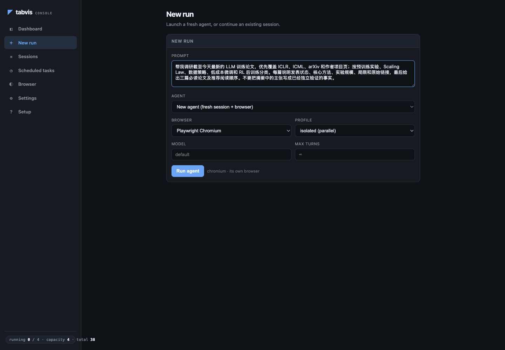
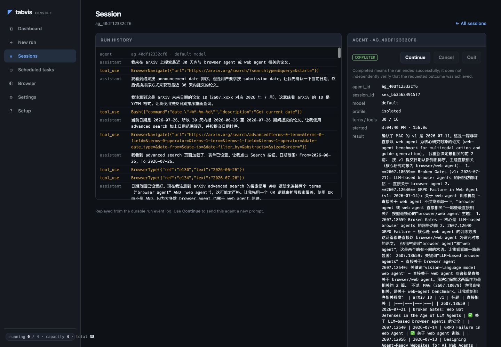

# 当“帮我调研最新论文”不再止于搜索框：用 Tabvis 追踪 LLM 训练前沿

> 一句话提出目标，让 AI 打开真实网页、阅读论文、核对来源、整理结论，并把整个过程留给你检查。

“帮我调研最新的 LLM 训练 paper。”

这可能是 AI 研究者、算法工程师和技术负责人最常提出，也最容易得到一份“看起来不错、实际不够用”答案的问题之一。

难点不在于找到几个论文标题，而在于：**什么叫最新？什么算 LLM 训练？哪些结论来自论文正文，哪些只是摘要里的主张？一篇去年上传 arXiv、今年被会议接收的论文，应该按哪一年归类？**

传统聊天机器人往往在一次回答里给出若干链接，然后把核验、下载、精读、分类和归档继续留给人来做。Tabvis 想解决的是后半程：把“回答一个问题”升级成“完成一次可检查、可继续、可复用的研究任务”。

## 从一句模糊需求，到一份真正能用的调研

Tabvis 是一个浏览器原生 AI Agent。它不是只读取搜索引擎返回的文本，而是通过 Playwright 驱动真实浏览器，在同一条推理链路中完成网页浏览、文件读写、命令执行和工具调用。

在 Tabvis 中，我们可以把最初的一句话稍微展开：

```text
帮我调研截至今天最新的 LLM 训练论文。

优先覆盖 ICLR、ICML、arXiv 和作者项目页，按预训练实验、
Scaling Law、数据策略、低成本微调和 RL 后训练分类。

每篇说明：
1. 首次公开时间与当前发表状态
2. 核心问题、方法与实验规模
3. 最值得关注的结论
4. 局限与尚未验证的部分
5. 原始论文和代码链接

最后给出三篇必读论文、推荐阅读顺序，以及对训练团队的启示。
不要把摘要中的主张写成已经独立验证的事实。
```



*在 New run 页面输入调研目标，并为任务选择浏览器、Profile、模型和最大运行轮数。*

接下来发生的，不只是“生成一段文字”。

### 1. 它先确定“最新”的边界

Tabvis 可以根据执行当天的日期检索论文源，分别记录论文首次公开时间、最近更新时间和会议状态，而不是把搜索排名误当成发表时间。

这很重要。比如一篇工作可能在 2025 年首次上传 arXiv，却在 2026 年成为 ICLR Poster。真正严谨的调研应同时保留这两个信息，而不是简单贴上“2025 论文”或“2026 新论文”的标签。

### 2. 它在真实网页中交叉查找

arXiv、OpenReview、作者主页、GitHub 项目页各自提供不同的信息。Tabvis 可以在真实浏览器中打开这些页面，处理 JavaScript 渲染的内容，并在需要时沿用已有浏览器登录状态。

这意味着它不必止步于搜索摘要，而能继续核对：

- 论文是预印本、Workshop 投稿，还是会议正式收录；
- 作者是否发布了代码、模型或数据；
- 网页上的实验数字是否能在论文正文中找到；
- 同一工作在不同平台上的标题、版本和时间是否一致。

### 3. 它能下载并继续阅读 PDF

发现论文只是开始。Tabvis 可以下载 PDF 到本次任务的独立工作区，再按页阅读；系统会记录已经覆盖的页码和后续待读页，避免把“看过摘要”误写成“读过全文”。

对于 LLM 训练论文，这一步尤其关键。训练 token 数、参数规模、基线设置、消融实验和限制条件，通常不会完整出现在摘要中。只有继续读方法、实验和附录，结论才有资格进入最终报告。

### 4. 它把论文组织成研究脉络，而不是链接清单

好的调研不会停留在“每篇论文三句话”。Tabvis 可以把材料重新组织成一张问题地图：

- 如何用更少的训练次数完成更多受控实验；
- 如何预测和诊断不同模型规模下的训练动态；
- 如何改进数据选择、配比与在线调度；
- 如何降低全参数微调的显存和计算成本；
- RL 后训练的模型规模、数据量和计算预算如何共同影响收益。

当论文被放回同一张地图，团队才能看见哪些工作在回答同一个问题，哪些结论可以互相印证，哪些只是看似相近。

### 5. 它交付结论，也保留证据

Tabvis 的 Web Console 会展示运行过程、浏览记录、工具调用和结果。研究者可以回到来源检查某个判断，而不必盲信最终生成的段落。



*一次真实的 arXiv 论文调研运行记录：左侧按时间回放 Agent 的推理与工具调用，右侧保留运行状态、轮数、工具次数和最终结果。*

最终内容还可以保存成 Markdown、JSON 或其他团队需要的结构，并继续交给本地脚本处理。一次调研不再是聊天窗口里很快沉底的消息，而能成为后续选型、实验设计和组会讨论的工作材料。

## 一次调研可能发现什么？

以 **2026 年 7 月 28 日** 为检索截点，下面几项工作就代表了近期 LLM 训练研究中值得关注的不同方向。它们不是“全部最新论文”的静态榜单，而是一个研究 Agent 应如何建立脉络的例子。

**一、把多个预训练实验放进同一次训练。**  
[Train Once, Answer All: Many Pretraining Experiments for the Cost of One](https://arxiv.org/abs/2509.23383) 提出在一次预训练中同时进行多个受控实验。作者在最高 2.7B 参数、210B token 的设置中安排了十个实验，用于研究数据污染、记忆、知识获取等问题。这项工作于 2025 年首次公开，并进入 ICLR 2026 Poster。对训练团队而言，它的价值不只是某个新指标，而是一种降低研究试错成本的实验范式。

**二、用训练曲线预测效率、发现异常。**  
[Scaling with Collapse: Efficient and Predictable Training of LLM Families](https://arxiv.org/abs/2509.25087) 研究不同规模模型的归一化损失曲线在合适训练配置下如何“塌缩”到可比较的轨迹，并将偏离这种轨迹用于早期发现训练异常和提前终止超参数搜索。它把 Scaling Law 从事后解释，推进到更接近训练过程中的诊断工具。

**三、追问幂律收敛从何而来。**  
[Universal One-third Time Scaling in Learning Peaked Distributions](https://arxiv.org/abs/2602.03685) 从 softmax、交叉熵和尖峰分布的组合出发，尝试解释损失为何出现缓慢的幂律收敛，并给出 \(1/3\) 时间标度。[OpenReview](https://openreview.net/forum?id=ue4WxHI1U4) 将其列在 ICML 2026。它提供的是机制层面的解释，也提醒读者把理论模型、受控实验和真实大规模训练证据分开评估。

**四、理解 RL 后训练中的规模效应。**  
[Scaling Behaviors of LLM Reinforcement Learning Post-Training](https://arxiv.org/abs/2509.25300) 基于 54 组数学推理实验，考察模型规模、数据量和计算预算在 RL 后训练中的关系。论文报告，在其设定下，固定计算预算时更大的模型配合较少训练步数更有优势；但这一结果来自特定算法、模型系列和数学任务，不能不加条件地外推到所有后训练场景。

这四篇论文放在一起，传递出的信号比四段独立摘要更有价值：**LLM 训练研究正在同时追求更便宜的实验、更可预测的训练过程、更扎实的机制解释，以及更明确的后训练规模规律。**

这才是“调研”的意义——不是告诉你最近出现了什么标题，而是帮助你判断下一轮实验应该把预算押在哪里。

## 为什么这类任务适合 Tabvis？

因为论文调研从来都不是一次问答，而是一条长链路：

```text
确定范围 → 检索 → 打开网页 → 核对版本 → 阅读 PDF
→ 提取实验 → 比较方法 → 标注局限 → 组织结论 → 保存交付物
```

Tabvis 把这条链路放进同一个 Agent 循环中。

- **真实浏览器，而非简化网页文本。** 能处理动态页面、交互流程和已有会话状态。
- **网页与本地工作区协同。** 找到论文后可以继续下载、阅读、整理和运行本地工具。
- **过程可观察。** 浏览轨迹、页面快照、DOM 记录和事件流让结果有据可查。
- **任务可以继续。** 持久浏览器 Profile 可以保留标签页、Cookie 和上下文，后续运行不必每次从零开始。
- **可以扩展。** MCP、Skills 和多模型 Provider 能把内部知识库、文献工具或团队工作流接入同一任务。
- **可以自动化。** 除了一次性 CLI，Tabvis 也提供本地 Web Console、HTTP/SSE 服务和定时任务；“调研最新论文”可以进一步变成每周更新的研究雷达。
- **操作受策略约束。** 浏览器、文件和命令操作经过权限与策略层，研究任务的执行边界更加明确。

## 从“给我答案”到“替我完成”

我们已经很习惯让大模型总结一篇论文。但真正消耗研究者时间的，往往是总结之前和之后的工作：找到正确版本、分辨发表状态、核对实验条件、追踪代码、比较相关工作，再把所有信息整理成团队能继续使用的形式。

Tabvis 的价值不在于再增加一个聊天入口，而在于让 AI 真正进入浏览器和工作区，把这些步骤连续做完。

下一次，不妨不要只问：

> “最近有哪些 LLM 训练论文？”

而是把目标交给 Tabvis：

> “帮我建立一份可追溯的 LLM 训练前沿报告，告诉我哪些工作值得读、为什么值得读，以及它们会怎样影响我们的下一轮实验。”

你提出结果，Tabvis 负责抵达。

## 立即体验

项目地址：[GitHub · LHKong7/tabvis](https://github.com/LHKong7/tabvis)

```bash
uv sync
uv run playwright install chromium
uv run tabvis
```

打开本地 Web Console 后，把文中的调研提示词交给 Tabvis。你看到的不只是一份回答，而是这份回答如何一步步成为研究成果。
